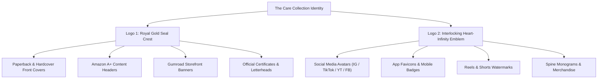

# The Care Collection — Brand Identity & Multi-Media Promotional Master Plan

## 1. Executive Brand Architecture

| Brand Dimension | Specification |
| :--- | :--- |
| **Series Umbrella** | **The Care Collection** |
| **Lead Imprint** | **Adorise Digital** (A Division of Trendy DigiStore LLC, Wyoming, USA) |
| **Author Authority** | **Sanjay Shharma** (Corporate Veteran & Lived-Experience Counselor • IIM Calcutta Alumni) |
| **Core Brand Promise** | Practical, emotionally intelligent blueprints for navigating life transitions, silent marriage drift, and family caregiving. |
| **Tone & Voice** | Authoritative, warm, empathetic, clinically disciplined, and quietly reassuring. |

---

## 2. Official Brand Color Palette System

The Care Collection brand identity utilizes a high-contrast luxury aesthetic engineered for instant authority and high-CTR performance across digital ads, social feeds, and physical book shelves.

```
+-----------------------------------------------------------------------------------------+
|                                    PRIMARY BRAND PALETTE                                |
|                                                                                         |
|   #0D131F              #D4AF37              #FFFFFF              #E2E8F0              #C86D56   |
|  [Midnight Navy]     [Imperial Gold]     [Pure White]        [Platinum Mist]     [Terracotta Rose] |
|   Authority Base      Prestige & Trust    Clarity & Title     Editorial Body      Viral Hook Accent |
+-----------------------------------------------------------------------------------------+
```

### Color Codes & Role Matrix

1. **Midnight Navy (`#0D131F` / `#141C2B`) — Primary Foundation (70%)**
   - **Psychology**: Psychological safety, emotional depth, masculine & feminine equilibrium, timeless trust.
   - **Usage**: Book front & back cover backgrounds, website hero sections, dark-mode social media graphics, video backgrounds.

2. **Imperial Polished Gold (`#D4AF37` / `#E5C158`) — Primary Accent (20%)**
   - **Psychology**: High perceived value, prestige, hope, emotional breakthrough, luxury publishing.
   - **Usage**: Series kicker banner (`THE CARE COLLECTION • BOOK 3`), logo seals, decorative borders, key quotes, high-converting CTA buttons, gold foil stamping on physical paperbacks.

3. **Crisp Pure White (`#FFFFFF`) — High-Contrast Copy (10%)**
   - **Psychology**: Clarity, honesty, unmistakable readability from smartphone thumbnail view.
   - **Usage**: Main title typography, author name, key takeaway bullet points.

4. **Platinum Mist Gray (`#E2E8F0` / `#CBD5E1`) — Supporting Editorial**
   - **Usage**: Subtitles, body copy on back covers, author credentials, divider rules.

5. **Terracotta Rose (`#C86D56`) — Viral Highlight / Emotional Callout**
   - **Usage**: Notification badges, promotional price tags, "Limited Time / Free Bonus" banners, emotional pull quotes on social carousels.

---

## 3. Brand Logo System & Cross-Media Matrix

The Care Collection features a dual-tier logo system designed for maximum adaptability across all mediums:



### Logo 1: The Royal Gold Crest Seal (`THE CARE COLLECTION • EST. 2026`)
- **Visual**: Embossed 3D circular gold medal with double-line borders, interlocking CC monogram, and clean serif engraving.
- **Application**:
  - Book covers (anchored at top-right corner).
  - Amazon KDP back cover publisher block.
  - Gumroad storefront hero banner.
  - Email newsletter header for Sanjay Shharma.

### Logo 2: The 3D Heart-Infinity Emblem
- **Visual**: Seamless 3D metallic gold ribbon flowing in an unbroken infinity-heart loop, representing lifelong union and emotional reconnection.
- **Application**:
  - Profile pictures on TikTok, Instagram, Facebook, and YouTube (readable down to 32px).
  - Bottom-right corner watermark on all 9:16 short-form video reels.
  - Book spine bottom icon.
  - Product packaging stickers and bookmark foil stamps.

---

## 4. Typography Hierarchy & System

| Level | Font Family | Weight & Style | Tracking / Spacing | Usage |
| :--- | :--- | :--- | :--- | :--- |
| **L1: Series Kicker** | Segoe UI / Montserrat | Bold, All-Caps | Tracking: `+2.5px` (Wide) | `THE CARE COLLECTION • BOOK 3` |
| **L2: Book Title** | Georgia / Playfair Display | Bold Serif, Title Case | Tracking: `+0.5px` | `STILL MARRIED, JUST SILENT` |
| **L3: Subtitle** | Segoe UI / Helvetica Neue | Medium / Regular | Tracking: `+0.2px` | `14 Conversations to Reopen a Quiet Marriage` |
| **L4: Author Block** | Georgia / Garamond | Bold All-Caps + Italic | Tracking: `+1.5px` | `SANJAY SHHARMA` (*IIM Calcutta Alumni*) |
| **L5: Body & Interior** | Garamond / Merriweather | Regular 11pt, 1.4 Leading | Standard | Interior 6x9 Amazon Manuscript |

---

## 5. Multi-Channel Promotional & Media Strategy

### Channel A: Amazon KDP & Kindle Ecosystem
1. **Paperback 6x9 Wrap**:
   - Front cover featuring the couple, bold gold series kicker, title, and gold crest seal.
   - Spine featuring title, author, and Adorise imprint mark.
   - Back cover with zero white-box glitches, gold double-frame border, ISBN barcode block, and Sanjay Shharma author credential.
2. **Amazon A+ Content (Enhanced Marketing)**:
   - **Header Banner (970 x 300)**: Midnight navy banner introducing the Care Collection universe.
   - **3-Module Feature Grid (300 x 300)**:
     - Module 1: *The Turtle Shell Protocol* (De-escalating withdrawal).
     - Module 2: *14 Step-by-Step Conversations* (Scripted dialogue cards).
     - Module 3: *The 30-Day Quiet Marriage Reset* (Structured daily worksheet roadmap).
   - **Catalog Comparison Table**: Cross-linking all 14 books in The Care Collection.

### Channel B: Gumroad Storefront & Direct Sales Funnel
1. **Hero Storefront Banner (1920 x 1080 / 2560 x 600)**:
   - Gold crest seal on left, collection statement in gold serif typography, luxury 3D book mockup on right.
2. **Tiered Value Packaging**:
   - **Tier 1 ($9.99)**: Single Ebook (PDF + EPUB + 6x9 Printable Manuscript).
   - **Tier 2 ($27.00)**: Marriage Reconnection Bundle (Ebook + Audio Manuscript + 30-Day Actionable Workbook + Cheat Sheets).
   - **Tier 3 ($97.00)**: The Care Collection Lifetime Vault (All 14 Master Ebooks, Audio Guides, and Printable Toolkits).

### Channel C: Viral Short-Form Video (TikTok, Reels, Shorts)
- **Format**: 9:16 Vertical Video (1080 x 1920).
- **The 3-Second Viral Hook Formula**:
  - *Hook Text*: "3 signs your marriage is quietly dying (and it's not cheating)."
  - *B-Roll Visual*: Cinematic young couple sitting in reflective silence on sofa with soft window lighting.
  - *Audio*: Sanjay Shharma's calm, measured counselor voice explaining "The Polite Roommate Syndrome."
  - *Branding*: Logo 2 (Heart-Infinity gold emblem) pulsing subtly in the bottom-right corner.
  - *Call to Action*: "Comment 'RESET' to get the free 7-day conversation starter guide."

### Channel D: High-Converting Meta Ads (Instagram & Facebook)
- **Format**: 1080 x 1080 Square & 1080 x 1350 Portrait Carousels.
- **5-Slide Carousel Structure**:
  - *Slide 1 (The Hook)*: "Why Did We Stop Talking?" (Young couple image + 3D book mockup).
  - *Slide 2 (The Diagnosis)*: "How passionate marriages drift into polite logistics."
  - *Slide 3 (The Cost)*: "The emotional cold war that raises silent walls between spouses."
  - *Slide 4 (The Breakthrough)*: "14 Guided conversations that unlock closeness without triggering defensiveness."
  - *Slide 5 (The Offer)*: "Still Married, Just Silent by Sanjay Shharma — Available now on Amazon & Gumroad."

### Channel E: Lead Magnet & Direct Relationship Nurturing
- **Lead Magnet Asset**: *The 7-Day Quiet Marriage Conversation Starter Kit* (PDF).
- **Email Newsletter**: *The Weekly Care Protocol* by Sanjay Shharma, delivering one actionable 5-minute relational check-in every Sunday evening.
