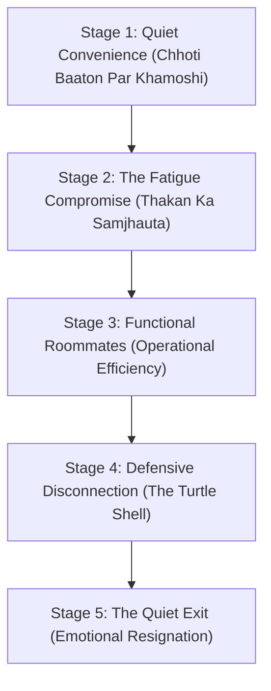
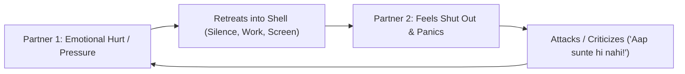
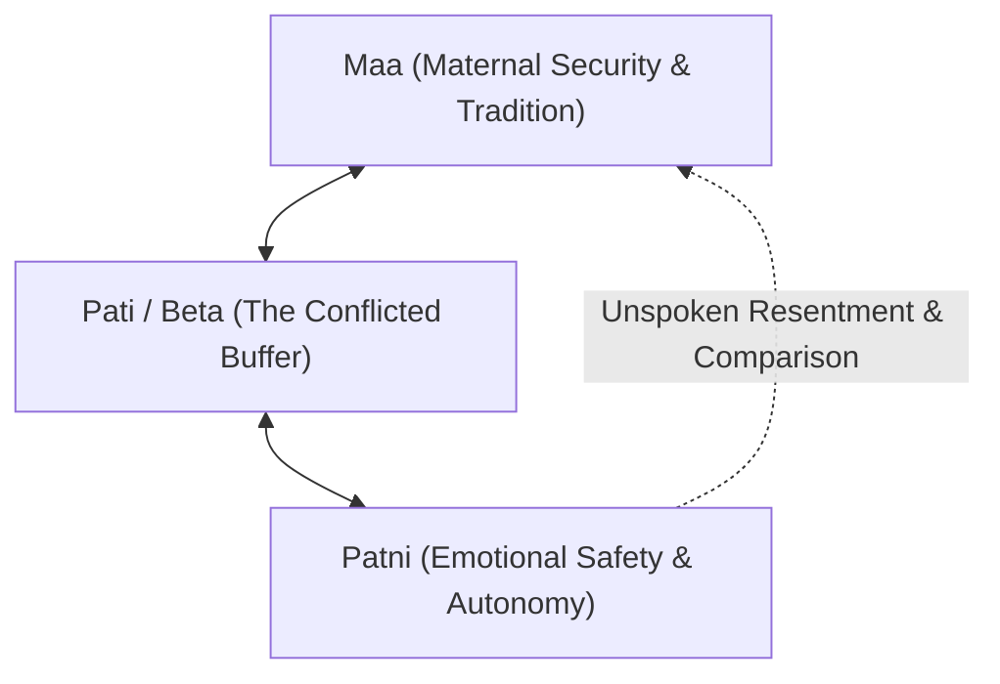
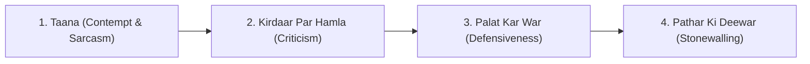
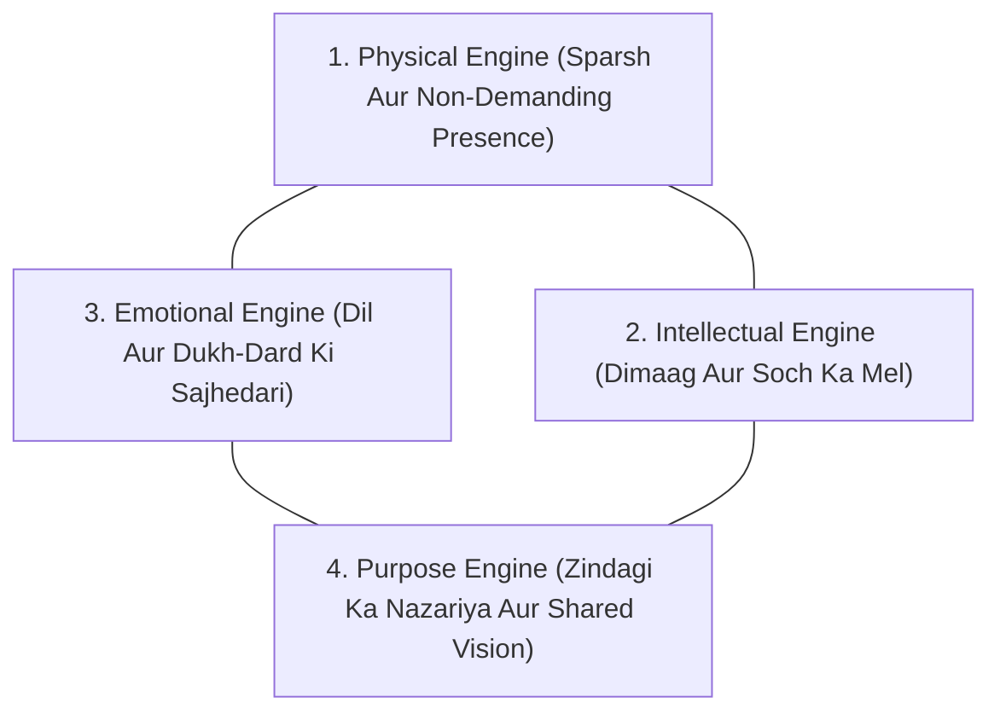
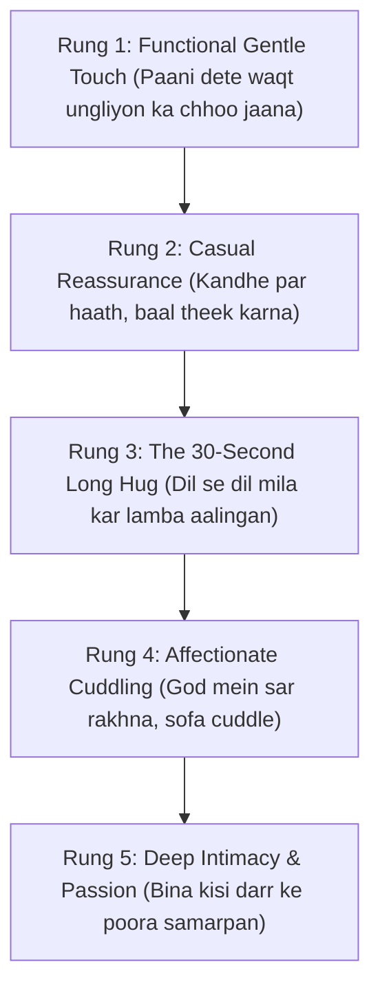

# Hum Ladte Nahi, Par Baat Nahi Karte
### A 4-Phase Framework for the Silent Indian Marriage
**Authored by Sanjay Shharma**
*M.Sc., MBA, APSCM (IIM Calcutta Alumni) • Author of The Care Collection*
*Published by Adorise Digital — A Division of Trendy DigiStore LLC, Wyoming, USA*

---

## Copyright Page

**Hum Ladte Nahi, Par Baat Nahi Karte**  
*A 4-Phase Framework for the Silent Indian Marriage (Complete Trade Bestseller Edition)*  
Copyright © 2026 by Sanjay Shharma. All rights reserved.

Published by Adorise Digital  
Trendy DigiStore LLC  
30 N Gould St, Ste R, Sheridan, WY 82801, USA  
Web: https://adorisedigital.com • https://books.adorisedigital.com

No part of this publication may be reproduced, stored in a retrieval system, or transmitted in any form or by any means, electronic, mechanical, photocopying, recording, or otherwise, without the prior written permission of the publisher, except in the case of brief quotations embodied in critical reviews.

**Disclaimer:** This book is based on personal observation, real-world case studies, and cultural psychology. It is intended for educational and self-reflection purposes only. The author is not a licensed psychiatrist or clinical medical practitioner. If your relationship involves domestic violence, coercive control, untreated clinical depression, or active substance addiction, please reach out to qualified medical professionals or specialized crisis counselors immediately.

**Confidential Helplines (India):**
- **iCall (TISS Psychosocial Helpline):** +91 9152987821 (Mon–Sat, 10 AM – 8 PM)
- **Vandrevala Foundation Helpline:** +91 9999 666 555 (24/7 Free & Confidential)
- **National Emergency Helpline for Women:** 181 (24/7 Toll-Free)
- **NIMHANS Tele-MANAS Mental Health:** 14416 (24/7 Multilingual Support)

---

## Dedication & Epigraph

> *"Ghar mein pyaar kam nahi tha.*  
> *Bas baatein khatam ho gayi thiin."*  
>  
> — Anonymized observation from over 300 Indian corporate living rooms.

*To the couples who never screamed, never threw dishes, and never made a public scene—yet wake up every morning wondering when their best friend turned into a polite, quiet roommate.*  
*To the partner who sits on the sofa with a phone in hand, looking across the room, wishing they knew how to say: 'I miss us.'*  
*This manual is your map home.*

---

## Author's Personal Note: Kyun Likhi Gayi Yeh Kitaab?
*(The Silence I Lived and Survived)*

Main ek businessman hoon, ek MBA aur APSCM hoon Indian Institute of Management (IIM) Calcutta se. Pichhle teen dashakon mein maine corporate boardrooms mein strategy banayi hai, hazaron executives ko train kiya hai, aur corporate leadership ke unche mukaam dekhe hain.

Lekin yeh credentials woh wajah nahi hain jinki wajah se aapko is kitaab par bharosa karna chahiye.

Asli credentials kisi corporate certificate par nahi chhapte. Asli credentials hospital ke thande corridors, ICU ke bahar 3 baje subah ki waiting room chairs, aur ghar ke us khamosh drawing room mein bante hain jahan do insaan anjaano ki tarah baithe hote hain.

Maine apni jeevansangini ko cancer ki lambi bimaari mein khoya hai. Har stage par, har chemotherapy cycle mein, har emergency midnight run mein main unka primary caregiver raha hoon. Maine unka haath pakad kar hospital ki un deewaron ko dekha hai jahan zindagi ke saare corporate designations, awards aur ghamand ek pal mein choor-choor ho jaate hain.

Us dauran maine shaadi ka ek aisa roop dekha jise hum mein se bohot kam log samajh paate hain:  
**Shaadi aasan dino ke liye nahi hoti; shaadi hospital ki seedhiyon ke liye hoti hai.**

Jab bimaari aati hai, jab career ka crisis aata hai, ya jab umar ka 50vaan saal aata hai—tab yeh matter nahi karta ki aapka HDFC bank loan kitna bada hai ya aapke paas kitni gaadiyan hain. Sirf ek cheez matter karti hai: **Kya us drawing room mein aapke paas ek aisa dost hai jisse aap bina kisi naqaab ke sach bol sakte hain?**

Corporate networks aur executive circles mein pichhle 20 saalon mein maine Bharat ke sabse padhe-likhe, sabse successful logon ko dekha hai. Bahar se sab kuch shaandar dikhta hai—Gurgaon ya Whitefield ka luxury gated apartment, bachhe international school mein, Diwali par matching kapdon mein picture-perfect Instagram family.

Lekin jab flat ka darwaza band hota hai, toh wahan ek ajeeb sa, pathrila sannata hota hai.

Do insaan ek hi bed par so rahe hain, beech mein sirf 12 inch ka faasla hai, lekin unke beech ka emotional distance 12,000 kilometer ka ban chuka hai. 

Yeh nafrat nahi hai. Yahan koi teesra insaan nahi hai. Yeh ladai bhi nahi hai.  
**Yeh dheere-dheere aane wali thakan aur anjaanepan ka jamna hai.**

Western marriage books kehti hain: *"Go on a weekend winery retreat"* ya *"Express your attachment anxiety."* Lekin Bharat ke parivar mein drawing room mein saas-sasur baithe hain, kitchen mein cook aur maid ki logistics hai, family WhatsApp group par 40 rishtedaar judge kar rahe hain, aur subah 6:30 baje bachhon ka tiffin pack karna hai.

Humein kisi Western theory ki zaroorat nahi thi. Humein ek aisi kitaab chahiye thi jo hamare kitchen ki sachhayi, hamari Hinglish bhasha, aur hamare sanskaron ki gehraayi ko samajh kar ek concrete, practical roadmap de sake.

Yeh kitaab wahi roadmap hai. 

Aapki shaadi khatam nahi hui hai. Woh bas thak gayi hai aur so gayi hai. Usko dobara jagane ke liye kisi tamashe ki zaroorat nahi hai. Sirf ek gentle, structured 30-day protocol chahiye.

Chaliye, saath chalte hain.

— **Sanjay Shharma**  
*M.Sc., MBA, APSCM (IIM Calcutta Alumni)*

---

## Introduction: The Marriage Nobody Talks About
*(Woh Shaadi Jiski Baat Koi Nahi Karta)*

Talaaq aur family court ke kisse akhbaron ki headline bante hain. Gharon mein hone wali cheekh-pukaar aur todfod padosiyon ko sunayi deti hai.

Lekin woh shaadi jiski baat koi nahi karta—woh woh shaadi hai jahan koi cheekh-pukaar nahi hoti, koi bartan nahi toot-te, aur koi public tamasha nahi hota.

Woh shaadi subah 6:30 baje shuru hoti hai. Dono partner kitchen aur drawing room mein mechanical efficiency ke saath ghoomte hain. Doodh ka packet fridge mein rakha jaata hai. Bachhe ko school bus tak drop kiya jaata hai. Dono apni-apni office cab ya gaadi mein nikalte hain. Din bhar mein unke beech sirf chaar transactional WhatsApp messages aate hain:
- *"Electrician aaya tha kya?"*
- *"Main late hounga, dinner shuru kar lena."*
- *"Dahi le aana aate waqt."*
- *"OK."*

Raat ko 9:30 baje dinner ke baad dono living room ke sofe par aate hain. Ek three-seater sofe par do alag-alag screens ki blue light chamak rahi hoti hai. Dono Instagram reels, YouTube shorts, ya office emails scroll kar rahe hote hain.

11:15 par ek partner kehta hai: *"Main light band kar raha hoon."*  
Doosra kehta hai: *"Theek hai."*

Aur dono peeth mod kar so jaate hain.

Agar aap bahar se dekhein, toh yeh rishta bilkul safe dikhta hai. Dono ke beech koi dushmani nahi hai. Dono ek doosre ki izzat karte hain. 

Lekin andar se, yeh rishta **"Emotional Hibernation"** mein jaa chuka hai. 

Dono ne yeh sach maanna chhod diya hai ki shaadi mein dosti, sharaarat, aur dil ki baat bhi ho sakti hai. Unhone yeh soch kar samjhauta kar liya hai: *"Umar ke saath sabhi shaadiyan aisi hi ho jaati hain. Bachhon ke liye sab theek chal raha hai na, bas kaafi hai."*

Yeh jhooth hai. 

Shaadi sirf ek household project management company nahi hai jismein do silent partners sirf EMI aur tiffin manage karein. Shaadi aapki zindagi ka sabse bada refuge—sabse bada sukoon—honi chahiye.

Is kitaab ka maqsad aapko kisi impractical sapne mein le jaana nahi hai. Is kitaab ka maqsad aapke usi drawing room mein, usi balcony mein chai peete hue, unhi 14 conversations aur rituals ke zariye us dosti ko wapas lana hai jo saalon pehle kahin kho gayi thi.

Aage badhiye, aur har chapter ke end mein diye gaye exercises aur scorecards ko imaandari se complete kijiye.

---

# PART 1: DIAGNOSE (KHAMOSHI KI PEHCHAN)

---

## Chapter 1: "Hum Toh Theek Hain" Sabse Khatarnak Jumla Hai
*(The Roommate Marriage & The Danger of Fine)*

Hospital ke surgical waiting room mein ghadi ki tick-tick aam dino se chaar guna zyada tez aur bhaari lagti hai. 

Subah ke 3:45 baje the. Bahar Delhi ki sard hawa chal rahi thi. Waiting room mein neeli fluorescent tube light ke neeche ek 54-saal ke senior corporate executive baithe the. Unki patni andar operating theatre mein theen—ek critical emergency abdominal surgery chal rahi thi jo pichhle aath ghante se khinch chuki thi.

Maine unke paas baith kar unke kandhe par haath rakha aur poochha: *"Aap pichhle aath ghante se is lakdi ki bench par baithe hain, kuch khaya nahi, chai tak nahi pi. Aap is waqt kya soch rahe hain?"*

Unhone jo jawab diya, woh main zindagi bhar nahi bhool sakta.

Unhone apni laal, thaki hui aankhein uthayi aur dheemi aawaz mein kaha:  
*"Sanjay, main pichhle aath ghante se us ladai ke baare mein soch raha hoon jo pichhle hafte hamare beech drawing room ke parde (curtains) ko lekar hui thi. Ek bekaar si, be-matlab si baat par hum teen din tak ek doosre se nahi bole the. Main office mein baith kar soch raha tha ki main sahi hoon aur woh galat hai. Main teen din tak ego lekar ghooma.*  
*Aur ab jab woh andar us table par hai aur machine ki beeping chal rahi hai, toh mujhe samajh aa raha hai ki parde kitne bekaar the. Mujhe samajh aa raha hai ki main saalon se pardo se, car ki service se aur credit card ke bill se shaadishuda tha, apni patni se nahi."*

Unhone aage kaha: *"Agar woh subah aankh kholti hai, toh main sabse pehle usse pardey ki ladai ke liye maafi mangunga. Aur usse kahunga ki mujhe uski zaroorat hai."*

Subah 7:15 baje jab unki patni ko recovery room mein laya gaya, toh pehli cheez jo unhone dekhi woh unke pati ka chehra tha, jo unka haath thaame ro rahe the. Unki patni ne kamzor muskurahat ke saath kaha: *"Aap itne pareshan kyun lag rahe hain? Sab theek ho gaya na."*

Pati ne kaha: *"Main pardey ke liye maafi mangta hoon. Mujhe maaf kar do."*  
Patni ne dheere se hasste hue kaha: *"Pardey toh main bhool bhi gayi thi. Accha hua aap yahan hain."*

Main yeh kahani har us Indian couple ko sunata hoon jo mere paas aate hain. 

Main unhe batata hoon: **Aapko nahi pata ki hospital ka din kab aayega. Aapko nahi pata ki aapki drawing room ki kaun si choti si kadvahat aapki aakhiri baat ban jaayegi.** 

Shaadi aasan dino mein restaurant mein dinner karne ke liye nahi hoti. Shaadi hospital ki seedhiyon ke liye hoti hai. Shaadi us kursi ke liye hoti hai jo ICU ke bahar raat bhar rakhi rehti hai. Agar aapke paas aisi shaadi nahi hai jo musibat ke waqt ek doosre ka sahara ban sake, toh aapke paas shaadi nahi hai—aapke paas sirf ek joint logistics firm hai.

### Sarah aur David (Aur Gurgaon ke Rajiv aur Ananya)

Rajiv aur Ananya ki shaadi ko gyarah saal ho chuke the. Rajiv ek multinational tech firm mein Director tha; Ananya ek international school mein senior educator thi. Gurgaon ke Golf Course Road par unka 4BHK luxury apartment tha.

Agar aap unke parivar ya doston se poochhte, toh sab kehte: *"Inki jodi kitni perfect hai. Na koi ladai, na koi hungama, kitne suljhe hue log hain."*

Lekin haqeeqat yeh thi ki pichhle teen saalon se Rajiv aur Ananya ne ek doosre se ek bhi aisi baat nahi ki thi jo ghar, EMI ya bachhe se judi hui na ho.

Ek Budhvaar ki shaam ko Ananya kitchen mein khadi thi. Cook chhutti par tha. Bachhe ke school se email aayi thi ki kal sports day hai aur white shoes chahiye. Sasurji ki BP ki dawai reorder karni thi. Ananya kitchen se aawaz lagakar Rajiv ko yeh list ginwa rahi thi, jo living room mein sofe par baith kar apne iPhone par LinkedIn feed scroll kar raha tha.

Teesri item bolte-bolte Ananya achanak beech mein rukh gayi. 

Usne kitchen ke counter par haath rakha aur living room ki taraf dekhte hue bohot dheemi aawaz mein poochha:  
*"Rajiv, aakhiri baar hum dono ne aisi baat kab ki thi jismein koi kaam, koi bill ya koi bachha shamil na ho?"*

Rajiv ne phone se aankhein uthayi. Isliye nahi ki sawal kadwa tha—balki isliye ki use sach mein jawab nahi pata tha.

Dono ne yaad karne ki koshish ki. Pichhla mahina? Pichhli Diwali? Pichhla saal?  
Jawab tha: **Unhe yaad hi nahi tha.**

Dono mein se koi yeh nahi maanta tha ki woh dukhi hain. Agar koi unse poochhta, toh dono ek hi jumla bolte: *"Hum theek hain (We're fine)."*

Aur yahi do shabd—**"Hum theek hain"**—kisi bhi rishte ka sabse meetha zeher hote hain.

### The Three Lies "Fine" Tells Itself

Jab koi couple kehta hai ki *"Hum theek hain"*, toh woh apne aap ko teen bade jhooth bol raha hota hai:

#### Lie #1: "Hamare beech koi badi problem nahi hai."
Aapke ghar mein koi sharaab peekar hungama nahi kar raha. Koi domestic abuse nahi hai. Koi extra-marital affair nahi hai. Ghar ki HDFC home loan EMI time par jaa rahi hai, bachhe ke marks acche aa rahe hain.

Lekin **"Badi museebat ka na hona"** ka matlab yeh bilkul nahi hota ki **"Rishte mein zindagi aur pyaar maujood hai."**

Ek insaan bina kisi cancer ya bimaari ke bhi dheere-dheere bhookh se mar sakta hai. Theek usi tarah, ek shaadi bina kisi bade jhagde ke bhi emotional bhookh (starvation) se mar sakti hai. Log aksar toofan ki kami ko shanti samajh lete hain, jabki woh shanti nahi, marghat ka sannata hota hai.

#### Lie #2: "Hum ek doosre se abhi bhi pyaar karte hain."
Pyaar fuel (petrol) ki tarah hota hai. Lekin pyaar gaadi ka engine nahi hota. Agar aap gaadi ki tanki mein duniya ka sabse mehenga petrol bhar dein, lekin gaadi ka engine hi jaam ho chuka ho, toh kya gaadi chalegi? Bilkul nahi.

Aap ek hi chaar-by-chhe ke mattress par ek doosre ke bagal mein 15 saal tak bina baat kiye so sakte hain aur dil mein pyaar rakh sakte hain. Lekin us pyaar ka kya fayda jo saamne wale ko sukoon aur garmi na de sake?

#### Lie #3: "Umar ke saath saari shaadiyan aisi hi ho jaati hain."
Yeh sabse purana aur sabse dangerous jhooth hai jo humare samaj mein bola jaata hai. Agar hamare maa-baap ne 40 saal tak bina kisi emotional connection ke ek doosre ke saath sirf zimmedari nibhayi thi, toh woh koi parampara (tradition) nahi thi—woh ek zakhm tha jo unhone chupchap saha.

Har shaadi mein thakan ke daur aate hain. Lekin thakan ka daur hamesha ke liye ghar ka mausam nahi ban jaana chahiye.

### The Four Tells of the Silent Marriage (4 Pehchan)

Aapka rishta silent ho chuka hai ya nahi, ise jaanchne ke chaar bilkul saaf nishaan hain:

1. **The Logistics-Only Conversation:** Pichhle do hafton mein aapke beech hone wali baaton ka 95% hissa sirf: khana, doodh, laundry, school, car service, aur bills ke baare mein tha.
2. **The Relief of Their Absence:** Jab aapka partner do din ke liye kisi office trip par ya mayke jaata hai, toh aapko akelepan ke bajaye ek chupke se aane wala relief (sukoon) mehsoos hota hai: *"Chalo, ab mujhe kisi ke mood ko manage nahi karna padega."*
3. **The Phone Shield on Bed:** Raat ko bed par aate hi dono ka haath instinctively smartphone ki taraf badhta hai, taaki beech mein aane wali awkward khamoshi ko reels ya WhatsApp se bhara jaa sake.
4. **The Curiosity Stoppage:** Aakhiri baar aapne apne partner se kab koi aisa sawal poochha tha jiska jawab aapko pehle se na pata ho? (Jaise: *"Aaj kal aisi kaun si cheez hai jo tumhe secretly pareshan kar rahi hai?"*).

---

### Before We Go Further — A 3-Minute Audit

Ek notebook aur pen uthaiye. Akele baithiye aur niche diye gaye teen sawalon ke sachhe jawab likhiye. Kisi ko dikhane ki zaroorat nahi hai:

1. **Aakhiri Real Conversation:** Aakhiri baar aap dono ne bina kisi household agenda, bachhe ya bill ke kab dil khol kar baat ki thi? Tareekh aur jagah yaad kijiye.
2. **Teen Dabi Hui Baatein:** Aise teen sentences jo aap pichhle ek saal se apne partner se kehna chahte the lekin darr ya thakan ki wajah se taal gaye.
3. **Ghar Ka Chhupa Hua Sach:** Aisi kaun si baat hai jo aapne apni maa, apni behen ya apne best friend ko bhi nahi batayi, par aapke dil par pathar ki tarah rakhi hai?

---

### Chapter 1 at a Glance: The 5 Things to Remember

- **1.** *"Hum theek hain"* shaadi ka sabse khatarnak jumla hai kyunki yeh samasya ko pehchanne se hi rok deta hai.
- **2.** Badi ladaiyon ki kami ka matlab mazboot rishta nahi hota; garmi aur dosti ka hona asli rishta hai.
- **3.** Shaadi hospital ki seedhiyon ke liye hoti hai—mushkil waqt se pehle dosti ki neev mazboot karni padti hai.
- **4.** Agar 90% baatein logistics hain, toh aap patni-pati nahi, corporate roommates hain.
- **5.** Khamoshi ko toda jaa sakta hai, lekin uske liye pehle yeh sweekar karna padega ki khamoshi maujood hai.

---

### Your Scorecard: Chapter 1 Diagnostic

Niche diye gaye 5 statements ko padhiye aur 0 se 3 tak score dijiye:  
*(0 = Kabhi nahi, 1 = Kabhi-kabhi, 2 = Zyadatar waqt, 3 = Hamesha)*

| Statement | Score (0-3) |
| :--- | :---: |
| 1. Hum rozana kam se kam 15 minute bina kisi phone ya logistics ke baat karte hain. | [ &nbsp; ] |
| 2. Mujhe apne partner ki current sabse badi 3 chintayein (worries) pata hain. | [ &nbsp; ] |
| 3. Jab koi acchi ya buri khabar aati hai, toh sabse pehle main apne partner ko batana chahta/chahti hoon. | [ &nbsp; ] |
| 4. Hum din mein kam se kam ek baar bina kisi sexual demand ke ek doosre ko affectionately chhoote ya gale lagate hain. | [ &nbsp; ] |
| 5. Mujhe yaad hai ki aakhiri baar hum dono ne dil khol kar ek saath kab hasa tha. | [ &nbsp; ] |
| **Total Score (out of 15):** | **[ &nbsp; / 15 ]** |

*Scoring Guide: 0–5: Serious Emotional Drift (Immediate Action Required) | 6–10: Quiet Roommate Zone | 11–15: Connected & Resilient.*

---

### Key Terms from This Chapter

- **Roommate Marriage:** Ek aisi shaadi jahan dono partner ghar aur parivar ki saari zimmedariyan efficiently nibhate hain, lekin aapas ka emotional aur physical connection khatam ho chuka hota hai.
- **The Curtain Fight:** Chhoti, be-matlab baaton par hone wala woh jhagda jo asal mein dabi hui purani thakan aur akelepan ka roop lekar bahar nikalta hai.
- **Logistical Trap:** Rishte ki saari baat-cheet ko sirf kaam, ration, bacche aur kharche tak seemit kar dena.
- **Emotional Hibernation:** Rishte ka bina kisi toofan ke chupchap so jaana aur anjaanepan mein dhal jaana.

---

## Chapter 2: Dooriyon Ke 5 Stages: Quiet Convenience Se Quiet Exit Tak
*(The 5 Sequential Stages of Marital Drift)*

Do insaan ek raat mein anjaan nahi bante. Doori hamesha dhoop mein dheere-dheere sukhte hue kapde ki tarah aati hai—reshe-dar-reshe, din-ba-din.

Vikram aur Pooja Bangalore ke ek mashhoor tech park mein Vice Presidents the. Dono ki love marriage thi. College ke dino mein dono ne ghanton CCD mein baith kar sapne dekhe the. Unki shaadi ko 12 saal ho chuke the.

Jab Vikram mere paas aaya, toh usne kaha: *"Sanjay, mujhe samajh nahi aaya ki kab humare beech sab kuch khatam ho gaya. Hamare beech koi bada jhagda nahi hua. Humne kabhi ek doosre ko gaali nahi di. Lekin aaj hum dono ek doosre ke liye bilkul ajnabi hain."*

Maine Vikram ko samjhaya ki rishta ek jhatke mein nahi toot-ta. Woh paanch sequential stages se guzarta hai:

### Stage 1: Quiet Convenience (Chhoti Shikayatein Jo Dab Gayi)
Shaadi ke pehle do saal. Chhoti-chhoti baatein hoti hain:
- Pati ne parivar ke samne patni ki cooking ya aadat ka halka sa mazaak uda diya. Patni ko bura laga, par usne socha: *"Mehfil mein kya bolna, chhod na."*
- Patni ne pati ke career ki tension ko samajhne ke bajaye keh diya: *"Aap hamesha late aate ho."* Pati ne socha: *"Isko meri mehnat ki kadar nahi hai."*

Dono ne socha ki baat ko chhedne ka koi fayda nahi hai. Lekin subconscious mind ke khate mein ek debit entry ho gayi.

### Stage 2: The Fatigue Compromise (Thakan Ka Samjhauta)
Shaadi ke 3 se 6 saal. Yahan zindagi mein do bade toofan aate hain: pehla bachha aur pehla bada home loan.

Energy ka level gir jaata hai. Dono partner raat ko 10 baje itne thake hote hain ki agar koi mudda samne aaye bhi, toh dono kehte hain: *"Theek hai, jo tumhein theek lage kar lo."*

Yeh faisla samajhdaari ki wajah se nahi hota—yeh physical thakan ki wajah se hota hai. Lekin iski bhedi keemat yeh hoti hai ki dono ne sach bolna aur genuine debate karna band kar diya.

### Stage 3: Functional Roommates (Operational Efficiency)
Shaadi ke 7 se 10 saal. Yahan ghar ek automated factory ban jaata hai:
- Swiggy Instamart se subah 7 baje doodh deliver ho raha hai.
- Bacche ki tuition aur chess class ka Google Calendar sync hai.
- SIP aur Mutual Fund investments on time chal rahi hain.
- Diwali par sasural aur mayke ke gifts perfectly deliver ho rahe hain.

Lekin dono ke beech romance, touch, aur dil ki baat bilkul zero ho chuki hai. Dono ek doosre ke saare calendar jaante hain, lekin ek doosre ke darr aur aansuon se anjaan hain.

### Stage 4: Defensive Disconnection (Kachhue Ka Shell)
Jab ek partner baar-baar koshish karke haar jaata hai ki saamne wala use samjhe, toh woh apne defensive bunker mein ghus jaata hai. 

Har baat par taana ya defensiveness:
- *"Aap late aaye?"* -> *"Haan toh kya karoon, job chhod doon?"*
- *"Mummy ka phone aaya tha?"* -> *"Mujhe kya pata, aapke gharwale hain."*

Dono ne ek doosre par emotional pathar phenkna band kar diya hai, lekin deewar itni unchi kar li hai ki koi andar na aa sake.

### Stage 5: The Quiet Exit (Resignation & Total Absence of Pain)
Yeh sabse dangerous stage hai. 

Pehle jab partner late aata tha, toh gussa aata tha, phone lagaye jaate the. Ab agar partner teen din ke liye doosre shehar chala jaaye, toh doosre ko koi fark nahi padta. Balki sukoon milta hai.

**Dard ka khatam ho jaana theek hone ki nishani nahi hoti; dard ka khatam hona paralysis ki nishani hoti hai.** 

Yahan aakar insaan physically usi ghar mein rehta hai, lekin emotionally apna samaan baandh kar nikal chuka hota hai.

---

### Before We Go Further — A Small Audit

1. Is waqt aapka rishta upar diye gaye 5 stages mein se kis stage par khada hai? 
2. Aakhiri baar aapne apne partner se kab sachha gussa ya dard express kiya tha (bina taane ke)?
3. Kya aapke andar abhi bhi thoda dard bacha hai, ya aap 'Quiet Exit' ke stage par pahunch chuke hain?

---

### Chapter 2 at a Glance: The 5 Things to Remember

- **1.** Marital drift achanak nahi aata; yeh 5 baareek stages mein dheere-dheere aage badhta hai.
- **2.** Stage 1 ki chhoti shikayatein dabi rehne par Stage 3 ki operational robotism ban jaati hain.
- **3.** Gussa aur ladai umeed ki nishani hoti hain; total khamoshi aur numb ho jaana danger sign hai.
- **4.** Agar partner ke bahar jaane par sukoon mehsoos hota hai, toh aap Stage 4 ya 5 par hain.
- **5.** Har stage se wapsi sambhav hai—jab tak dono mein se koi ek partner bhi conscious kadam uthane ko tayyar ho.

---

### Your Scorecard: Chapter 2 Diagnostic

| Statement | Score (0-3) |
| :--- | :---: |
| 1. Main apne partner se bina jhagde ke darr ke apni shikayat share kar sakta/sakti hoon. | [ &nbsp; ] |
| 2. Hum rozana thakan ke bawajood 10 minute aapas mein connect karne ke liye nikaalte hain. | [ &nbsp; ] |
| 3. Humare beech ki baatein sirf bachhon aur bills se aage badhti hain. | [ &nbsp; ] |
| 4. Jab mera partner out-of-town hota hai, toh mujhe unki yaad aati hai, na ki akelepan ka sukoon. | [ &nbsp; ] |
| 5. Main apne partner ke samne bina kisi defensive shield ke apni kamzori rakh sakta/sakti hoon. | [ &nbsp; ] |
| **Total Score (out of 15):** | **[ &nbsp; / 15 ]** |

---

### Key Terms from This Chapter

- **Marital Drift:** Do saathi ka saalon ke dauran bina kisi bade jhagde ke dheere-dheere anjaano ki tarah alag disha mein chale jaana.
- **The Fatigue Compromise:** Thakan ki wajah se sachhi baat na karke aasan samjhauta kar lena.
- **The Quiet Exit:** Sharir se ghar mein rehna lekin dil aur aatma se rishte ko hamesha ke liye chhod dena.

---

## Chapter 3: The Invisible Mental Load
*(Dikhne Wali Mehnat, Na-Dikhne Wala Bojh)*

Meera aur Rahul Pune ke ek leading software MNC mein Project Directors the. Dono barabar kamate the. Rahul apne aap ko ek modern, supportive Indian husband maanta tha:  
*"Main Meera ki bohot madad karta hoon. Jab woh kehti hai, main sabzi le aata hoon. Main bachhe ko swimming class drop kar deta hoon. Main weekend par bartan bhi dho deta hoon."*

Lekin Meera har shaam ek ajeeb si exhaustion aur chidchidahat se bhari rehti thi. Rahul ko samajh nahi aata tha: *"Ghar mein full-time maid hai, cook hai, main itna supportive hoon. Phir bhi yeh hamesha stressed kyun rehti hai?"*

Rahul ko yeh samajh nahi aa raha tha ki:  
**Physical Task karna (Helper banna) aur Mental Load uthana (Manager banna) mein zameen-aasmaan ka fark hota hai.**

### The 40 Open Browser Tabs in an Indian Home

Agar aap kisi computer mein ek saath 40 heavy software programs open karke chhod dein, toh chahe aap uspe typing na bhi kar rahe hon, computer ka processor garam ho jaayega aur battery 1 ghante mein khatam ho jaayegi.

Indian gharon mein aurat ka dimaag unhi 40 open background tabs ki tarah chalta rehta hai:
- *Cook kal subah aayega toh sabzi kya banegi? Paneer fridge mein hai ya mangwana hai?*
- *Sasurji ki heart ki dawai Friday ko khatam ho rahi hai, Apollo Pharmacy se kab book karni hai?*
- *Bachhe ke school ka fee portal Wednesday ko close ho raha hai, OTP verify hua kya?*
- *Devar ki shaadi mein mausi ko kya gift dena hai taaki parivar mein bura na maanein?*
- *Diwali deep-cleaning ke liye sofa shampooing wale ko kab bulana hai?*

Jab Rahul kehta hai: *"Tum mujhe bata deti na, main kar deta"*—toh Rahul ko lagta hai ki usne help ki. 

Lekin Meera ke liye yeh ek aur bojh ban jaata hai: **Delegation aur Follow-up ka bojh.**  
Meera ko lagta hai: *"Main pehle sochun, phir Rahul ko kaam samjhaun, phir teen baar poochhun ki kaam hua ya nahi—isse accha toh main khud hi kar loon!"*

Yeh unexpressed mental load dheere-dheere **zehreeli kadvahat (resentment)** ban jaata hai. Aur jab raat ko Rahul intimacy ya warmth ki umeed karta hai, toh Meera ka system bilkul crash ho chuka hota hai.

### The Solution: The "Owner vs. Helper" Framework

Rishte mein shanti lane ke liye mard ko 'Helper' se 'Domain Owner' banna padega.

| Helper Mindset (Toxic) | Domain Owner Mindset (Bestseller Standard) |
| :--- | :--- |
| *"Mujhe bata dena kya sabzi lani hai."* | Fridge check karna, list banana, sabzi lana, aur cook ko instruct karna. |
| *"Bachhe ko school chhod aaya."* | School calendar, PTM dates, homework, aur uniform ka poora record khud rakhna. |
| *"Doctor ka appointment le diya na."* | Dawai ka stock, report follow-up, aur agle checkup ki date ka reminder khud sambhalna. |

### The Sunday 15-Minute Sync Protocol

Har Sunday shaam 6:00 baje ek cup chai ke saath 15 minute nikaaliye:
1. Ek saaf paper par agle 7 din ke 5 bade logistical tasks likhiye.
2. Har task ke aage ek naam likhiye (Rahul ya Meera).
3. Ek baar naam likh gaya, toh doosra partner us task ke baare mein zero follow-up karega. Poori ownership uski hogi.

---

### Before We Go Further — A Small Audit

1. Aapke ghar mein subah se raat tak chalne wale 20 micro-tasks ki list banaiye. Inme se kitne tasks ka mental load patni utha rahi hai aur kitna pati?
2. Kya pati ghar mein sirf ek 'Helper' ki tarah instruction ka intezar karta hai?
3. Dono milkar kaun se 3 bade tasks ko 100% split kar sakte hain?

---

### Chapter 3 at a Glance: The 5 Things to Remember

- **1.** Kaam karna aasan hota hai; kaam ko yaad rakhna aur coordinate karna dimaag ko nichod deta hai.
- **2.** *"Mujhe bata deti na"* kehna doosre partner par manager banne ka additional stress daalta hai.
- **3.** Helper banne ke bajaye poore domain ka 'Owner' baniye.
- **4.** Sunday ka 15-minute sync hafte bhar ki 50 bekaar chik-chik ko khatam kar deta hai.
- **5.** Jab mental load barabar bat-ta hai, tabhi bedroom mein warmth aur physical intimacy ke liye jagah banti hai.

---

### Your Scorecard: Chapter 3 Diagnostic

| Statement | Score (0-3) |
| :--- | :---: |
| 1. Humare ghar ke grocery, doctor aur bachhon ke tasks dono ke beech saaf-saaf bate hue hain. | [ &nbsp; ] |
| 2. Ek partner ko doosre partner ko rozana instruction ya reminder dene ki zaroorat nahi padti. | [ &nbsp; ] |
| 3. Hum hafte mein ek baar aane wale 7 dino ke kaamon ko advance mein align karte hain. | [ &nbsp; ] |
| 4. Pati ghar ke kisi ek bade domain (jaise bachhe ki school logistics ya parents' healthcare) ka 100% owner hai. | [ &nbsp; ] |
| 5. Raat ko sone se pehle dono mein se kisi ka dimaag unmanaged tasks ki chinta mein nahi jalta. | [ &nbsp; ] |
| **Total Score (out of 15):** | **[ &nbsp; / 15 ]** |

---

### Key Terms from This Chapter

- **Invisible Mental Load:** Kisi kaam ko karne ki physical mehnat ke bajaye usko plan karne, yaad rakhne aur coordinate karne ka adrushya dimaagi bojh.
- **The Helper Trap:** Khud ko progressive maanna lekin har kaam ke liye partner ke instructions aur reminders par depend rehna.
- **Domain Ownership:** Kisi responsibility ko shuru se aakhir tak bina kisi reminder ke akele execute karna.

---

## Chapter 4: Kachhue Ka Shell: The Quiet Exit of the "Strong One"
*(Defensive Disconnection & Emotional Withdrawal)*

Sameer aur Neha Mumbai ke Andheri West mein rehte the. Sameer ek investment bank mein VP tha, Neha ek boutique interior design firm chalati thi. 

Sameer parivar ka "The Strong One" tha. Bachpan se usne seekha tha: *"Mard rote nahi hain. Mard mushkilon ko solve karte hain aur parivar ko safe rakhte hain."*

Lekin pichhle do saalon se market mein bohot pressure tha. Bank mein layoffs chal rahe the. Sameer par 25 logon ki team ka target tha aur ghar par 1.8 crore ka home loan.

Sameer har shaam jab ghar aata, toh uska dimaag phat raha hota tha. Lekin ghar aakar woh kisi se kuch nahi bolta tha. Woh sidha apne study room mein jaata, laptop kholta ya TV par sports dekhne lagta. 

Neha jab poochhti: *"Sameer, kya hua? Aap itne shant kyun hain?"*—toh Sameer ka pehla reflex hota tha: *"Kuch nahi, sab theek hai. Main thoda thaka hua hoon."*

Neha ko lagta tha ki Sameer usse baatein chhipa raha hai, use ignore kar raha hai. Neha gussa hokar taane marne lagti: *"Aapko toh ghar se koi matlab hi nahi hai! Bas apne office mein ghuse rahiye!"*

Aur yahi sunte hi Sameer apne **"Kachhue Ke Shell (Turtle Shell)"** ke andar aur gehra chala jaata tha.

### The Psychology of the Turtle Shell

Kachhua ek bohot seedha aur shaant janwar hota hai. Jab woh dekhta hai ki bahar mahol safe nahi hai, ya koi khatra hai, toh woh ladne ya bhagne nahi jaata. 

Woh apne haath, pair aur sar ko apne pathrila shell ke andar kheench leta hai. Bahar se chahe toofan aaye ya koi uspe danda maare, use chot nahi lagti.

Lekin iski keemat yeh hoti hai ki woh dhoop, hawa aur pyaar se bhi mehroom ho jaata hai.

### Why Men Retreat: The Shame of Inadequacy
Indian mard ko problem solver banna sikhaya gaya hai. Jab ghar mein patni apni thakan ya bura lagna share karti hai, toh mard ka dimaag turant "Fixer Mode" mein chala jaata hai:  
*"Cook badal do. Tum mummy ki baat ka bura mat maano. Tum yoga shuru karo."*

Jab patni kehti hai: *"Mujhe solution nahi chahiye, mujhe bas suno!"*—toh mard ko lagta hai ki woh fail ho gaya. Uske andar **Inadequacy (na-kaafi hone)** ka darr baith jaata hai. Aur us shame se bachne ke liye, woh silence ke shell mein chala jaata hai.

### Why Women Retreat: The Exhaustion of Being Dismissed
Indian aurat shuruati saalon mein bohot bolti hai. Woh ro kar baat karti hai, gussa karti hai, lambe messages likhti hai. 

Lekin jab har baar uske jazbaaton ko *"Tum hamesha overreact karti ho"* ya *"Tumhare nakhre kabhi khatam nahi hote"* keh kar uda diya jaata hai—toh ek din woh chup ho jaati hai.

Yeh shanti shanti nahi hoti; yeh **Emotional Resignation** hoti hai. Usne faisla kar liya hota hai: *"Inse kehne ka koi fayda nahi hai. Main apna sahara khud banungi."*

### Breaking the Shell Without Smashing the Partner

Kachhue ko shell se nikalne ke liye shell par hathoda mat chalaiye. Jitna zor se aap shell todne ki koshish karenge, kachhua utna hi gehra andar ghusega.

Kachhua sirf tabhi bahar aata hai jab:
1. Bahar ka taapman garam aur safe ho.
2. Uspe koi hamla na ho raha ho.
3. Use yakeen ho jaaye ki bahar aane par koi shikaari nahi khada hai.

Agle part mein hum decode karenge ki kaise drawing room ke mahol ko step-by-step safe banaya jaaye taaki dono partner bina kisi darr ke bahar aa sakein.

---

### Before We Go Further — A Small Audit

1. Aapke rishte mein kachhua kaun banta hai aur hamla karne wala kaun?
2. Jab partner shell mein ghusta hai, toh aapka reaction kya hota hai? (Kya aap aur unchi aawaz mein bolte hain?)
3. Shell se bahar aane ke liye aapko apne partner se kis tarah ki safety chahiye?

---

### Chapter 4 at a Glance: The 5 Things to Remember

- **1.** Silence aksar gusse ki wajah se nahi, darr aur sharmindgi (shame) ki wajah se aati hai.
- **2.** Mard fail hone ke darr se shell mein jaate hain; auratein dismiss hone ki thakan se shell mein jaati hain.
- **3.** Hathode se shell nahi toot-ta; warmth aur patience se kachhua bahar aata hai.
- **4.** Saamne wale ke silence ko personal attack mat samjhiye; yeh unka defense mechanism hai.
- **5.** Safe communication shuru karne ke liye pehle judgement aur taane ko zero karna padega.

---

### Your Scorecard: Chapter 4 Diagnostic

| Statement | Score (0-3) |
| :--- | :---: |
| 1. Main apne partner ke gusse ya silence ke peeche ke darr ko samajh sakta/sakti hoon. | [ &nbsp; ] |
| 2. Jab partner chup hota hai, toh main unpar taana marne ke bajaye unhe space deta/deti hoon. | [ &nbsp; ] |
| 3. Main apne partner ke samne bina judge hone ke darr ke ro sakta/sakti hoon. | [ &nbsp; ] |
| 4. Hum dono ek doosre ki emotional thakan ko dismiss nahi karte. | [ &nbsp; ] |
| 5. Humare beech 'Fixer Mode' ke bajaye 'Empathy Mode' mein baatein hoti hain. | [ &nbsp; ] |
| **Total Score (out of 15):** | **[ &nbsp; / 15 ]** |

---

### Key Terms from This Chapter

- **The Turtle Shell:** Khatre ya emotional overwhelm ke waqt apne jazbaaton ko band karke silence mein chale jaana.
- **The Strong One:** Parivar ka woh sadasya jo sabka bojh uthata hai lekin khud kabhi kamzori nahi dikhata.
- **The Fixer Trap:** Emotional takleef ko sunne ke bajaye turant practical advice dekar baat khatam karne ki koshish karna.

---

# PART 2: DECODE (GHAR KI SIYASAT AUR AWAZON KA SACH)

---

## Chapter 5: Sasural, Mayka aur WhatsApp Family Dynamics
*(The Cultural Pressure System Nobody Talks About)*

Hindustan mein shaadi do aazaad insaanon ka contract nahi hoti; do bhed-bhaav se bhare parivaron ka geopolitical merger hoti hai.

Ankit aur Radhika Delhi ke Pitampura mein ek joint family business background se aate the. Ankit apne parivar ka bada beta tha, jo family wholesale chemical business sambhalta tha; Radhika ek interior stylist thi. 

Shuruati do saal theek rahe. Lekin teesre saal Diwali ke shopping ke waqt aag bhadki. 

Radhika ne festive curtains aur bedsheets apni pasand ke liye the. Drawing room mein jab Ankit ki maa (Mummy ji) ne dekha, toh unhone meethi aawaz mein kaha: *"Aaj kal ki ladkiyon ki choice thodi ajeeb hoti hai na. Hamare zamane mein toh rangdaar kapde aate the, yeh feeke rang lagte hain."*

Radhika ne Ankit ki taraf dekha, is umeed mein ki Ankit kahega: *"Mummy, Radhika ki choice acchi hai."*  
Lekin Ankit chup raha. Usne nazar jhuka li aur chai ki chuski leta raha. 

Raat ko bedroom mein jab Radhika ne gusse mein kaha: *"Aap hamesha apni maa ke samne bheeghi billi kyun ban jaate hain?"*—toh Ankit bhadak gaya: *"Tumhe meri maa se hamesha problem kyun hoti hai? Unki umar ho gayi hai, unhone itna sa bol diya toh kya aasmaan toot pada?"*

Agli subah family WhatsApp group par—jismein Ankit ke do chacha, teen bua aur chaar cousins the—Mummy ji ne ek generic sanskari status daal diya:  
> *"Maa ki mamta ko wahi samajhta hai jiska apna khoon ho. Paraye log toh sirf fayda dekhte hain."*

Ghar mein koi khula jhagda nahi hua. Lekin agle teen mahine tak bedroom ka darwaza band hone ke baad Ankit aur Radhika ke beech ek baraf ki deewar khadi rahi.

### The Triad Dynamic: Maa, Beta aur Patni

Indian culture mein maa aur bete ka rishta bohot gehra aur emotional hota hai. Saalon tak maa ne bete ke liye tiffin banaya, uske kapde dhoye, uski bimaari mein raat bhar jaagi. 

Jab ghar mein bahu aati hai, toh maa ke subconscious dimaag mein ek adrushya darr baith jaata hai:  
*"Kahin meri jagah koi aur toh nahi le lega? Kahin mera beta mujhse door toh nahi ho jaayega?"*

Aur doosri taraf ek naye parivar mein aayi ladki hoti hai, jisne apna bachpan ka ghar, apne mata-pita aur apna aaram chhod kar naye ghar ke niyam apnaye hote hain. Use umeed hoti hai ki uska pati uska sabse bada dhaal (shield) banega.

Jab drawing room mein koi anban hoti hai, toh mard dono ke beech ek trapped referee ki tarah khada ho jaata hai.

Zyadatar Indian mard is situation mein do galat raste chunte hain:
1. **The Dismissive Son:** Maa ke samne chup rehte hain aur baad mein bedroom mein band hokar patni se kehte hain: *"Maa toh aisi hi hain, unki umar ho gayi hai. Tum thoda adjust nahi kar sakti?"* Isse patni ko lagta hai ki is ghar mein uska koi wajood nahi hai, woh akeli hai.
2. **The Aggressive Defender:** Maa par chillane lagte hain: *"Aap har baat mein interfere mat kiya kijiye!"* Isse maa rone lagti hai, aur patni par "parivar todne wali" ka thappa lag jaata hai.

### The Primary Shielding Protocol (Asli Mardaangi aur Samajhdaari)

Is daldal se nikalne ka sirf ek hi golden rule hai:

> **The Golden Rule:** *Apne parivar ki boundary aap khud sambhaliye. Apne partner ko bullet jhelne ke liye aage mat kijiye.*

- **Agar Pati ke maa-baap hain:** Toh pati ki zimmedari hai ki woh akele mein, aadar ke saath, apni maa ko samjhaye: *"Mummy, humne yeh milkar decide kiya hai. Yeh mera faisla hai, Radhika ka nahi."* Kabhi patni ke kandhe par bandook rakh kar goli mat chalaiye.
- **Agar Patni ke maa-baap hain:** Toh patni ki zimmedari hai ki woh apne mayke mein boundary banaye: *"Mummy, hum dono aapas mein dekh lenge, aap chinta mat kijiye."* Apne pati ki kamzoriyon ya jhagdon ko mayke mein roz phone par broadcast mat kijiye.

### The WhatsApp Family Group Poison & Digital Hygiene

Aaj ke daur mein shaadiyon mein 30% dooriyan WhatsApp groups ki wajah se aa rahi hain:
- Subah aane wale forwarded sanskari taane.
- Family functions ki photos par kisne kya comment kiya, iski microscopic scrutiny.
- Screenshots lekar aapas mein ladna.

**Rule of Bedroom Sanctity:**  
Family group mein jo kuch bhi ho, uska zeher bedroom ke andar nahi aayega. Ek doosre se wada kijiye: **"Hum dono ek team hain. Duniya bahar se kitna bhi shor machaye, hamare beech ka darwaza band hone ke baad hum ek doosre ke sachhe dost rahenge."**

---

### Before We Go Further — A Small Audit

1. Jab aapke parivar ki taraf se partner par koi baat aati hai, toh kya aap unke dhaal bante hain ya neutral referee?
2. Kya aap apne mayke ya sasural mein apne partner ki galtiyan share karte hain?
3. WhatsApp family groups ki baaton se aapke rishte mein kitna stress generate hota hai?

---

### Chapter 5 at a Glance: The 5 Things to Remember

- **1.** Indian shaadi do parivaron ka merger hoti hai; boundary banana sharam ki baat nahi, suraksha ki baat hai.
- **2.** Apne parivar ki boundary khud sambhaliye; partner ko bullet mat khane dijiye.
- **3.** Maa aur patni ke beech referee mat baniye; dono ko akele mein unka samman aur aadar dijiye.
- **4.** Mayke ya sasural mein aapas ki baatein broadcast karna rishte ki neev kamzor karta hai.
- **5.** WhatsApp forwards aur status updates ko bedroom ke andar enter karne ki ijaazat mat dijiye.

---

### Your Scorecard: Chapter 5 Diagnostic

| Statement | Score (0-3) |
| :--- | :---: |
| 1. Mera partner apne parivar ke samne meri izzat aur boundaries ko protect karta hai. | [ &nbsp; ] |
| 2. Hum aapas ke jhagde apne mata-pita ya relatives se share nahi karte. | [ &nbsp; ] |
| 3. Parivar ke WhatsApp groups ke drame hamare bedroom ke sukoon ko kharab nahi karte. | [ &nbsp; ] |
| 4. Pati apni maa ko akele mein aadar se boundary samjha sakta hai bina gussa kiye. | [ &nbsp; ] |
| 5. Hum dono maante hain ki hamari primary loyalty ek doosre ke prati hai. | [ &nbsp; ] |
| **Total Score (out of 15):** | **[ &nbsp; / 15 ]** |

---

### Key Terms from This Chapter

- **Primary Shielding:** Apne parivar ki negative baaton ya demands se apne partner ko aage aakar bachana.
- **The Triad Trap:** Maa, bete aur bahu ke beech ka woh triangle jahan unexpressed insecurities aapas mein takrati hain.
- **Bedroom Sanctity:** Parivar aur samaj ke shor-sharabe se door bedroom ko ek safe sanctuary banana.

---

## Chapter 6: The 4 Horsemen of Indian Marriages
*(Taane, Criticism, Defensiveness, aur Pathar Ki Khamoshi)*

Dr. John Gottman ne 40 saalon ke scientific research ke baad chaar aise toxic behaviors pehchane the jo 93% accuracy ke saath divorce ya emotional separation ko predict karte hain.

Jab hum inko Indian living room aur Indian bhasha mein translate karte hain, toh yeh chaar toxic horsemen bante hain:

### 1. Taana (Contempt & Sarcasm)
Hindustan mein taana marna ek art form maana jaata hai. Log seedha gussa nahi nikalte, balki meethi aawaz mein zehreeli baat kehte hain:
- *"Arre bhai, bade sahab hain, inke paas hum jaison ke liye kahan time hoga."*
- *"Tumhare mayke mein toh sab aise hi ameer hain na, humari aukaat kahan."*
- *"Lagta hai aaj suraj pashchim se nikla hai jo tumne bachhe ki copy check kar li."*

**Taana pyaar ka sabse bada kaatil hai.** Taane ka subconscious matlab hota hai: *"Main tumse uncha hoon, aur tum meri nazar mein ghatiya ho."* 

Medical research saaf dikhati hai ki jin rishton mein roz taane chalte hain, wahan dono partner ka immune system kamzor ho jaata hai aur unhe heart diseases, hypertension aur viral infections teen guna zyada hote hain.

### 2. Kirdaar Par Hamla (Criticism vs. Complaint)
Complaint ek specific harkat ke baare mein hoti hai. Criticism insaan ke poore wajood aur kirdaar par hamla hota hai:
- **Complaint (Healthy):** *"Kal raat tumne geyser off nahi kiya, mujhe chinta ho rahi thi."*
- **Criticism (Toxic):** *"Tum ho hi careless! Tumhein kisi cheez ki chinta hi nahi rehti. Pata nahi tumhara dimaag kahan rehta hai!"*

Jab aap "Tum hamesha..." ya "Tum kabhi nahi..." jaise shabdon ka istemal karte hain, toh saamne wala apni galti theek karne ke bajaye apne bunker mein ghus jaata hai.

### 3. Palat Kar War (Defensiveness & The Historical Audit)
Jab ek partner koi takleef share karta hai, toh doosra partner us baat ko sunne aur samajhne ke bajaye pichhle teen saal purana hisaab nikal kar saamne rakh deta hai:
- Patni: *"Aap pichhle teen weekend se office ka kaam kar rahe hain, hum bahar nahi gaye."*
- Pati (Defensive): *"Aur tum jo pichhle hafte apni behen ke ghar gayi theen teen din ke liye? Tab toh maine kuch nahi bola! Main yahan kiske liye mehnat kar raha hoon?"*

Defensiveness ka matlab hai: *"Galti meri nahi ho sakti, tumhi galat ho."* Isse baat mudde se hatkar purani files kholne par chali jaati hai.

### 4. Pathar Ki Deewar (Stonewalling)
Yeh silent Indian marriage ka sabse aam hathiyar hai. 

Jab ghar mein koi charcha shuru hoti hai, toh ek partner bilkul sunn ho jaata hai. Aankhein jhuka leta hai, phone scroll karne lagta hai, ya uth kar doosre kamre mein chala jaata hai aur ghanton darwaza band kar leta hai. 

Saamne wale ko lagta hai ki woh deewar se baat kar raha hai. Yeh rejection kisi thappad se kam nahi lagta.

### The 8 Sentences That Save You (The Antidote Table)

| Toxic Horseman | Desi Reaction | The 8 Healing Sentences (Kya Bolna Hai) |
| :--- | :--- | :--- |
| **Taana (Contempt)** | *"Bade sahab ko time mil gaya!"* | **1.** *"Mujhe tumhari yaad aa rahi thi. Aao 10 minute chai peete hain."* **2.** *"Mujhe tumhare saath waqt bitana pasand hai."* |
| **Kirdaar Par Hamla (Criticism)** | *"Tum hamesha laparwah ho!"* | **3.** *"Jab light on reh jaati hai toh mujhe safety ki chinta hoti hai."* **4.** *"Mujhe is kaam mein tumhari help chahiye."* |
| **Palat Kar War (Defensiveness)** | *"Maine kiya toh kya, tumne bhi toh kiya tha!"* | **5.** *"Haan, main samajh sakta hoon ki meri wajah se tumhein bura laga."* **6.** *"Meri galti thi, main aage dhyan rakhunga."* |
| **Pathar Ki Deewar (Stonewalling)** | Room se nikal jaana, phone mein ghus jaana | **7.** *"Main abhi thoda overwhelmed mehsoos kar raha hoon. Mujhe 20 minute do shant hone ke liye."* **8.** *"Main bhaag nahi raha, main shant hokar baat karunga."* |

---

### Before We Go Further — A Small Audit

1. Niche diye gaye chaar horsemen mein se aapke ghar mein sabse zyada kaun sa ghooma karta hai?
2. Aakhiri baar aapne apne partner par kaun sa taana mara tha? Usko ek healthy sentence mein badalkar likhiye.
3. Jab aapka partner stonewall karta hai, toh aap unhe kitna waqt dete hain normalize hone ke liye?

---

### Chapter 6 at a Glance: The 5 Things to Remember

- **1.** Taana marna mazaak nahi hai; yeh rishte aur sharir dono ke liye zeher hai.
- **2.** Mudde par baat kijiye (Complaint), insaan ke kirdaar par hamla mat kijiye (Criticism).
- **3.** Purani files kholna band kijiye; ek waqt mein sirf aaj ke topic par baat kijiye.
- **4.** Stonewalling tab hoti hai jab heart rate 100 bpm se upar chala jaata hai; 20 minute ka pause lijiye.
- **5.** The 8 healing sentences ko memorize kijiye aur agle jhagde mein practice kijiye.

---

### Your Scorecard: Chapter 6 Diagnostic

| Statement | Score (0-3) |
| :--- | :---: |
| 1. Hum aapas mein ek doosre par taane ya sarcasm ka istemal nahi karte. | [ &nbsp; ] |
| 2. Gusse mein hum 'Tum hamesha' ya 'Tum kabhi nahi' bolne se bachte hain. | [ &nbsp; ] |
| 3. Galti hone par hum turant purana hisaab kholne ke bajaye galti sweekar karte hain. | [ &nbsp; ] |
| 4. Agar koi partner overwhelmed ho, toh doosra unhe 20 minute ka cooling pause deta hai. | [ &nbsp; ] |
| 5. Jhagde ke baad hum ghanton ya dino tak bolchal band (stonewalling) nahi karte. | [ &nbsp; ] |
| **Total Score (out of 15):** | **[ &nbsp; / 15 ]** |

---

### Key Terms from This Chapter

- **The 4 Horsemen:** Gottman research par aadharit chaar toxic aawazein: Taana, Criticism, Defensiveness, aur Stonewalling.
- **Flooding:** Jab emotional stress ki wajah se sharir ka heart rate 100 bpm paar kar jaaye aur rational dimaag band ho jaaye.
- **The Healing Antidote:** Har toxic aadat ko replace karne wala specific compassionate dialogue framework.

---

# PART 3: REPAIR (THE 30-DAY RECONNECTION PROTOCOL)

---

## Chapter 7: Sirf Pyaar Kaafi Kyun Nahi Hota? The 4 Engines of Marriage
*(The Four Engines That Keep Love Moving)*

Kunal aur Shreya Mumbai ke BKC (Bandra Kurla Complex) mein finance aur private equity firms mein Senior Partners the. Dono 38 saal ke the. Unke paas South Bombay mein sea-facing apartment tha, luxury German gaadiyan theen, aur dono saal mein do baar Europe aur Japan vacation par jaate the.

Kunal ne mujhse kaha: *"Sanjay, hum dono ek doosre se bohot pyaar karte hain. Humare beech koi dushmani nahi hai. Lekin pichhle chaar saalon se hamari shaadi mein koi jaan nahi bachi hai. Hum ek doosre ko dekh kar muskurate hain, par andar sab kuch so chuka hai. Agar pyaar hai, toh gaadi chal kyun nahi rahi?"*

Maine Kunal aur Shreya ko ek practical reality samjhayi:  
**Pyaar ek beej (seed) ki tarah hota hai, lekin beej ko ped banne ke liye mitti, paani, dhoop aur hawa chahiye hoti hai.**

Shaadi ek four-engine aircraft (jaise Boeing 747) ki tarah hoti hai. Agar chaar mein se do engine hawa mein band ho jaayein, toh chahe aapke paas kitna bhi aviation fuel ho, plane dheere-dheere altitude loose karega aur crash ho jaayega.

### Engine 1: The Physical Engine (Touch & Physical Reassurance)
Physical connection sirf bedroom ke andar hone wala physical sambandh nahi hai. Iski buniyaad din bhar mein hone wale chhote-chhote non-demanding touches par tikki hoti hai:
- Subah kitchen mein paani peete waqt kandhe par 2 second haath rakhna.
- Gadi chalate waqt traffic signal par partner ka haath pakad lena.
- Sofa par baithte waqt bina kisi sexual expectation ke ghutne par haath pherna.

Jab kisi shaadi mein yeh non-demanding touch band ho jaata hai aur touch sirf tabhi hota hai jab intimate relation chahiye—toh doosre partner ko lagta hai ki unka use ho raha hai. Isse physical engine seize ho jaata hai.

### Engine 2: The Intellectual Engine (Dimaag Aur Soch Ka Mel)
Courtship aur shuruati saalon mein aap dono ghanton baatein karte the: *"Tumhara favourite author kaun hai? Tumhari life ki philosophy kya hai? Desh ke economy par tumhari kya rai hai?"*  
Dheere-dheere baatein simat kar sirf: *"Maid aayi kya? Sabzi le aana"* tak reh gayi.

Intellectual engine ka matlab hai ek doosre ke dimaag ki izzat karna aur duniya ke muddo par ek curious dost ki tarah charcha karna.

### Engine 3: The Emotional Engine (Dil Aur Dukh-Dard Ki Sajhedari)
Yeh shaadi ka sabse naazuk hissa hai. Iska matlab hai:
- Kya aap apne partner ke samne ro sakte hain bina is darr ke ki woh aapko kamzor samjhega?
- Kya aap apni sabse badi insecurity share kar sakte hain bina is darr ke ki kal kisi ladai mein woh is baat ko aapke khilaf hathiyar banayega?

Agar aapko apne dil ka dukh batane ke liye kisi purane school dost ya WhatsApp friend ke paas jaana padta hai, toh aapka emotional engine band ho chuka hai.

### Engine 4: The Purpose Engine (Sath Budhe Hone Ka Nazariya)
Aap dono milkar kahan jaa rahe hain? Sirf agle 15 saal tak EMI chukana zindagi ka maqsad nahi ho sakta. 

Jab dono milkar kisi nek kaam, bachhon ke sanskaron, ya kisi joint creative passion par kaam karte hain, toh rishte mein ek alag hi garima aur thehrav aata hai.

---

### Before We Go Further — A Small Audit

1. Aapke rishte ke chaar engines mein se kaun sa engine sabse kamzor chal raha hai? (1 se 10 tak rank kijiye).
2. Aakhiri baar aapne kab bina kisi demand ke apne partner ko 30 seconds tak gale lagaya tha?
3. Kya aap dono ke paas koi aisa sapna hai jo sirf aap dono ka ho?

---

### Chapter 7 at a Glance: The 5 Things to Remember

- **1.** Pyaar fuel hai, lekin engine 4 hote hain: Physical, Intellectual, Emotional, aur Purpose.
- **2.** Non-demanding touch physical engine ko restart karta hai.
- **3.** Intellectual baatein band hone se do log ek hi kamre mein reh kar bhi bore ho jaate hain.
- **4.** Emotional safety tab aati hai jab kamzori dikhane par koi taana nahi padta.
- **5.** Zindagi ka ek sajha maqsad (shared purpose) rishte ko 40 saal tak baandh kar rakhta hai.

---

### Your Scorecard: Chapter 7 Diagnostic

| Statement | Score (0-3) |
| :--- | :---: |
| 1. Humare beech bina kisi sexual expectation ke affection aur warm touch maujood hai. | [ &nbsp; ] |
| 2. Hum dimaagi muddo (books, ideas, world news) par bina argue kiye charcha karte hain. | [ &nbsp; ] |
| 3. Main apne sabse gehre darr aur aansu apne partner ke samne khol sakta/sakti hoon. | [ &nbsp; ] |
| 4. Hum dono ke paas agle 5 saalon ka ek joint vision hai jo sirf EMI se aage ka hai. | [ &nbsp; ] |
| 5. Hum ek doosre ki kamzoriyon ko kisi ladai mein hathiyar ki tarah istemal nahi karte. | [ &nbsp; ] |
| **Total Score (out of 15):** | **[ &nbsp; / 15 ]** |

---

### Key Terms from This Chapter

- **The 4 Engines:** Marital alignment ke chaar mukhy stambh: Sharir, Dimaag, Dil, aur Maqsad.
- **Non-Demanding Touch:** Aisa sparsh jiske peeche physical intimacy ki koi shart ya demand na ho.
- **Vulnerability Safety:** Saamne wale ke aage kamzor hone par mazaak na banne ka puka vishwas.

---

## Chapter 8: Panch Micro-Conversations Jo Rishte Ko Zinda Rakhti Hain
*(Rozana 10 Minute Ki Baat-Cheet Jo Rishte Ko Bachati Hai)*

Humein lagta hai ki rishte ko theek karne ke liye 7 din ke liye Switzerland ya Maldives jaana padega.

Lekin sach yeh hai: **Badi chhuttiyan rishta nahi bachatiin; rozana ke 5 micro-conversations rishta bachate hain.**

Agar aap rozana yeh 5 micro-conversations shuru kar dein, toh 30 din ke andar aapke ghar ka taapman thanda se garam hone lagega:

### 1. The Morning Soft-Start (Subah Ka 60-Second Check-In)
Subah aankh khulte hi pehla jumla kisi order ya shikayat ka mat boliye (*"Alarm band karo, doodh wala aa gaya"*).  
Sirf 60 seconds ke liye aankhein milaiye aur boliye:  
> *"Good morning. Aaj ka din tumhare liye kaisa rehne wala hai? Koi tough meeting ya kaam hai kya?"*  
Yeh ek line partner ke dimaag ko batati hai ki aaj din bhar woh aapke dimaag mein akela nahi hai.

### 2. The Mid-Day Anchor Ping (Dopahar Ka Ek Message)
Dopahar 1:30 se 2:30 ke beech, bina kisi grocery list ya chore ke, ek chhota sa text bhejiye:  
> *"Bas aise hi yaad aayi. Lunch kar liya? Take care of yourself."*  
Bas itna. Koi call nahi, koi reply ki compulsion nahi. Yeh message ek digital aalingan (hug) ki tarah kaam karta hai.

### 3. The Unloading Zone (Shaam Ka Decompression Window)
Jab dono shaam ko ghar aate hain ya laptop band karte hain, toh din bhar ka cortisol (stress hormone) charam par hota hai.  
Is waqt aate hi koi problem mat discuss kijiye. Dono ko 15 minute muh-haath dhone aur paani peene ka waqt dijiye.  
Uske baad poochhiye:  
> *"Aaj din bhar mein sabse zyada kis baat par thakan ya gussa aaya?"*  
Aur suniye. Solution mat dijiye. Sirf suniye aur boliye: *"Main samajh sakta/sakti hoon."*

### 4. The Gratitude Ping (Ek Chhoti Tareef)
Indian shaadiyon mein hum sabse badi galti yeh karte hain ki hum har cheez ko 'obvious' maan lete hain.  
Din mein ek baar ek aisi cheez notice kijiye jo partner ne ki ho aur shabdon mein kahiye:  
> *"Aaj subah jo tumne mummy ko dawai di thi, mujhe bohot accha laga."* ya *"Baarish mein auto arrange karne ke liye thank you."*  
Tareef oxygen ki tarah hoti hai—jab nahi milti tabhi pata chalta hai ki dam ghut raha tha.

### 5. The Bedtime Pillow Check (Sone Se Pehle Ki Shanti)
Phone side mein rakh kar sirf 2 minute:  
> *"Aaj din bhar mein humare beech sab theek tha? Koi baat aisi toh nahi jo dabi reh gayi ho?"*  
Agar partner kahe ki sab theek hai, toh haath pakad kar so jaiye. Agar koi baat ho, toh use bina defensive hue sun lijiye.

---

### Before We Go Further — A Small Audit

1. In 5 micro-conversations mein se pichhle ek mahine mein aapne kaun si conversations bilkul nahi ki hain?
2. Aaj dopahar aap kaun sa anchor ping bhejne wale hain?
3. Sone se pehle phone ko kitni der pehle side mein rakhna possible hai?

---

### Chapter 8 at a Glance: The 5 Things to Remember

- **1.** 10-10 minute ki rozana baat-cheet saal ke end mein hone wale toofan ko rok leti hai.
- **2.** Subah ka pehla jumla tone set karta hai; usko gentle rakhein.
- **3.** Dopahar ka anchor ping bina kisi kaam ke hona chahiye.
- **4.** Shaam ko sunte waqt 'Fixer' nahi, 'Safe Harbor' baniye.
- **5.** Gratitude rozana ka practice hai; choti cheezon ko notice kijiye.

---

### Your Scorecard: Chapter 8 Diagnostic

| Statement | Score (0-3) |
| :--- | :---: |
| 1. Subah hamari baat kisi gentle soft-start ke saath shuru hoti hai. | [ &nbsp; ] |
| 2. Din mein hum bina kisi kaam ke ek doosre ko affection message bhejte hain. | [ &nbsp; ] |
| 3. Shaam ko ghar aane ke baad hum ek doosre ko bina advice diye sunte hain. | [ &nbsp; ] |
| 4. Hum rozana kam se kam ek cheez ke liye ek doosre ka shukriya adaa karte hain. | [ &nbsp; ] |
| 5. Sone se pehle hum phone door rakh kar 2 minute check-in karte hain. | [ &nbsp; ] |
| **Total Score (out of 15):** | **[ &nbsp; / 15 ]** |

---

### Key Terms from This Chapter

- **Micro-Conversations:** Chhote, 60-second se 5-minute ke aise samvaad jo bina kisi delivery ke sirf connection ke liye kiye jaate hain.
- **Decompression Window:** Kaam se ghar aane ke baad shant hone aur dimag ko relax karne ke liye 15 minute ka waqt.
- **The Bedtime Check:** Sone se pehle dabi hui baaton ko clean karke shanti se sona.

---

## Chapter 9: Hafte Ke Teen Rituals Jo Rishte Ko Bachate Hain
*(Chai, Walks, aur Date Nights Without Guilt)*

Indian parivar mein jab ek shaadishuda joda akele bahar jaata hai, toh unke andar ek bhayanak guilt hota hai:  
- *"Mummy-ji ghar par akele hain, unko kaisa lagega?"*  
- *"Bachhe ko maid ke bharose chhod kar jaana selfish lagta hai."*  
- *"Faltu mein 2500 rupaye kharch honge, ghar par hi Swiggy mangwa lete hain."*

Lekin yaad rakhiye: **Bachhon ke liye sabse bada security blanket yeh hota hai ki unke mata-pita ek doosre se pyaar karte hain aur khush hain.**

Agar aapka rishta sukhega, toh poore ghar ki chhat kamzor hogi. Isliye weekly rituals koi aiyashi nahi hain—yeh preventive maintenance hain.

### The 3 Core Weekly Rituals:

1. **The Saturday Night 11:30 PM Chai:**  
   Jab parivar aur bachhe so jaate hain, tab balcony ya terrace par 2 cup adrak wali chai lekar 20 minute shanti se baithiye. Taare dekhiye aur dheemi aawaz mein baat kijiye.
2. **The Sunday Morning 30-Minute Phone-Free Walk:**  
   Park ya society mein dono haath mein haath daal kar chaliye. Earphones lagana sakht mana hai.
3. **The Bi-Weekly Date Night (Guilt-Free):**  
   Mahine mein do baar, 2 ghante ke liye akele bahar jaiye. 

### The 3 Strict Rules of the Desi Date Night:
- **Rule 1: No Kid Logistics Talk.** Bachhe ke tuition, marks, ya school uniform par baat nahi hogi. Agar koi baat shuru kare, toh doosra bolega: *"Red Card!"*
- **Rule 2: No In-Law Drama.** Kiski bua ne kya bola ya chacha ne kya taana mara, ispar charcha zero.
- **Rule 3: Dream & Reminisce Only.** Shuruati dino ki yaadein taaza kijiye ya aage ke travel sapne discuss kijiye.

---

### Before We Go Further — A Small Audit

1. Pichhle 6 mahino mein aap dono akele bahar kitni baar gaye hain bina bachhon ke?
2. Kya bahar jaate waqt aapke andar sasural ya bachhon ko lekar guilt aata hai?
3. Agle Saturday night ki balcony chai ke liye aapka specific plan kya hai?

---

### Chapter 9 at a Glance: The 5 Things to Remember

- **1.** Rituals rishte ke calendar ka permanent hissa hone chahiye, optional nahi.
- **2.** Guilt chhod dijiye; khush maa-baap hi bachhon ko surakshit bhavishya de sakte hain.
- **3.** Date night par 'Red Card' rule lagu kijiye: No kid logistics, no family politics.
- **4.** 11:30 PM ki terrace chai bohot low-cost lekin bohot high-impact hoti hai.
- **5.** Walk karte waqt phone aur earphones ghar par chhod kar chaliye.

---

### Your Scorecard: Chapter 9 Diagnostic

| Statement | Score (0-3) |
| :--- | :---: |
| 1. Hum hafte mein kam se kam ek baar akele chai ya coffee shanti se peete hain. | [ &nbsp; ] |
| 2. Hum hafte mein ek phone-free walk zaroor karte hain. | [ &nbsp; ] |
| 3. Hum bina guilt ke mahine mein do baar akele date night par jaate hain. | [ &nbsp; ] |
| 4. Date night par hum bachhon ke tuition aur bills par baatein nahi karte. | [ &nbsp; ] |
| 5. Hum dono is ritual ko protect karte hain aur cancel nahi hone dete. | [ &nbsp; ] |
| **Total Score (out of 15):** | **[ &nbsp; / 15 ]** |

---

### Key Terms from This Chapter

- **Preventive Maintenance:** Rishte ke kharab hone ka intezar kiye bina pehle se hi weekly recharge karna.
- **The Red Card Rule:** Date night par logistics aur family politics ki baat chhidte hi turant topic change karna.
- **Terrace Sanctuary:** Ghar ke andar hi ek aisa kona jahan dono bina disturbance ke mil sakein.

---

## Chapter 10: 7-Day Physical Reconnection & The Touch Ladder
*(Safe Affection Se Intimacy Tak)*

Jab kisi shaadi mein saalon ka sannata aa jaata hai, toh physical intimacy sabse pehle khatam hoti hai. Aur agar physical relation banta bhi hai, toh woh bohot awkward aur transaction jaisa lagta hai.

Kyunki log seedha step 10 par chhalang lagane ki koshish karte hain. 

Agar do mahine se dosti nahi hai aur raat ko achanak ek partner intimacy chahta hai, toh doosre ko lagta hai ki uska use ho raha hai. Is doori ko mitane ke liye hum **The 5-Rung Touch Ladder (Sparsh Ki Seedhi)** ka istemal karte hain:

### Day 1 & Day 2: Rung 1 & 2 (Safe Reassurance)
Pehle do din kisi intimate relation ki baat bilkul mat kijiye. Sirf din mein 3 se 4 baar chhota sa warm touch dijiye:
- Kitchen mein paani peene jaate waqt partner ki peeth par dheere se haath pherna.
- Sofa par baithte waqt ghutne par 2 second ke liye haath rakhna.
- Bed par aate waqt mathe par chhota sa kiss karna bina aage badhe.

Isse partner ke nervous system ko signal milta hai: *"Yeh touch safe hai. Iske peeche koi transaction nahi hai."*

### Day 3 & Day 4: Rung 3 (The 30-Second Hug)
Medical science kehti hai ki jab do insaan 20 se 30 seconds tak ek doosre ko seene se lagate hain, toh unke sharir mein **Oxytocin** (trust and bonding hormone) release hota hai aur Cortisol tezi se girta hai.

Roz shaam ko bina kuch bole 30 seconds ke liye gale lagaiye. Saans lijiye. Ek doosre ki heartbeat mehsoos kijiye.

### Day 5 & Day 6: Rung 4 (Relaxed Affection)
Sofa par TV dekhte waqt partner ke kandhe par sar rakhna ya god mein sar rakh kar aaram karna. Haath mein haath daal kar baithna.

### Day 7: Rung 5 (Deep Intimacy)
Jab pehle 4 steps poore ho chuke hote hain, tab bedroom mein warmth khud-b-khud wapas aa jaati hai. Yahan aakar intimacy koi obligation nahi hoti—yeh do jud chuke doston ka swabhavik milan hota hai.

---

### Before We Go Further — A Small Audit

1. Aapke rishte mein touch kitne saalon se sirf transactional ya functional ban kar reh gaya hai?
2. Kya aapka partner aapke touch se sahsa sikud (flinch) jaata hai?
3. Rung 3 (30-second hug) aaj shaam execute karne mein aapko kya jhijhak mehsoos ho rahi hai?

---

### Chapter 10 at a Glance: The 5 Things to Remember

- **1.** Seedha step 10 par mat koodiye; pehle safe touch se neev banaiye.
- **2.** Non-demanding touch partner ke dimaag ko safety ka signal deta hai.
- **3.** 30 seconds ka hug oxytocin release karta hai aur saalon ki thakan door karta hai.
- **4.** Intimacy pressure se nahi aati; warmth aur acceptance se aati hai.
- **5.** 7-day protocol ko step-by-step bina jaldbaazi ke follow kijiye.

---

### Your Scorecard: Chapter 10 Diagnostic

| Statement | Score (0-3) |
| :--- | :---: |
| 1. Hum din mein 2-3 baar bina kisi sexual intention ke warm touch share karte hain. | [ &nbsp; ] |
| 2. Gale lagte waqt hum dono relax mehsoos karte hain, koi awkwardness nahi hoti. | [ &nbsp; ] |
| 3. Hum TV dekhte ya aaram karte waqt haath pakadte hain. | [ &nbsp; ] |
| 4. Humara touch kisi transaction jaisa nahi lagta. | [ &nbsp; ] |
| 5. Bedroom mein intimacy do doston ke aapas ke prem ka roop hai. | [ &nbsp; ] |
| **Total Score (out of 15):** | **[ &nbsp; / 15 ]** |

---

### Key Terms from This Chapter

- **The Touch Ladder:** 5-step ka framework jo touch ko safe reassurance se deep intimacy tak le jaata hai.
- **Oxytocin Release:** 20-30 second ke gale lagne se release hone wala hormone jo dimaag ke darr ko shaant karta hai.
- **Non-Demanding Reassurance:** Chhota sparsh jo sirf yeh batata hai ki 'Main yahan hoon aur tum safe ho.'

---

## Chapter 11: Bharosa Dobara Banane Ka Tareeka & The 4-Part Clean Apology
*(Bina "Lekin" Aur "Tumne Bhi Kiya Tha" Ke Maafi Mangna)*

Hindustan mein maafi mangna sabse mushkil kaam maana jaata hai. Humein lagta hai ki maafi mangne se hum chote ho jayenge ya saamne wala humare sar par chadh jaayega.

Aur agar koi maafi mangta bhi hai, toh aisi mangta hai jo maafi kam aur taana zyada lagti hai:
- *"Chalo sorry bol diya na, ab baat ko badhana band karo."* (Dismissive)
- *"I am sorry, LEKIN tumne jo pichhle hafte bola tha uski wajah se mujhe gussa aaya tha."* (Defensive Blame-Shift)
- *"Agar tumhe bura laga toh sorry."* (Conditional — apni galti nahi maani, saamne wale ko oversensitive bata diya)

### The 4-Part Clean Apology Formula

Asli aur pavitra maafi ke chaar hisse hote hain:

1. **Clear Admission (Bina 'Lekin' ke galti maanna):**  
   *"Maine jo kal tumhare mummy ke samne aawaz uthayi thi, woh meri galti thi."*
2. **Impact Validation (Saamne wale ke dard ko samajhna):**  
   *"Main samajh sakta/sakti hoon ki sabke samne tumhe kitni sharmindgi aur dukh mehsoos hua hoga."*
3. **No Justification (Koi bahaana na banana):**  
   *"Mera office ka stress tha, lekin uska yeh matlab nahi ki main tum par chillaoon. Mera behavior bilkul galat tha."*
4. **Restitution & Future Action (Aage sudhaar ka wada):**  
   *"Main aage se dhyan rakhunga. Agar mujhe gussa aaye toh main kamre se bahar chala jaunga, par tum par aawaz nahi uthaunga. Kya tum mujhe maaf kar sakti/sakte ho?"*

Jab aap is tarah se maafi mangte hain, toh saamne wale ke dil ka saara gussa pighal jaata hai. Maafi kamzori nahi, sabse bade aatmavishwas ki nishani hai.

---

### Before We Go Further — A Small Audit

1. Aakhiri baar aapne kab bina "Lekin" lagaye dil se maafi maangi thi?
2. Aisi kaun si baat hai jiska zakhm aapke partner ke dil par abhi bhi taaza hai?
3. Upar diye gaye 4-part formula ka istemal karke aaj ek saaf maafi likhiye.

---

### Chapter 11 at a Glance: The 5 Things to Remember

- **1.** Maafi mein 'Lekin' lagte hi maafi taana ban jaati hai.
- **2.** Galti maanne ke saath saamne wale ke dard ko validate karna sabse zaroori hai.
- **3.** Bahaane mat banaiye; office ka stress ghar par nikalne ka koi justification nahi hota.
- **4.** Sudhaar ka concrete wada kijiye taaki bharosa dobara ban sake.
- **5.** Clean apology rishte ke zakhmon par marham ka kaam karti hai.

---

### Your Scorecard: Chapter 11 Diagnostic

| Statement | Score (0-3) |
| :--- | :---: |
| 1. Main apni galti bina bahaana banaye sweekar kar sakta/sakti hoon. | [ &nbsp; ] |
| 2. Galti maangte waqt main 'Lekin' ya 'Tumne bhi kiya tha' nahi bolta/bolti. | [ &nbsp; ] |
| 3. Main samajhta hoon ki meri harkat se partner ko kitna dukh hua. | [ &nbsp; ] |
| 4. Hum maafi ke baad purane mudde ko dobara taane ke roop mein nahi laate. | [ &nbsp; ] |
| 5. Humare rishte mein maafi mangna aasan aur safe hai. | [ &nbsp; ] |
| **Total Score (out of 15):** | **[ &nbsp; / 15 ]** |

---

### Key Terms from This Chapter

- **Clean Apology:** Aisi maafi jismein zero justification, zero blame-shift aur poori accountability ho.
- **Impact Validation:** Saamne wale ke dukh ko acknowledge karna chahe aapka irada dukh dene ka na raha ho.
- **Restitution:** Rishte ko theek karne ke liye aage ka concrete aur practical kadam uthana.

---

## Chapter 12: Clean Fighting: Mudde Par Ladna, Insaan Ko Zaleel Kiye Bina
*(How to Disagree Without Destroying the Marriage)*

Jhagda na hona shaadi ki kamyabi nahi hai; **dhang se ladna aana** shaadi ki kamyabi hai.

Jo jode yeh sochte hain ki woh kabhi nahi ladenge, woh asal mein zeher ko apne andar daba rahe hote hain. Ek na ek din woh pressure cooker fat padta hai. Isliye jhagde se mat dariye—bas jhagadte waqt rule book follow kijiye.

### The 5 Golden Rules of Clean Fighting:

1. **One Topic at a Time (Purani files band rakhein):**  
   Agar baat aaj ki late aane par ho rahi hai, toh 2021 mein Diwali par kya hua tha, woh topic beech mein nahi aayega. Ek waqt mein sirf ek mudda.
2. **No Character Assassination (Insaan ko mat kosiyo):**  
   *"Tum badtameez ho"* mat boliye. Kahiye: *"Tumhari is baat se mujhe takleef hui."*
3. **The 20-Minute Physiological Pause (Heart Rate Trigger):**  
   Agar kisi jhagde mein aapka heart rate 100 beats per minute se upar chala jaaye, toh aapka rational brain (prefrontal cortex) switch off ho jaata hai aur reptile brain active ho jaata hai. Is waqt aap sirf nuksan pahunchayenge.  
   Turant kahiye: *"Main abhi bohot gusse mein hoon. Hum 20 minute baad ispar baat karenge."* 20 minute tehal kar aaiye, thanda paani pijiye, phir baat shuru kijiye.
4. **Never Fight In Front of Children or Parents:**  
   Bachhon ke samne ladne se unke dimaag mein lifelong anxiety baith jaati hai. Aur maa-baap ke samne ladne se teesre log involve ho jaate hain aur mudda kabhi solve nahi hota.
5. **No Threat of Separation (Divorce ya Chhodne Ki Dhamki Mana Hai):**  
   Gusse mein kabhi yeh mat boliye: *"Mujhe tumhare saath rehna hi nahi hai!"* ya *"Chalo family court chalte hain!"*  
   Yeh dhamki rishte ki neev hila deti hai. Jhagda kitna bhi bada ho, neev par hathoda mat chalaiye.

---

### Before We Go Further — A Small Audit

1. Jab aap dono ladte hain, toh kya purani baaton ki files khul jaati hain?
2. Kya aap gusse mein separation ya divorce ki dhamki dete hain?
3. Pichhle jhagde mein 20-minute pause rule apply na karne se kya nuksan hua tha?

---

### Chapter 12 at a Glance: The 5 Things to Remember

- **1.** Ladai buri nahi hoti; ladai ka dhang kharab hona bura hota hai.
- **2.** Ek waqt mein sirf ek mudda; purani Diwali ke jhagde band rakhein.
- **3.** Insaan ke kirdaar par hamla mat kijiye, behavior par baat kijiye.
- **4.** 100 bpm heart rate par prefrontal cortex band ho jaata hai; 20 minute ka pause lijiye.
- **5.** Separation ki dhamki neev hila deti hai; boundary banakar ladiye.

---

### Your Scorecard: Chapter 12 Diagnostic

| Statement | Score (0-3) |
| :--- | :---: |
| 1. Jhagde ke dauran hum ek waqt mein sirf ek mudde par baat karte hain. | [ &nbsp; ] |
| 2. Gusse mein hum ek doosre ke kirdaar ya parivar ko gaali/taana nahi dete. | [ &nbsp; ] |
| 3. Jab mahol garam hota hai, toh hum 20 minute ka physiological pause lete hain. | [ &nbsp; ] |
| 4. Hum bachhon ya maa-baap ke samne cheekh-pukaar nahi karte. | [ &nbsp; ] |
| 5. Hum kabhi bhi gusse mein talaaq ya alag hone ki dhamki nahi dete. | [ &nbsp; ] |
| **Total Score (out of 15):** | **[ &nbsp; / 15 ]** |

---

### Key Terms from This Chapter

- **Clean Fighting:** Mudde par ladna bina insaan ko neecha dikhaye ya rishte ki neev ko dhamkaye.
- **The 20-Minute Pause:** Flooding ke waqt heart rate normal karne ke liye physiological reset.
- **Nuclear Threats:** Gusse mein separation ya talaaq ki dhamki dekar saamne wale ke dil mein insecurity paida karna.

---

# PART 4: FUTURE-PROOF (AAGE KA SAFAR AUR MAZBOOT RISHTA)

---

## Chapter 13: The Sandwich Generation Dilemma
*(Caring for Aging Parents, Teenage Kids, and Each Other)*

Agar aapki umar 35 se 52 saal ke beech hai, toh aap Bharat ki sabse zyada dabav mein jeene wali generation ka hissa hain—jise sociological science kehti hai: **The Sandwich Generation.**

Aap ek aise sandwich ki tarah hain jo dono taraf se dab raha hai:
- Upar se buzurug maa-baap aur sasur-saas ki bimaariyan, hospital ke rounds, unka akelepan aur unki emotional demands.
- Neeche se bachhon ke board exams, competitive coaching (JEE/NEET/CLAT), screen addiction aur teenage mood swings.
- Aur beech mein aapka apna corporate career, HDFC home loan EMI, aur sharir ki girtee hui energy.

Amit aur Sunita Gurgaon mein rehte the. Amit 44 saal ka tha, ek FMCG company mein General Manager; Sunita 42 saal ki thi, ek publishing firm mein consultant.

Subah 5:45 baje Sunita uthti thi sasurji ke blood sugar ki fasting report check karne aur unki morning tea banane. 6:30 baje dono bachhon ko coaching aur school ke liye jagana. 8:00 baje Amit office ke liye nikalta tha 90 minute ke traffic jam mein. 

Raat ko 9:30 baje jab Amit thaka-haara ghar laut-ta, toh Sunita kehti: *"Papa ko doctor ne kal ultrasound ke liye bola hai. Tumhare paas time hai kya?"*  
Amit gusse mein bol padta: *"Main office mein meetings chhod kar roz hospital kaise jaa sakta hoon? Tum freelance karti ho, tum kyun nahi le jaati?"*

Sunita ke aankhon mein aansu aa jaate: *"Mujhe freelance karna aasan lagta hai kya? Main subah se paanch logon ka khana aur tiffin dekh rahi hoon!"*

Is sandwich mein jo sabse pehli cheez pichti hai aur gayab ho jaati hai, woh hai: **Aapka aur aapke partner ka aapas ka rishta.**

Aap dono ek doosre ke dushman nahi hain. Lekin bimaari aur thakan aapko ek doosre ke khilaf khada kar deti hai.

### The 3 Anchor Rules of the Sandwich Generation:

1. **You Are a Team, Not Opponents:**  
   Bimaari, budhapa aur bachhon ka stress dushman hain—aapka partner dushman nahi hai. Jab koi crisis aaye, toh ek doosre ka haath thamiye aur boliye: *"Situation tough hai, par hum dono milkar isko paar karenge."*
2. **Scheduled Respite (Saans Lene Ka Haq):**  
   Mahine mein ek baar, 4 ghante ke liye kisi trusted relative ya professional attendant ki madad lijiye. Dono bina kisi guilt ke 2 ghante ke liye kisi shant coffee shop mein baithiye.
3. **Praise the Sacrifices:**  
   Jab aapka partner aapke maa-baap ke liye kuch karta hai, toh use silently take for granted mat kijiye. Akele mein boliye: *"Pata hai aaj papa ko hospital le jaana kitna exhausting tha, thank you so much tumne sambhal liya."* Yeh ek line saari thakan door kar deti hai.

---

### Before We Go Further — A Small Audit

1. Is waqt aapke parivar mein elderly care aur bachhon ka kitna bojh dono par alag-alag pad raha hai?
2. Kya aap stress ka gussa anjaane mein apne partner par nikalte hain?
3. Agle 15 dino mein aap 3 ghante ka scheduled respite kaise plan karenge?

---

### Chapter 13 at a Glance: The 5 Things to Remember

- **1.** Sandwich generation hona aam baat hai; isme rishta sabse pehle pichta hai.
- **2.** Bimaari aur thakan dushman hain; partner aapka sabse bada ally hai.
- **3.** Caregiver burnout se bachne ke liye scheduled respite zaroori hai.
- **4.** Partner ke sacrifices ko shabdon mein acknowledge kijiye.
- **5.** Bachhon ko aage nikal jaana hai aur parents ko chhoot jaana hai; aakhir mein sirf aap dono bachenge.

---

### Your Scorecard: Chapter 13 Diagnostic

| Statement | Score (0-3) |
| :--- | :---: |
| 1. Parivar ki bimariyon ke waqt hum ek doosre par jhunjhlaane ke bajaye team ban kar ladte hain. | [ &nbsp; ] |
| 2. Hum mahine mein ek baar bina guilt ke apne liye waqt nikaalte hain. | [ &nbsp; ] |
| 3. Main apne partner ki mehnat aur sacrifices ko verbally acknowledge karta/karti hoon. | [ &nbsp; ] |
| 4. Hum bachhon ke mood swings aur exams ko aapas mein ladne ka reason nahi banne dete. | [ &nbsp; ] |
| 5. Hum maante hain ki hamari shaadi poore parivar ki chhat hai. | [ &nbsp; ] |
| **Total Score (out of 15):** | **[ &nbsp; / 15 ]** |

---

### Key Terms from This Chapter

- **The Sandwich Generation:** Woh umar jab insaan ek taraf buzurug maa-baap aur doosri taraf badhte bachhon ki simultaneous caregiving karta hai.
- **Caregiver Fatigue:** Lagatar doosron ki seva aur chinta karte-karte apna physical aur emotional balance kho dena.
- **Scheduled Respite:** Pre-planned aisi window jahan dono partner parivar ki zimmedari se thodi der ke liye aazaad hote hain.

---

## Chapter 14: The Forever Plan: Saath Budhe Hone Ka Roadmap
*(Logistics Se Dobara Saathi Banna)*

Ek din aayega jab bachhe bade hokar college nikal jayenge. Unka apna career hoga, unka apna parivar hoga.  
Ek din aayega jab mata-pita ki chhat bhi chhut jayegi.  
Ek din aayega jab office ki emails, meetings aur corporate designations bhi band ho jayengi.

Us din, jab ghar ka shor-sharaba shant ho jayega, toh us drawing room mein sirf do log bachenge: **Aap aur aapka partner.**

Agar aapne pichhle 25 saalon mein sirf "bachhe aur EMI" ke dhaage se khud ko baandh kar rakha tha, toh us din aap ek doosre ke samne bilkul ajnabi ban kar khade honge. Hindustan mein 55 saal ke baad hone wale akelepan aur depression ki sabse badi wajah yahi hai.

Isliye aaj hi, isi waqt se, agle 10 saal ka ek joint vision banaiye.

### The 3 Anchor Questions for the Next Decade:

1. **Financial Freedom & Space:**  
   Hum kab tak rat-race mein daudenge? Kis umar ke baad hum aisi zindagi jeena chahte hain jahan roz ka bhag-daud na ho?
2. **Shared Passions (Sajha Shauk):**  
   Aap dono milkar aisi kaun si cheez enjoy karte hain jismein koi teesra involve na ho? Baghbani (gardening), purane gaane sunna, pahadon par jaana, ya koi social work? Ek aisi cheez dhoondhiye jo sirf aap dono ki ho.
3. **The Final Pact (Gehri Dosti Ka Wada):**  
   Yeh faisla kijiye ki chahe zindagi kitne bhi mod le, hum ek doosre ke dost ban kar rahenge. 

Jawani mein shaadi passion aur aakarshan se chalti hai; madhyam umar mein shaadi zimmedari aur partnership se chalti hai; aur budhape mein shaadi sirf aur sirf **Gehri Dosti aur Shanti** se chalti hai.

Us dosti ki buniyaad aaj se hi rakhni padegi.

---

### Before We Go Further — A Small Audit

1. 10 saal baad jab bachhe apne ghar chale jayenge, toh aap dono ka din kaisa dikhega?
2. Aisi kaun si ek activity hai jo aap dono agle hafte se saath shuru kar sakte hain?
3. Aaj raat bed par jaate waqt aap apne partner se kya promise karna chahenge?

---

### Chapter 14 at a Glance: The 5 Things to Remember

- **1.** Logistics khatam ho jayenge; aakhir mein sirf dosti bachegi.
- **2.** Empty nest syndrome se bachne ke liye aaj se shared passions build kijiye.
- **3.** 10-year vision par aapas mein imaandari se baat kijiye.
- **4.** Budhape ki shaadi dosti aur shanti par chalti hai.
- **5.** Har din ek naya mouka hai shuru se shuru karne ka.

---

### Your Scorecard: Chapter 14 Diagnostic

| Statement | Score (0-3) |
| :--- | :---: |
| 1. Hum dono ke paas retirement ke baad ki zindagi ka ek khushnuma sapna hai. | [ &nbsp; ] |
| 2. Humare paas kam se kam ek aisi activity hai jo hum dono saath enjoy karte hain. | [ &nbsp; ] |
| 3. Hum ek doosre ke saath shanti se akele baithne mein comfortable hain. | [ &nbsp; ] |
| 4. Humne faisla kiya hai ki hum ek doosre ke sabse acche dost ban kar rahenge. | [ &nbsp; ] |
| 5. Hum dono is rishte ko har roz cherish karne ke liye committed hain. | [ &nbsp; ] |
| **Total Score (out of 15):** | **[ &nbsp; / 15 ]** |

---

### Key Terms from This Chapter

- **Empty Nest Syndrome:** Bachhon ke ghar chhod kar chale jaane ke baad achanak aane wala sannata aur akelapan.
- **The Forever Plan:** 10 saal ka roadmap jo shaadi ko transactional zimmedari se gehri dosti mein badalta hai.
- **The Final Covenant:** Zindagi ke aakhiri saalon tak ek doosre ka haath thame rakhne ka aatmik wada.

---

# EPILOGUE: WHAT COMES AFTER THE LAST PAGE
*(Jab Kitaab Khatam Ho Par Zindagi Shuru Ho)*

Kitaab padhna aasan hota hai. Kitaab band karke drawing room mein jaana aur saamne baithe insaan se baat shuru karna mushkil hota hai.

Aapke haath mein yeh kitaab ab khatam hone wali hai. Lekin aapka asli kaam aaj raat se shuru hoga.

Aapka partner shayad thoda chaunke jab aap unhe bina kisi wajah ke chai ka cup denge. Woh shayad thoda defensive ho jaayein jab aap unhe 30 seconds tak gale lagayenge. Unhe lagega: *"Inhe achanak kya ho gaya? Kahin koi galti toh nahi kar di?"*

Ghabraiye mat. Saalon ki baraf ko pighalne mein kuch din lagte hain.

Bas unka haath pakadiye aur muskura kar kahiye:  
> *"Kuch nahi hua. Main bas humari dosti ko wapas lana chahta/chahti hoon."*

Agar aapne is kitaab ke 30-day protocol ko poore dil se follow kiya, toh aap dekhenge ki dheere-dheere aapke ghar ka mahol badal raha hai. Wahi drawing room jahan thakan aur sannata rehta tha, wahan ab hansi aur sukoon aane laga hai.

Shaadi koi bojh nahi hai. Shaadi zindagi ka sabse khoobsurat aashiyana hai.

Dosti shuru kijiye. Aaj raat se.

— **Sanjay Shharma**

---

# BONUS TOOLKITS & ACTION TEMPLATES

---

## Bonus Toolkit I: The Re-Entry Menu & 30-Day Daily Protocol

Apne fridge par ya side table par is matrix ko rakhiye. Har din sirf ek micro-action complete kijiye aur tick mark lagaiye:

| Din | Phase | Action / Exercise (Rozana Ka Ek Kadam) | Done? |
| :--- | :--- | :--- | :---: |
| **Day 1** | Soft-Start | Subah aankh khulte hi 60s eye contact + "Good morning, aaj kaisa din rahega?" | [ ] |
| **Day 2** | Curiosity | Dopahar mein bina kisi kaam ke ek gentle check-in message bhejiye. | [ ] |
| **Day 3** | Shielding | Raat ko bed par aane se pehle phone ko 20 minute ke liye doosre kamre mein rakhiye. | [ ] |
| **Day 4** | Gratitude | Partner ki kisi ek aisi baat ki tareef kijiye jise aap aksar notice nahi karte the. | [ ] |
| **Day 5** | Unloading | Shaam ko ghar aane ke baad 15 minute partner ko suniye bina koi solution diye. | [ ] |
| **Day 6** | Touch | Rung 2: Casual non-demanding touch (kandhe par haath ya baal theek karna). | [ ] |
| **Day 7** | Chai Ritual | Raat ko bachhon ke sone ke baad terrace par 20 minute chai peete hue purani yaadein taaza kijiye. | [ ] |
| **Day 8** | Micro-Kindness | Partner ke liye unki pasand ka ek chhota snack ya drink bina maange laakar dijiye. | [ ] |
| **Day 9** | The 30s Hug | Rung 3: Din mein bina kisi aage ki demand ke 30 seconds tak ek doosre ko gale lagaiye. | [ ] |
| **Day 10** | Mental Load | Ghar ke 3 aise tasks jo partner coordinate karta tha, unka poora ownership khud lijiye. | [ ] |
| **Day 11** | Clean Apology | Kisi purani chhoti baat par bina 'Lekin' lagaye dil se ek saaf maafi mangiye. | [ ] |
| **Day 12** | Memory Lane | Apni shaadi ya courtship ki 5 puraani photos saath baith kar dekhiye aur muskuraiye. | [ ] |
| **Day 13** | Laugh Together | Koi purana funny show, comedy clip ya movie 30 minute saath baith kar dekhiye. | [ ] |
| **Day 14** | The Walk | 30 minute ki evening walk jismein koi earphones na hon aur hath pakad kar chaliye. | [ ] |
| **Day 15** | Mid-Point Check | "Pichhle do hafte mein hamare beech kya thoda sa better laga?" par 10 minute baat kijiye. | [ ] |
| **Day 16** | Food Memory | Woh dish order kijiye ya banaiye jo aap courtship ke dino mein khaya karte the. | [ ] |
| **Day 17** | Safe Space | Poochhiye: "Aisa kaun sa darr hai jo pichhle kuch dino se tumhe pareshan kar raha hai?" | [ ] |
| **Day 18** | WhatsApp Silence | Poore din parivar ke WhatsApp forwards ya rishtedaron ki gossip par discussion zero rakhiye. | [ ] |
| **Day 19** | Public Compliment | Kisi family member ya bachhe ke samne partner ki sacchi tareef kijiye. | [ ] |
| **Day 20** | Quiet Presence | Ek hi kamre mein 30 minute bina screen ke baith kar book padhiye ya shanti mehsoos kijiye. | [ ] |
| **Day 21** | Date Night | 2 ghante ke liye akele bahar coffee ya dinner par jaiye (Rule: No kid logistics talk). | [ ] |
| **Day 22** | Surprise Morning | Subah partner ke uthne se pehle unke liye bina maange manpasand chai/coffee banaiye. | [ ] |
| **Day 23** | Future Dreaming | Agle saal ki kisi ek chhoti trip ke baare mein baat kijiye jo aap dono akele karna chahte hain. | [ ] |
| **Day 24** | Touch Reassurance | Haath pakad kar TV dekhiye ya sofa par aaram kijiye bina kisi awkwardness ke. | [ ] |
| **Day 25** | Clean Reset | Agar koi baat ho, toh 20-minute pause rule apply karke mudde par baat kijiye. | [ ] |
| **Day 26** | Letter of Honor | Ek chhota handwritten note likhiye jismein 3 baatein hon ki aap unki respect kyun karte hain. | [ ] |
| **Day 27** | Shared Silence | Raat ko terrace par taare dekhte hue 15 minute khamoshi mein haath thamiye. | [ ] |
| **Day 28** | Gratitude Flood | Ek doosre ko 5 specific cheezein bataiye jinke liye aap unke aabhari hain. | [ ] |
| **Day 29** | Intimate Reconnect | Bina kisi jaldbaazi ya pressure ke, dil se judte hue kareeb aaiye. | [ ] |
| **Day 30** | The New Covenant | Dono notebook mein likhiye: 'Hum aage ke saal kaise bitana chahte hain?' aur hug kijiye. | [ ] |

---

## Bonus Toolkit II: The Talking Points Repair Manual
*(10 Word-for-Word Desi Living Room Scripts)*

Mushkil maukon par aisi lines jo gusse ko shant karke connection banati hain:

1. **Jab Sasural Ya Mayke Ki Taraf Se Unfair Demand Aaye:**  
   > *"Suniyega, main jaanta/jaanti hoon ki parivar hamare liye kitna zaroori hai. Lekin is weekend par mere andar additional stress lene ki capacity nahi hai. Chaliye dono milkar ek polite rasta nikalte hain jisse unka aadar bhi bana rahe aur hum par bhi load na aaye."*
2. **Jab Partner Office Ka Gussa Ghar Par Nikale:**  
   > *"Main dekh raha/rahi hoon ki aaj aapka din bohot tough raha hai. Lekin is tone se mujhe chot lag rahi hai. Aap 15 minute relax kar lijiye. Jab shant ho jayein, tab main poori baat sununga/sunungi."*
3. **Jab Intimacy Ke Liye Mann Na Ho (Bina Hurt Kiye):**  
   > *"Aapki closeness mere liye bohot zaroori hai. Lekin aaj mera sharir itna thaka hai ki main present mehsoos nahi kar paa rahi/raha. Kya aaj hum bas gale lagakar so sakte hain? Kal shaam fresh hokar time spend karenge."*
4. **Jab Budget Ya Kharchon Par Baat Karni Ho:**  
   > *"Maine is mahine ke accounts dekhe. Aane wale goals ko lekar mujhe thodi anxiety ho rahi hai. Main koi ungli nahi utha raha/rahi, chaliye dono milkar dekhte hain ki kahan balance bana sakte hain."*
5. **Jab Partner Phone Chhod Kar Baat Na Sune:**  
   > *"Mujhe aapse ek pyaari baat share karni hai. Lekin jab nazar screen par hoti hai toh lagta hai main akela bol raha hoon. Kya bas 5 minute ke liye phone face-down rakh sakte hain?"*
6. **Jab Bachhe Ke Samne Disagreement Ho:**  
   > *(Bachhe ke samne)*: *"Papa/Mummy ne jo bola hai, abhi hum uspe sochte hain."*  
   > *(Akele mein)*: *"Bachhe ke samne humein team dikhna zaroori hai. Aage se pehle aapas mein align karenge."*
7. **Jab Purani Galatiyan Ginwayi Jayein:**  
   > *"Main samajh sakta hoon ki purani baaton ne aapko dard diya hai. Lekin agar hum saari baatein ek saath kholenge toh koi shant nahi reh payega. Aaj is specific mudde ko solve karte hain, kal purani baatein shanti se sunenge."*
8. **Jab Kaamon Ka Division Unfair Lage:**  
   > *"Meri battery 5% par aa gayi hai. Agar aap grocery aur doctor follow-up poori tarah apne zimme le lein, toh main saans le paunga/paungi. Kya hum yeh partnership kar sakte hain?"*
9. **Jab Partner Ke Taane Ko Rokna Ho:**  
   > *"Aapne jo baat mazaak mein kahi, usne mujhe chot pahunchayi. Agar koi shikayat hai toh saaf-saaf boliye, main sunne ko tayyar hoon. Lekin please taane mat mariye."*
10. **The Reconnection Olive Branch (Khamoshi Todna):**  
    > *(Chai ka cup aage rakhte hue)*: *"Pichhle do ghante ka yeh sannata mujhe bhaari lag raha hai. Mujhe ladna nahi hai, hum dono is rishte mein zaroori hain. Chalo shuru se baat karte hain."*

---

## Bonus Toolkit III: The Lie Map
*(The 10 Unspoken Lies Couples Tell Themselves and the Real Truth)*

| The Lie We Tell Ourselves | The Real Subconscious Truth | The Antidote Action |
| :--- | :--- | :--- |
| 1. *"Main bolunga toh jhagda badh jaayega."* | Main conflict handle karne se darta hoon. | Soft-start ke saath 2 minute baat kijiye. |
| 2. *"Isko meri koi kadar nahi hai."* | Maine kabhi saaf shabdon mein apni zaroorat nahi batayi. | Vulnerability ke saath apni need express kijiye. |
| 3. *"Time ke saath sab theek ho jaayega."* | Time bina effort ke cheezon ko aur door kar deta hai. | Aaj se structured micro-steps shuru kijiye. |
| 4. *"Bachhe bade ho jayenge tab sochenge."* | Tab tak rishta bilkul pathar ban chuka hoga. | Aaj hi 15 minute ka ritual shuru kijiye. |
| 5. *"Galti uski hai, pehle woh aakar bole."* | Mera ego mere rishte se bada ban gaya hai. | Chai ka cup lekar pehla kadam aap uthaiye. |
| 6. *"Hum ladte nahi, toh sab theek hai."* | Humne umeed chhod kar bolna band kar diya hai. | Small audit complete kijiye. |
| 7. *"Mera partner badal hi nahi sakta."* | Maine pichhle 5 saal se ek hi tareeke se complain kiya hai. | Naye conversation scripts try kijiye. |
| 8. *"Ab hamari umar ho gayi hai romance ki."* | Mujhe rejection aur awkwardness se darr lagta hai. | The Touch Ladder step 1 se shuru kijiye. |
| 9. *"Main sab akele manage kar lungi/lunga."* | Main resentment ko paal raha/rahi hoon. | Ownership maangiye aur delegate kijiye. |
| 10. *"Hamara pyaar khatam ho gaya hai."* | Pyaar so gaya hai kyunki dosti band ho gayi thi. | 30-Day protocol follow kijiye. |

---

## Bonus Toolkit IV: The Forever Plan Workbook
*(Guided Reflections for the Next Decade)*

1. **The 5-Year Living Room Vision:**  
   Agle 5 saal baad hamare ghar ka mahol kaisa dikhega? Hum shaam ko kya kar rahe honge?  
   `[ Write 3 lines here ]`

2. **The Shared Passion Project:**  
   Aisi kaun si ek cheez hai jo hum dono milkar shuru kar sakte hain (e.g. travel, social cause, health)?  
   `[ Write here ]`

3. **The Covenant Statement:**  
   "Hum dono yeh wada karte hain ki chahe parivar ya career mein kitna bhi stress aaye, hum har hafte ek ghanta..."  
   `[ Complete this sentence together ]`

---

## 50 Hinglish Conversation Starters
*(Baat Chhedne Ke 50 Aasaan Sawal)*

Chai ke waqt ya car drive ke dauran in 50 sawalon mein se koi ek sawal aaram se poochhiye:

### Category A: Purani Yaadein & Nostalgia
1. "Humari pehli date par tumhare dimaag mein sabse pehla thought kya aaya tha mere baare mein?"
2. "Courtship ke dauran humara sabse funny ya embarrassed moment kaun sa tha?"
3. "Aapko bachpan ki aisi kaun si aadat yaad hai jo aaj bhi aapke andar thodi si zinda hai?"
4. "College ke dino ka kaun sa aisa gaana hai jise sunte hi aap purane dino mein chale jaate hain?"
5. "Humari shaadi ke function mein aisa kaun sa moment tha jo sirf hum dono ko pata tha par kisi rishtedaar ko nahi?"
6. "Agar humein humari pehli wali trip dobara recreate karni ho, toh kya badalna chahoge?"
7. "Bachpan mein aapko sabse zyada kis baat par daant padti thi?"
8. "Aapke school time ka sabse favourite teacher kaun tha aur kyun?"
9. "Aapko apni life ka pehla earned paisa yaad hai? Uska kya kiya tha?"
10. "Aisa kaun sa purana rishtedaar tha jo aapko bachpan mein sabse ajeeb lagta tha?"

### Category B: Dil Ki Baat & Unspoken Feelings
11. "Pichhle ek saal mein aisa kaun sa din tha jab aapne bohot akela mehsoos kiya par mujhe nahi bataya?"
12. "Aisa kaun sa kaam hai jo main karta/karti hoon aur aapko lagta hai ki main aapko appreciate nahi karta?"
13. "Jab aap bohot zyada stressed hote hain, toh mere kis reaction se aapko sabse zyada sukoon milta hai?"
14. "Aapko mujhse aakhiri baar sabse zyada pyaar kab mehsoos hua tha?"
15. "Aapko meri aisi kaun si baat lagti hai jo pichhle 5 saalon mein kaafi change ho gayi hai?"
16. "Agar aapko pata ho ki main gussa nahi hounga, toh aap mujhse kya kehna chahoge?"
17. "Aapke dimaag mein aisi kaun si baat hai jise aap share karna chahte the par socha 'rehnde do'?"
18. "Aapko sabse zyada kis cheez ka darr lagta hai jab aap future ke baare mein sochte hain?"
19. "Kya kabhi aisa hua hai jab aapko laga ho ki maine aapki baat ka mazaak uda diya?"
20. "Aapko kya lagta hai, humare rishte mein sabse pehle kis cheez par dhyan dene ki zaroorat hai?"

### Category C: Dimaag, Sapne & Aspirations
21. "Agar paison aur family ki koi tension na ho, toh aap agle 6 mahine kya karna pasand karenge?"
22. "Aisa kaun sa shauk ya passion tha jo shaadi ya career ke chakkar mein peeche chhoot gaya?"
23. "Agar aapko koi ek nayi language ya skill seekhni ho bina kisi pressure ke, toh kya hogi?"
24. "Aapko retirement ke baad kis shehar ya pahadi ilaqe mein rehne ka mann karta hai?"
25. "Aapko apni professional life mein aisi kaun si achievement lagti hai jispar aapko sabse zyada garv hai?"
26. "Aapke hisaab se humari sabse badi strength as a couple kya hai?"
27. "Agar hum dono milkar koi ek social work ya charity karna chahein, toh woh kya honi chahiye?"
28. "Aapko kaun si nayi habit shuru karne ka mann hai jo aap akele nahi kar paa rahe?"
29. "Aapko duniya mein sabse shaant aur sukoon bhari jagah kaun si lagti hai?"
30. "Aapko agle 5 saalon mein humare ghar mein kya badlaav dekhna hai?"

### Category D: Fun, Quirky & Playful
31. "Agar hum dono ko kisi reality TV show mein bhej diya jaaye, toh sabse pehle kaun haarega?"
32. "Aapko meri aisi kaun si weird aadat lagti hai jo sirf aapko pata hai?"
33. "Agar kal subah aapko ek din ke liye mera dimaag mil jaaye, toh aap sabse pehle kya check karenge?"
34. "Agar aapko humare pure ghar mein se koi ek aisi cheez phenkne ki permission mile jo meri hai, toh kya phenkoge?"
35. "Aapke hisaab se humare bachhe mein aapki kaun si quality aayi hai aur meri kaun si kamzori?"
36. "Agar humein ek din ke liye bilkul anjaan ban kar ek hotel bar mein milna ho, toh aapka pick-up line kya hoga?"
37. "Aapki sabse guilty pleasure wali movie ya web series kaun si hai jo aap akele mein dekhte hain?"
38. "Aisa kaun sa street food hai jise dekh kar aapki diet ki saari planning fail ho jaati hai?"
39. "Agar humari shaadi par koi Bollywood movie banti, toh uska title kya hota?"
40. "Aapko sabse zyada irritating WhatsApp forward kaun sa lagta hai?"

### Category E: Intimacy, Touch & Romance
41. "Aapko mera kaun sa touch sabse zyada safe aur soothing lagta hai?"
42. "Aapko mere kaun se kapde ya look mein sabse zyada attractiveness mehsoos hoti hai?"
43. "Aisa kaun sa romantic moment tha jo aap chahte the ki thoda lamba chale par khatam ho gaya?"
44. "Aapke hisaab se humari intimacy ko fresh rakhne ke liye humein kya experiment karna chahiye?"
45. "Kya aapko subah ka hug zyada pasand hai ya raat ko sone se pehle ka?"
46. "Aisi kaun si baat hai jo main romantically karoon aur aapko lage ki haan, main sirf aapka hoon?"
47. "Aapko haath pakad kar chalna public mein comfortable lagta hai ya akele mein?"
48. "Aapko kiss karne ka sabse favourite moment kaun sa yaad hai?"
49. "Agar humein 24 ghante ke liye bina kisi phone aur disturbance ke ek kamre mein rehna pade, toh hum kya karenge?"
50. "Aapko mere andar aisi kaun si cheez sabse khoobsurat lagti hai jo umar ke saath aur nikhri hai?"

---

# BACK MATTER & DIGITAL ECOSYSTEM SHOWCASE

---

## About the Author: Sanjay Shharma

**Sanjay Shharma** is the author of *The Care Collection*—groundbreaking books for couples and families navigating the second half of life, written by a man who lived the silence and survived it.

He lost his wife of many years to chronic cancer. He was her primary caregiver through every stage of her illness—holding her hand during 3 a.m. hospital alarms, sitting in cold waiting rooms, and learning the deep silence of a marriage the way you learn a language you never wanted to speak.

He is also an executive mentor, an M.Sc., an MBA, and an APSCM from the prestigious **Indian Institute of Management (IIM) Calcutta**, with over thirty years in corporate executive management. But these corporate credentials are not why readers trust him; they trust him because he writes from the honest reality of someone who has been on every side of a marriage—the ambitious professional, the exhausted partner, the devoted caregiver, and the one left behind.

He lives and works between India and international consulting engagements.

---

## Connect with the Author & Adorise Ecosystem

- **Reader Correspondence:** `support@adorisedigital.com`
- **Publishing Inquiries:** `support@adorisedigital.com`
- **Official Bookstore & Free Previews:** [books.adorisedigital.com](https://books.adorisedigital.com)
- **Global Digital Distribution:** [adorisedigital.gumroad.com](https://adorisedigital.gumroad.com)
- **LinkedIn:** [linkedin.com/in/sanjayshharma](https://www.linkedin.com/in/sanjayshharma)
- **Instagram:** [instagram.com/sanjayshharma](https://www.instagram.com/sanjayshharma)
- **Facebook Business Pages:** Adorise Digital / The Care Collection
- **Publisher:** Adorise Digital — A Division of Trendy DigiStore LLC, 30 N Gould St, Ste R, Sheridan, WY 82801, USA

---

## The 48-Book Master Catalog Showcase

Explore all 48 life-stage publications across our four flagship digital collections at **books.adorisedigital.com**:

### 1. The Care Collection (Marital Reconnection & Family Caregiving)
- *Hum Ladte Nahi, Par Baat Nahi Karte* (India Edition • Hinglish)
- *Still Married, Just Silent* (Global English Edition • 208 Pages)
- *The Quiet Care* (Alzheimer's & Chronic Illness Caregiver Guide)
- *When They Forget Your Name* (Dementia Family Playbook)
- *The Second Chapter* (Rebuilding Identity and Romance After 50)
- *The Long Goodbye* & *The Long Hello* (Grief, Healing & Grace)

### 2. The Wealth & Succession Collection
- *The Indian Family Business Constitution*
- *Generational Wealth Transfer & Succession Roadmaps*
- *Estate Planning & Trust Structures for Indian Families*

### 3. The AI & Tech Mastery Collection
- *Never Miss Another Call: Deploying Autonomous Voice AI Agents*
- *The Autonomous SDR: 100+ B2B Leads Per Week on Autopilot*
- *AI for Solopreneurs & Agency Scaling*

### 4. The Mind & Executive Performance Collection
- *InboxCalm: The Executive Guide to Ending Email Anxiety*
- *Decision Fatigue & Burnout in Senior Leadership*
- *The Focused Founder: Deep Work in a Distracted World*

---

**If you or someone you know is in emotional crisis, please reach out to confidential helplines:**  
India: iCall (+91 9152987821) | Vandrevala Foundation (9999 666 555) | NIMHANS Tele-MANAS (14416)  
US: National DV Hotline (1-800-799-7233) | Suicide & Crisis Lifeline (988)  
UK: Samaritans (116 123) | Canada: Talk Suicide (1-833-456-4566)
