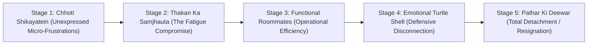

# Hum Ladte Nahi, Par Baat Nahi Karte
### A 4-Phase Framework for the Silent Indian Marriage
**Authored by Sanjay Shharma**
*M.Sc., MBA, APSCM (IIM Calcutta Alumni) • Author of The Care Collection*
*Published by Adorise Digital — A Division of Trendy DigiStore LLC, Wyoming, USA*

---

## Copyright Page

**Hum Ladte Nahi, Par Baat Nahi Karte**  
*A 4-Phase Framework for the Silent Indian Marriage*  
Copyright © 2026 by Sanjay Shharma. All rights reserved.

Published by Adorise Digital  
Trendy DigiStore LLC  
30 N Gould St, Ste R, Sheridan, WY 82801, USA

No part of this publication may be reproduced, distributed, or transmitted in any form or by any means, including photocopying, recording, or other electronic or mechanical methods, without the prior written permission of the publisher, except in the case of brief quotations embodied in critical reviews and certain other noncommercial uses permitted by copyright law.

**Disclaimer:** This book is based on personal observation, executive coaching frameworks, and cultural psychology. It is intended for educational and self-reflection purposes only. The author is not a licensed clinical psychologist or psychiatric medical practitioner. If your marriage involves domestic abuse, coercive control, untreated severe addiction, or clinical depression, please consult qualified professional healthcare providers immediately.

**Confidential Helplines (India):**
- iCall (TISS Psychosocial Helpline): +91 9152987821
- Vandrevala Foundation: +91 9999 666 555
- National Emergency Helpline for Women: 181
- NIMHANS Tele-MANAS Mental Health Helpline: 14416

---

## Dedication & Epigraph

> *"Ghar mein pyaar kam nahi tha.*  
> *Bas baatein khatam ho gayi thiin."*  
>  
> — Anonymized observation from over 200 Indian corporate living rooms.

*To the couples who never screamed, never threw dishes, and never made a scene—yet wake up every morning wondering when their best friend turned into a quiet roommate.*  
*This manual is your map home.*

---

## Author's Note: Kyun Likhi Gayi Yeh Kitaab?

Main koi family court ka lawyer nahi hoon, aur na hi koi TV par gyaan baantne wala guru. 

Pichhle teen dashakon mein—corporate executive leadership, healthcare coaching aur IIM Calcutta ke corporate networks ke dauran—maine hazaron parivaron ko bohot kareeb se dekha hai. Maine dekha hai ki kaise Bharat ke sabse padhe-likhe, sabse successful, aur sabse mehnati log apne career mein aage nikalte chale gaye, lekin unke gharon ke drawing room mein dheere-dheere ek ajeeb sa sannata jamta chala gaya.

Yeh woh log hain jinki shaadi bahar se bilkul "perfect" lagti hai:
- Bandhan bank ya HDFC ka home loan time pe jaa raha hai.
- Bacche shehar ke sabse acche international school mein hain.
- Diwali aur Eid par parivar ke saath matching kapdon mein photo social media par post hoti hai.
- Parivar aur samaj mein sab kehte hain, *"Inki jodi kitni shaant aur suljhi hui hai."*

Lekin darwaza band hone ke baad ki haqeeqat sirf un dono ko pata hoti hai. 

Shaam ko 8:30 baje dono ek hi three-seater sofe par baithe hain. Dono ke haath mein unka smartphone hai. Dono ki aankhon par screen ki neeli roshni chamak rahi hai. Aur pichhle teen ghanton mein dono ke beech sirf teen jumlein bole gaye hain:
1. *"Khana garam kar doon?"*
2. *"Kal subah doodh wale ko paise dene hain."*
3. *"Gaadi ki chaabi kahan rakhi hai?"*

Yeh nafrat nahi hai. Yeh koi teesra insaan nahi hai. Yeh ladai bhi nahi hai.  
**Yeh thakan hai.** 

Yeh woh thakan hai jo saalon tak bina kisi emotional renewal ke roz subah 6 baje se raat 11 baje tak responsibility ka bojh uthane se aati hai. Jab do insaan patni aur pati banne se pehle ek project management company ke do silent partners ban jaate hain, tab shaadi mein ladai band ho jaati hai—lekin baat bhi band ho jaati hai.

Western self-help kitabein kehti hain: *"Go on a weekend winery trip"* ya *"Communicate your attachment trauma."* Lekin Indian reality alag hai. Yahan drawing room mein saas-sasur baithe hain, WhatsApp family group par 40 rishtedaar judge kar rahe hain, monthly EMI ka stress hai, aur subah 6:30 baje bachhon ka tiffin pack karna hai.

Yeh kitaab kisi Western theory ka translation nahi hai. Yeh aapke ghar ki, aapki kitchen ki, aur aapke rishte ki sachhi Hinglish manual hai. 

Aap akele nahi hain. Aur aapka rishta khatam nahi hua hai—woh bas dhoop aur hawa na milne ki wajah se so gaya hai. Usko dobara jagane ke liye kisi tamashe ki zaroorat nahi hai. Sirf 30 din ka ek structured, gentle system chahiye.

Chaliye, shuru karte hain.

— **Sanjay Shharma**

---

# PART 1: DIAGNOSE (KHAMOSHI KI PEHCHAN)

---

## Chapter 1: The Roommate Marriage
*(Jab Ladai Band Ho Gayi, Par Baat Bhi Band Ho Gayi)*

Rohan aur Ananya ki shaadi ko gyarah saal ho chuke the. Rohan ek tech firm mein Vice President tha; Ananya ek private school mein senior educator thi. Gurgaon ke Phase 5 mein unka 3BHK flat tha. 

Agar aap unke doston se poochhte, toh woh kehte ki Rohan aur Ananya "ideal couple" hain. Gyarah saalon mein unhone kabhi kisi party mein ek doosre par awaz nahi uthayi thi. Unke beech kabhi koi public scene nahi hua tha. 

Lekin pichhle chaar saalon se, unki shaadi ek corporate logistics operation ban chuki thi.

Subah 6:15 par alarm bajta tha. Rohan gym jaata tha, Ananya kitchen mein bachhe ke breakfast aur lunchbox ki tayyari karti thi. 7:45 par school bus aati thi. 8:30 par dono apni-apni gaadiyon mein office nikalte the. Din bhar mein unke beech sirf chaar WhatsApp messages aate the:
- *“Sabzi le aana aate waqt.”*
- *“Geyser ka electrician aaya tha kya?”*
- *“Main aaj late hounga, 8:30 PM.”*
- *“OK.”*

Raat ko 9:30 baje dinner ke baad, dono bed par aate the. Dono ne din bhar ke kapde badal liye the. Rohan apne laptop par Q3 ke performance deck dekh raha hota tha, aur Ananya Instagram reels scroll kar rahi hoti thi. 

11:00 baje Rohan kehta tha: *"Main light band kar raha hoon."*  
Ananya kehti thi: *"Theek hai."*

Aur dono peeth modkar so jaate the. 

Beech mein na koi jhagda tha, na koi gaali-galoch, na koi taana. Lekin us chaar-by-chhe ke mattress par, dono ke beech ek poora samandar behta tha. Agar us raat kisi ne Rohan se poochha hota, *"Kya tum Ananya se pyaar karte ho?"*—toh Rohan thoda chaunk kar kehta, *"Haan, of course. Hum ladte thodi hain."*

Lekin agar koi poochhta, *"Aakhiri baar tum dono ne ek doosre ki aankhon mein dekh kar aisi baat kab ki thi jo ghar, EMI ya bachhe se judi hui na ho?"*—toh Rohan ko yaad karne mein paanch minute lag jaate. Aur shayad jawab milta: **"Pata nahi. Shaayad paanch saal pehle."**

### Silence Is Not Peace (Khamoshi Shanti Nahi Hoti)

Hindustan mein humne shaadi ki safalta ki definition hi galat seekhi hai. Hum sochte hain:
- Agar ghar mein cheekh-pukaar nahi hai, toh shaadi acchi hai.
- Agar koi bartan nahi toot raha hai, toh rishta mazboot hai.
- Agar divorce ki baat nahi ho rahi hai, toh sab theek hai.

Lekin psychology aur real-world relationships ka sach bilkul ulta hai:  
**Jhagda yeh dikhata hai ki rishte mein abhi bhi umeed zinda hai.** Jab koi jhagadta hai, toh woh aakhiri koshish kar raha hota hai yeh kehne ki—*"Mujhe suno! Mujhe tumhari zaroorat hai!"* 

Lekin jab jhagda band ho jaata hai aur uski jagah polite, mechanical khamoshi le leti hai, tab samajh lijiye ki rishta **"Emotional Hibernation"** mein chala gaya hai. 

Roommate marriage tab shuru hoti hai jab dono partner yeh faisla kar lete hain—bina ek lafz bole—ki:
1. *“Ab is baat ko chhedne ka koi fayda nahi hai.”*
2. *“Main jaisa hoon, waisa hi theek hoon. Tum apne raste raho, main apne raste.”*
3. *“Bachhon ke samne natak theek-thaak rehna chahiye.”*

### The Roommate Marriage Audit Checklist

Apne rishte ko sachhayi se jaanchne ke liye, niche diye gaye paanch sawalon ko dhyan se padhiye. Kisi ko jawab batane ki zaroorat nahi hai—sirf apne dil mein 'Haan' ya 'Na' kahiye:

1. **The Logistics Trap:** Kya pichhle ek hafte mein aapke beech hone wali 90% baatein sirf ghar, khana, bill, bachhe ya parivar ke baare mein theen?
2. **The Eye-Contact Deficit:** Din bhar mein kya aap dono 60 seconds ke liye bina phone ya TV ke ek doosre ki aankhon mein dekh kar muskurate hain?
3. **The Phone Shield:** Raat ko bistar par aate hi, kya aapka pehla reflex phone uthana hota hai taaki beech mein aane wali ajeeb si khamoshi ko bhara jaa sake?
4. **The Safe Zone Habit:** Kya aap dono aisi baatein chhedne se darte hain jo purani yaadon, sapnon ya feelings se judi hon, yeh soch kar ki *"bekaar mein mahol kharab hoga"*?
5. **The Missing Touch:** Kya aap dono ke beech touch sirf functional reh gaya hai (kisi cheez ko pakdate waqt haath chhu jaana), aur affection ya bina kisi demand ke gale lagana band ho chuka hai?

Agar aapne inme se teen ya teen se zyada sawalon par **'Haan'** kaha hai—toh aap Roommate Marriage ke phase mein hain. 

Dariye mat. Sharminda mat hoiye. Yeh Bharat ke lakhoon gharon ka sach hai. Aur sabse acchi baat yeh hai ki jahan se khamoshi shuru hui thi, wahin se dobara dosti shuru karne ka rasta bhi nikalta hai.

### Actionable Micro-Step for Tonight:
> **The 3-Minute Rule (No Agenda):**  
> Aaj raat bed par jaate waqt, dono apne phone ko drawing room ya side table par rakh dijiye. Ek doosre se koi shikayat mat kijiye. Sirf ek simple sawal poochhiye:  
> *"Aaj din bhar mein tumhare liye sabse thakane wala pal kaun sa tha?"*  
> Aur jawab sunte waqt koi solution mat dijiye. Sirf suniye aur kahiye: *"Samajh sakta/sakti hoon."*

---

## Chapter 2: The 5 Stages of Marital Drift
*(Dooriyon Ka Safar: Chhoti Shikayaton Se Pathar Banne Tak)*

Ek shaadi ek raat mein silent nahi banti. Do insaan ek jhatke mein anjaan nahi bante. 

Doori hamesha dhoop mein sukhte hue kapde ki tarah aati hai—dheere-dheere, baareek reshe-reshe se. Shuruat mein pata bhi nahi chalta ki rishte ki nami kahan gayab ho gayi. 

Saalon ke corporate observations aur psychological case studies ke baad, maine Indian marriages mein drift ke **5 Sequential Stages** ko document kiya hai:

### Stage 1: Unexpressed Micro-Frustrations (Chhoti Shikayatein Jo Dab Gayi)
Yeh pehla saal ya doosra saal hota hai. Chhoti-chhoti baatein hoti hain:
- Pati ne maa ke samne patni ki baat ka mazaak bana diya. Patni bura maan gayi, lekin mehfil mein chup rahi.
- Patni ne pati ke career stress ko samajhne ke bajaye keh diya: *"Aap hamesha late aate hain."* Pati ne socha: *"Isko meri mehnat ki kadar nahi hai."*

Dono ne socha: *"Chhoti si baat hai, chhod na. Issue banane ka kya fayda."* Lekin subconscious mind mein ek chhota sa register khul gaya. Har dabi hui baat ne us register mein ek tick mark laga diya.

### Stage 2: The Fatigue Compromise (Thakan Ka Samjhauta)
Shaadi ke 3 se 5 saal. Zindagi mein pehla bachha aata hai, ya EMI shuru hoti hai, ya dono ke career mein promotions ka pressure badhta hai.  
Energy ka level girta hai. Ab dono ke paas itni shakti nahi bachi hoti ki raat ko baith kar 45 minute tak kisi mudde par dhang se baat karein. 

Toh ek partner kehta hai: *"Theek hai, jo tum bolo."*  
Yeh samjhauta shanti ke liye nahi hota—yeh thakan ki wajah se hota hai. Lekin iska nuksan yeh hota hai ki dono ne sach bolna band kar diya.

### Stage 3: Functional Roommates (Operational Efficiency)
Shaadi ke 6 se 10 saal. Yahan shaadi ek high-efficiency factory ban jaati hai.
- Ghar ka ration aa raha hai.
- Bacche swimming class jaa rahe hain.
- Insurance premium on-time bhari jaa rahi hai.
- Diwali par gifts sahi samay par deliver ho rahe hain.

Lekin dono ke beech **"Romantic & Emotional Insolvency"** aa chuki hai. Dono ek doosre ke saare routine jaante hain, lekin ek doosre ke andar chal rahe darr aur akelepan se bilkul anjaan hain.

### Stage 4: The Emotional Turtle Shell (Kachhue Ka Shell)
Jab koi partner baar-baar koshish karke thak jaata hai ki saamne wala use samjhe, toh woh apne aangan mein simat jaata hai. Jaise kachhua kisi khatre ko dekh kar apne shell ke andar apna sar chhupa leta hai.

Agar patni kuch kehti hai, toh pati kehta hai: *"Haan theek hai, kar lena."*  
Agar pati kuch poochhta hai, toh patni kehti hai: *"Mujhe kya pata, aap dekh lo."*  
Ab koi umeed nahi bachi. Kisi ne aag lagane ki koshish nahi ki, lekin batti band kardi.

### Stage 5: Total Detachment (Pathar Ki Deewar)
Yeh aakhiri stage hai. Yahan aakar log kehte hain: *"Mujhe ab fark hi nahi padta."* 

Pehle jab partner late aata tha ya phone nahi uthata tha, toh gussa aata tha, bechaini hoti thi. Ab agar partner teen din ke liye out-of-town chala jaaye, toh doosre partner ko akelepan ke bajaye ek ajeeb sa **"Relief"** mehsoos hota hai. Yeh stage sabse dangerous hota hai, kyunki yahan aakar dard bhi khatam ho chuka hota hai.

### The Good News About Reversal
Har stage se wapas lauta jaa sakta hai. Stage 4 aur Stage 3 par baithe hue log agar ek sahi framework follow karein, toh 30 din ke andar unke rishte ki warmth dobara shuru ho sakti hai. 

Lekin uske liye pehla kadam yeh manna hai ki aap abhi kis stage par khade hain.

---

## Chapter 3: The Invisible Mental Load
*(Dikhne Wali Mehnat, Na-Dikhne Wala Bojh)*

Sunil aur Meera dono MNCs mein Directors the. Sunil Finance mein tha, Meera HR mein. Dono barabar kamate the. Sunil apne aap ko ek progressive, modern Indian pati maanta tha. Woh kehta tha: *"Main Meera ki bohot help karta hoon. Jab woh kehti hai, main sabzi le aata hoon. Main bachhon ko school chhod aata hoon."*

Lekin Meera har shaam ek ajeeb si chidchidahat aur thakan se bhari rehti thi. Sunil ko samajh nahi aata tha ki galti kahan ho rahi hai: *"Ghar mein cook hai, maid hai, driver hai. Main saare kaam mein help karne ko tayyar hoon. Phir bhi yeh hamesha stressed kyun rehti hai?"*

Sunil ko yeh samajh nahi aa raha tha ki:  
**Physical Labor (kaam karna) aur Mental Load (kaam ko yaad rakhna aur coordinate karna) mein zameen-aasmaan ka fark hota hai.**

### What Is Invisible Mental Load in an Indian Home?
Ghar chalana sirf jhaadu-pocha ya sabzi lana nahi hai. Ghar chalana ek 24/7 background operating system hai:
- *Doodh ka packet kab khatam hoga aur kal subah ke liye extra kab mangwana hai?*
- *Bachhe ke school ka sports day Thursday ko hai, toh white uniform Wednesday shaam tak dry-clean hokar aani chahiye.*
- *Sasurji ki diabetes ki dawai agle hafte khatam ho rahi hai, toh online 1mg se reorder kab karna hai?*
- *Devar ki shaadi mein mausi ko kaun si saree gift karni hai taaki woh naraz na hon?*
- *Cook ne bola hai ki masala khatam ho gaya hai, toh monthly grocery list kab banegi?*

Yeh saara data Indian gharon mein 95% waqt mahila ke dimaag mein background apps ki tarah chalta rehta hai. 

Jab pati kehta hai: *"Mujhe bata deti na, main kar deta"*—toh woh anjaane mein patni par ek aur bojh daal deta hai: **Manager banne ka bojh.**  
Patni ko lagta hai: *"Main pehle sochun, phir tumhe instruct karoon, phir follow up karoon ki kaam hua ya nahi—isse accha main khud hi kar loon!"*

Yeh unexpressed mental load dheere-dheere **Resentment (zehreeli kadvahat)** ban jaata hai. Aur jab raat ko pati pyaar ya intimacy ki umeed karta hai, toh patni ka dimaag 40 khuli hui tabs ke saath crash ho chuka hota hai.

### How to Dismantle the Invisible Load:
1. **Ownership vs. Helping:**  
   Pati ko 'Helper' nahi banna hai, 'Owner' banna hai. Agar bachhe ki school logistics aapki zimmedari hai, toh school group ke messages padhna, tiffin pack karwana, aur calendar maintain karna aapka kaam hai—patni ko reminder nahi dena padega.
2. **The Sunday 15-Minute Sync:**  
   Har Sunday shaam ko 15 minute ek notebook lekar baithiye. Agle 7 din ke 5 bade logistical tasks ko aapas mein divide kijiye aur likh lijiye. Ek baar task likh gaya, toh doosra partner uske baare mein sochna band kar dega.

---

## Chapter 4: The Emotional Turtle Shell
*(Kachhue Ka Shell: Kyun Ek Partner Apne Aangan Mein Simat Jaata Hai)*

Jab ek aadmi ya aurat saalon tak mehsos karta hai ki uske jazbaaton ki kadar nahi hai, toh woh do tarah se react karta hai:
- Kuch log **Loud** ho jaate hain (chillana, taane marna, blame karna).
- Lekin 70% urban Indian mard aur auratein **Silent** ho jaati hain.

Is silent response ko hum kehte hain: **The Turtle Shell Strategy.**

Kachhua jab dekhta hai ki bahar mahol safe nahi hai, toh woh ladne nahi jaata. Woh chupchap apne haath, pair aur gardan ko apne motey, pathrile shell ke andar kheench leta hai. Bahar se aap uspe danda maariyo ya patthar, use koi chot nahi lagti. 

Lekin iski keemat yeh hoti hai ki woh dhoop, hawa aur pyaar se bhi mehroom ho jaata hai.

### Why Men Retreat into the Shell:
Indian mardon ko bachpan se ek hi training milti hai: *"Mardon ko rona nahi chahiye. Mardon ka kaam hai provide karna aur problem solve karna."*  
Jab ghar mein patni apni koi emotional thakan share karti hai, toh mard ka dimag turant 'Fixer Mode' mein chala jaata hai: *"Toh maid badal do. Tum itna stress kyun leti ho? Maa ki baat ka bura mat maana karo."*

Jab patni kehti hai: *"Aap mujhe samajhte hi nahi!"*—toh mard ko lagta hai ki woh fail ho gaya. Uske andar shame aur inadequacy aati hai. Aur us shame se bachne ke liye, woh apne study room, TV remote, office laptop ya silence ke shell mein chala jaata hai.

### Why Women Retreat into the Shell:
Indian aurat shuruati saalon mein bohot bolti hai. Woh explain karti hai, woh gussa hoti hai, woh ro kar baat karti hai. Lekin jab har baar uske jazbaaton ko *"Tum hamesha overreact karti ho"* ya *"Tumhare nakhre hi khatam nahi hote"* keh kar dismiss kar diya jaata hai—toh ek din woh achanak shant ho jaati hai.

Yeh shanti gusse ki shanti nahi hoti. Yeh **"Resignation"** ki shanti hoti hai.  
Usne decide kar liya hota hai: *"Inse keh kar koi fayda nahi hai. Meri feelings meri hain. Main apna khayal khud rakh lungi."*

### Breaking the Shell Without Breaking the Partner:
Kachhue ko shell se bahar nikalne ke liye patthar se shell todne ki koshish mat kijiye. Jitna zor se aap shell par prahaar karenge, kachhua utna hi gehra andar ghusega.

Kachhua sirf ek hi condition mein bahar nikalta hai:  
**Jab bahar ka taapman garam ho, mahol shant ho, aur use yakeen ho jaaye ki bahar koi shikaari nahi khada hai.**

Agla part (Phase 2 & Phase 3) aapko sikhayega ki kaise us mahol ko step-by-step safe banaya jaaye taaki dono partner bina darr ke apne shell se bahar aa sakein.
