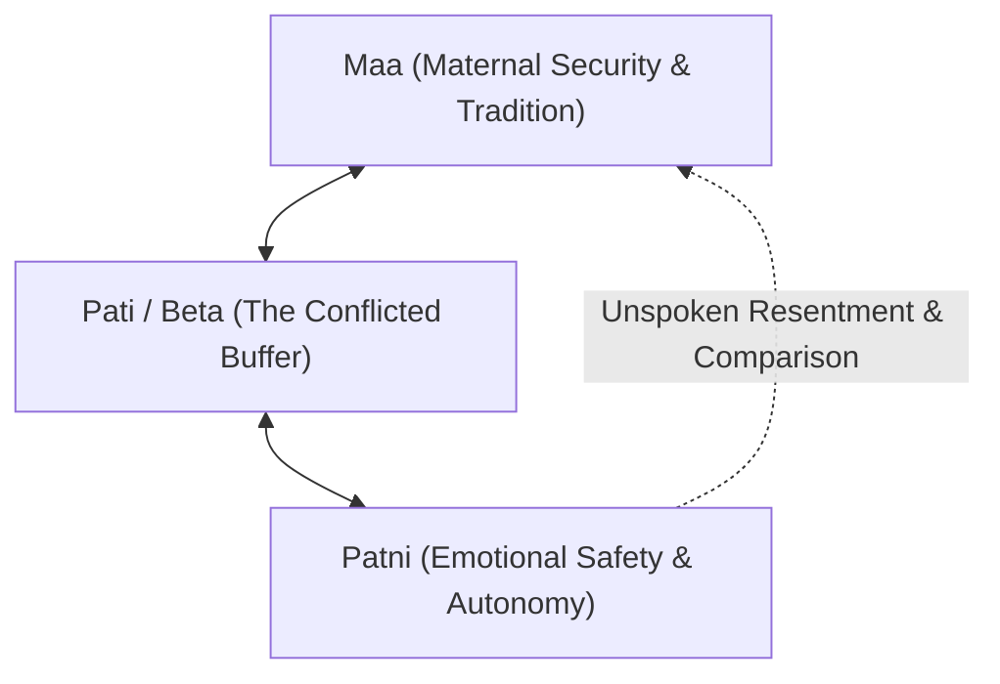
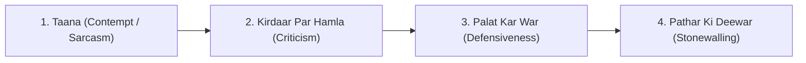

# PART 2: DECODE (GHAR KI SIYASAT AUR AWAZON KA SACH)

---

## Chapter 5: In-laws, Joint Family & The WhatsApp Group Dynamic
*(Sasural, Mayka, aur WhatsApp Family Politics)*

Hindustan mein do insaano ki shaadi nahi hoti—do parivaron ka merger hota hai. 

Western psychology books kehti hain: *"Set boundaries with your parents and live your independent nuclear life."* Lekin yeh advice Mumbai ke Andheri ke 2BHK flat ya Bangalore ke gated community mein rehne wale Indian couple par fit nahi baithti. 

Yahan agar aap keh dein ki *"Mummy ji, humein privacy chahiye"*, toh agle 15 minute mein teen mausi, do chacha, aur doosre shehar mein baithe buaji ke paas phone pahunch jaata hai ki *"Bahu ne parivar todne ka plan bana liya hai"* ya *"Beta badal gaya hai, haath se nikal gaya."*

Indian context mein shaadi ke drawing room mein hamesha chaar adrushya (invisible) log aur baithe hote hain:
1. Pati ke mata-pita aur unki aashayein (expectations).
2. Patni ke mata-pita aur unki chintayein (anxieties).
3. Samajik "log kya kahenge" ka constant pressure.
4. Aur sabse naya mehmaan: **Family WhatsApp Group.**

### The Triad Trap: The Mother-Son-Wife Triangle

Indian culture mein maa aur bete ka rishta bohot emotional aur protective hota hai. Saalon tak maa ne bete ke liye tiffin banaya, uske kapde dhoye, uski bimaari mein raat bhar jaagi. 

Jab shaadi hoti hai, toh maa ke subconscious mind mein ek darr baith jaata hai: *"Kahin meri jagah koi aur toh nahi le lega? Kahin mera beta mujhe bhool toh nahi jaayega?"*

Aur doosri taraf ek naye parivar mein aayi ladki hoti hai, jisne apna bachpan ka ghar, apne mata-pita, aur apna aaram chhod kar naye ghar ke rules aur rasmo-riwaaj apnaye hote hain. Use umeed hoti hai ki uska pati uska sabse bada sahara banega.

Lekin jab drawing room mein koi anban hoti hai—jaise khane mein namak, bachhe ki parvarish, ya weekend par kahan jaana hai—toh mard dono ke beech ek trapped referee ki tarah khada ho jaata hai.

Zyadatar Indian mard is situation mein do galat raste chunte hain:
1. **The Dismissive Boy:** Maa ke samne chup rehte hain aur baad mein bedroom mein band hokar patni se kehte hain: *"Maa toh aisi hi hain, unki umar ho gayi hai. Tum thoda adjust nahi kar sakti?"* Isse patni ko lagta hai ki is ghar mein uska koi wajood nahi hai, woh akeli hai.
2. **The Aggressive Defender:** Maa par chillane lagte hain: *"Aap har baat mein interfere mat kiya kijiye!"* Isse maa rone lagti hai, aur patni par "parivar todne wali" ka thappa lag jaata hai.

### The Solution: The "Air-Traffic Controller" Protocol

Rishte ko bachane ke liye ek golden rule hai jise hum **Primary Shielding Principle** kehte hain:

> **Rule:** *Apne parivar ki boundary aap khud sambhaliye. Apne partner ko bullet jhelne ke liye aage mat kijiye.*

- **Agar Pati ke maa-baap hain:** Toh pati ki zimmedari hai ki woh akele mein, aadar ke saath, apni maa ko samjhaye: *"Mummy, humne yeh decide kiya hai. Yeh mera faisla hai, Ananya ka nahi."* Kabhi patni ke kandhe par bandook rakh kar goli mat chalaiye.
- **Agar Patni ke maa-baap hain:** Toh patni ki zimmedari hai ki woh apne mayke mein boundary banaye: *"Mummy, hum dono aapas mein dekh lenge, aap chinta mat kijiye."* Apne pati ki kamzoriyon ko mayke mein roz phone par broadcast mat kijiye.

### The Family WhatsApp Group Danger

Aaj ke zamane mein shaadiyon mein 30% dooriyan WhatsApp groups ki wajah se aa rahi hain:
- Subah 6:00 baje aane wale sanskari gyaan aur *"Bahu ka kartavya"* wale forwarded status.
- Parivar ke kisi function mein kaun aaya, kisne kya pehna, kisne kiske pair chhue—iski baareek microscopic scrutiny.
- Chhote-mote taano ko emoji ke parde ke peeche chupana.

**The Golden WhatsApp Rule for Couples:**  
Family group mein jo kuch bhi ho, bed par aane se pehle uska screenshot lekar aapas mein ek doosre par taana mat mariye. Ek doosre se promise kijiye: **"Ghar ki deewar ke andar ki baatein bahar nahi jayengi, aur WhatsApp group ka zeher hamare bedroom ke andar nahi aayega."**

---

## Chapter 6: The 4 Horsemen of Indian Marriages
*(Taane, Chhote Mazaak, Defensiveness, aur Pathar Ki Khamoshi)*

Dr. John Gottman ne 40 saalon ke research ke baad chaar aise toxic behaviors pehchane the jo kisi bhi shaadi ko khatam kar sakte hain. Jab hum inko Indian living room aur Indian bhasha mein translate karte hain, toh yeh chaar cheezein nikal kar aati hain:

### 1. Taana (Contempt & Sarcasm)
Hindustan mein taana marna ek art form maana jaata hai. Log seedha gussa nahi nikalte, balki meethi aawaz mein zehreeli baat kehte hain:
- *"Arre bhai, bade log hain, inke paas hum jaison ke liye kahan time hoga."*
- *"Tumhare mayke mein toh sab aise hi ameer hain na, humari aukaat kahan."*
- *"Lagta hai aaj suraj pashchim se nikla hai jo tumne bachhe ka homework dekh liya."*

**Taana pyaar ka sabse bada kaatil hai.** Taane ka matlab hota hai: *"Main tumse behtar hoon, aur tum meri nazar mein chhote ho."* Research dikhati hai ki jin rishton mein roz taane chalte hain, wahan logon ka immune system kamzor ho jaata hai aur physical illness badh jaati hai.

### 2. Kirdaar Par Hamla (Criticism vs. Complaint)
Complaint ek specific harkat ke baare mein hoti hai. Criticism insaan ke poore wajood aur kirdaar par hamla hota hai:
- **Complaint (Healthy):** *"Kal raat tumne geyser off nahi kiya, mujhe chinta ho rahi thi safety ki."*
- **Criticism (Toxic):** *"Tum ho hi careless! Tumhein kisi cheez ki chinta hi nahi rehti. Pata nahi tumhara dimaag kahan rehta hai!"*

Jab aap "Tum hamesha..." ya "Tum kabhi nahi..." jaise shabdon ka istemal karte hain, toh saamne wala apni galti theek karne ke bajaye apne defensive bunker mein ghus jaata hai.

### 3. Palat Kar War (Defensiveness)
Jab ek partner koi takleef share karta hai, toh doosra partner us baat ko sunne aur samajhne ke bajaye pichhle teen saal purana hisaab nikal kar saamne rakh deta hai:
- Patni: *"Aap pichhle teen weekend se office ka kaam kar rahe hain, hum bahar nahi gaye."*
- Pati (Defensive): *"Aur tum jo pichhle hafte apni behen ke ghar gayi theen teen din ke liye? Tab toh maine kuch nahi bola! Main yahan kiske liye mehnat kar raha hoon?"*

Defensiveness ka matlab hai: *"Galti meri nahi ho sakti, tumhi galat ho."* Isse baat mudde se hatkar purani files kholne par chali jaati hai.

### 4. Pathar Ki Deewar (Stonewalling)
Yeh silent Indian marriage ka sabse aam hathiyar hai. 

Jab ghar mein koi charcha shuru hoti hai, toh ek partner bilkul sunn ho jaata hai. Aankhein jhuka leta hai, phone scroll karne lagta hai, ya uth kar doosre kamre mein chala jaata hai aur ghanton darwaza band kar leta hai. 

Saamne wale ko lagta hai ki woh deewar se baat kar raha hai. Yeh rejection kisi thappad se kam nahi lagta.

### The Antidote Table (Kismein Badalna Hai)

| Toxic Horseman | Desi Example | The Healthy Antidote (Kya Bolna Hai) |
| :--- | :--- | :--- |
| **Taana (Contempt)** | *"Bade sahab ko time mil gaya!"* | *"Mujhe tumhari yaad aa rahi thi. Aao 10 minute chai peete hain."* |
| **Kirdaar Par Hamla (Criticism)** | *"Tum hamesha laparwah ho!"* | *"Jab light on reh jaati hai toh mujhe stress hota hai, please check kar liya karo."* |
| **Palat Kar War (Defensiveness)** | *"Maine kiya toh kya, tumne bhi toh kiya tha!"* | *"Haan, main samajh sakta hoon ki meri wajah se tumhein bura laga. Main dhyan rakhunga."* |
| **Pathar Ki Deewar (Stonewalling)** | Room se nikal jaana, phone mein ghus jaana | *"Main abhi thoda overwhelmed mehsoos kar raha hoon. Mujhe 20 minute do shant hone ke liye, phir baat karte hain."* |
