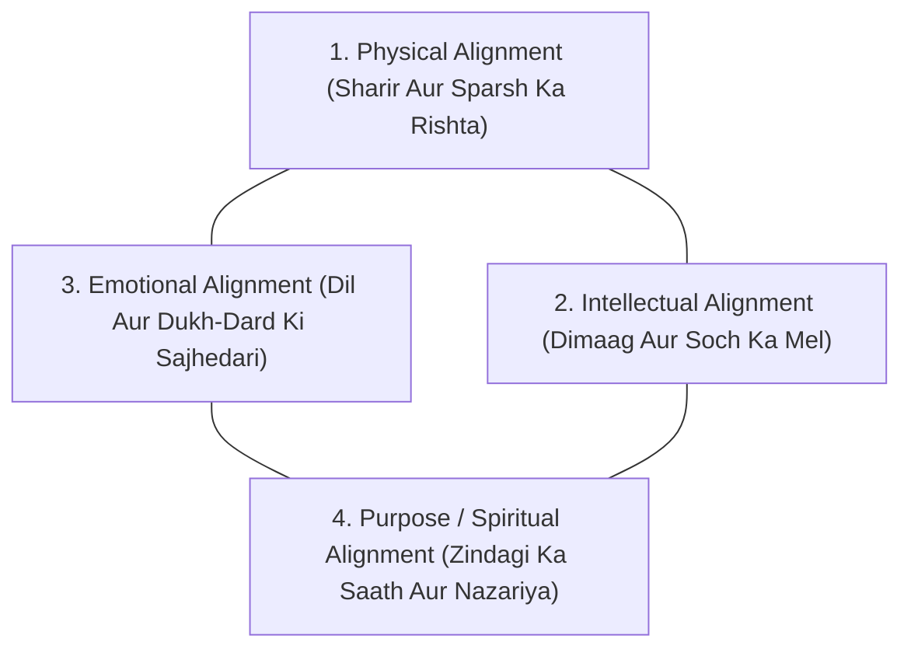
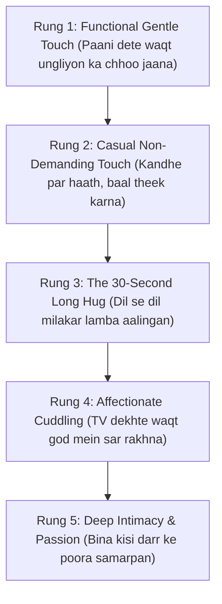

# PART 3: REPAIR (THE 30-DAY RECONNECTION PROTOCOL)

---

## Chapter 7: The 4 Engines of Marriage
*(Chaaron Pahiye: Kahan Atki Hai Gaadi?)*

Ek purani kahawat hai ki shaadi ek gaadi ki tarah hoti hai jismein chaar pahiye hote hain. Agar teen pahiye bilkul naye hon lekin ek pahiya puncture ho jaaye, toh gaadi aage nahi badhegi—woh ghisat-ghisat kar chalegi aur aakhirkaar rukh jaayegi.

Indian couples aksar sochte hain: *"Humare paas ghar hai, gaadi hai, bachhe acche school mein hain, hum ek doosre ko dhokha nahi de rahe—phir bhi khushi kyun nahi hai?"*

Kyunki unke charon pahiye balance mein nahi hain. Aaiye in **4 Engines of Marital Alignment** ko samajhte hain:

### Engine 1: Physical Alignment (Touch & Physical Presence)
Physical intimacy sirf bed ke andar physical sambandh banana nahi hai. Iski shuruat subah ki chai ke waqt kandhe par haath rakhne se hoti hai. 
Jab shaadi mein "Non-Demanding Touch" (bina kisi expectation ke gale lagana, haath pakadna, sar par haath pherna) band ho jaata hai, toh physical engine choke ho jaata hai. Partner ko lagta hai ki touch sirf tabhi hota hai jab physical favour chahiye, warna hum anjaan hain.

### Engine 2: Intellectual Alignment (Dimaag Aur Soch Ka Mel)
Jab aapki nayi-nayi shaadi hui thi ya courtship thi, tab aap ghanton baatein karte the: *"Tumhe kaun si kitaab pasand hai? Tumhara career dream kya hai? Desh ki politics par tumhari kya rai hai?"*  
Dheere-dheere yeh saari baatein khatam ho gayi aur bachi sirf: *"Gas cylinder deliver hua kya?"*  
Intellectual alignment ka matlab hai ek doosre ke dimaag ki respect karna aur duniya ke muddo par bina jhagde ke charcha karna.

### Engine 3: Emotional Alignment (Dil Aur Dukh-Dard Ki Sajhedari)
Yeh shaadi ka sabse naazuk engine hai. Emotional alignment ka matlab hai:
- Kya aap apne partner ke samne ro sakte hain bina is darr ke ki woh aapko kamzor samjhega?
- Kya aap apni sabse badi insecurity share kar sakte hain bina is darr ke ki kal kisi ladai mein woh is baat ko aapke khilaf hathiyar banayega?

Agar aapko apne dukh batane ke liye kisi school ke dost ya WhatsApp par purane friend ke paas jaana padta hai, toh aapka emotional engine kharab ho chuka hai.

### Engine 4: Purpose & Spiritual Alignment (Zindagi Ka Nazariya)
Aap dono milkar kahan jaa rahe hain? Agle 10 saal baad aapki zindagi kaisi dikhegi? 
Sirf EMI chukana zindagi ka maqsad nahi ho sakta. Jab dono milkar kisi nek kaam, bachhon ke mulya (values), ya ek joint vision par kaam karte hain, toh rishte mein ek gehra thehrav aata hai.

---

## Chapter 8: The 5 Micro-Conversations
*(Rozana 10 Minute Ki Baat-Cheet Jo Rishte Ko Zinda Rakhti Hai)*

Humein lagta hai ki rishte ko theek karne ke liye Maldives ki 7 din ki chhutti par jaana padega ya koi mehenga dinner plan karna padega. 

Lekin sach yeh hai: **Badi chhuttiyan rishta nahi bachatiin; rozana ke 5 micro-conversations rishta bachate hain.**

Agar aap rozana yeh 5 micro-conversations shuru kar dein, toh mahine bhar mein aapke ghar ka mahol badal jaayega:

### 1. The Morning Soft-Start (Subah Ka 60-Second Check-in)
Subah aankh khulte hi pehla jumla kisi instruction ya shikayat ka mat boliye (*"Alarm band karo, doodh wala aa gaya"*).  
Sirf 60 seconds ke liye aankhein milaiye aur kahiye:  
> *"Good morning. Aaj ka din tumhare liye kaisa rehne wala hai? Koi tough meeting hai kya?"*  
Yeh ek line partner ko batati hai ki aaj din bhar woh aapke dimaag mein akela nahi hai.

### 2. The Mid-Day Anchor Ping (Dopahar Ka Ek Message)
Dopahar 1:30 se 2:30 ke beech, bina kisi grocery list ya delivery instruction ke, ek chhota sa text bhejiye:  
> *"Bas aise hi yaad aayi. Khana kha liya? Take care."*  
Bas itna. Koi reply ki demand nahi, koi call nahi. Yeh message ek digital hug ki tarah kaam karta hai.

### 3. The Unloading Zone (Shaam Ko Ghar Aane Ke Pehle 10 Minute)
Jab dono shaam ko kaam se ghar aate hain ya laptop band karte hain, toh dimag par din bhar ka cortisol (stress hormone) chadh chuka hota hai.  
Is waqt aapas mein aate hi koi problem mat discuss kijiye. Dono ko 15 minute ka "Decompression Window" dijiye—muh haath dhone dijiye, ek cup paani ya chai peene dijiye.  
Uske baad poochhiye:  
> *"Aaj office mein sabse zyada kis baat par gussa ya thakan aayi?"*  
Aur suniye. Advice mat dijiye. Sirf suniye.

### 4. The Gratitude Ping (Ek Chhoti Tareef)
Indian shaadiyon mein hum sabse badi galti yeh karte hain ki hum har cheez ko "taken for granted" maan lete hain: *"Khana toh patni banayegi hi, salary toh pati layega hi."*  
Din mein ek baar ek aisi cheez notice kijiye jo partner ne ki ho aur shabdon mein kahiye:  
> *"Aaj jo tumne mummy se aaram se baat ki thi, mujhe bohot accha laga."* ya *"Subah baarish mein auto arrange karne ke liye thank you."*  
Tareef oxygen ki tarah hoti hai—jab nahi milti tabhi pata chalta hai ki dam ghut raha tha.

### 5. The Bedtime Pillow Check (Sone Se Pehle Ki Shanti)
Phone side mein rakh kar sirf 2 minute:  
> *"Aaj din bhar mein humare beech sab theek tha? Koi baat aisi toh nahi jo dabi reh gayi ho?"*  
Agar partner kahe ki sab theek hai, toh muskura kar so jaiye. Agar koi chhoti baat ho, toh use pyaar se sun lijiye taaki kal subah ka suraj purani kadvahat ke bina nikle.

---

## Chapter 9: The Weekly Ritual
*(Chai, Evening Walks, aur Date Nights Bina Guilt Ke)*

Indian parivar mein jab ek shaadishuda joda akele bahar jaata hai, toh unke andar ek anjana guilt hota hai:  
- *"Mummy-ji ghar par akele hain, unko kaisa lagega?"*  
- *"Bachhe ko maid ke bharose chhod kar jaana sahi hai kya?"*  
- *"Faltu mein 3000 rupaye restaurant mein udayenge, isse accha ghar par hi Swiggy mangwa lete hain."*

Lekin yaad rakhiye: **Bachhon ke liye sabse bada gift yeh nahi hai ki aap unhe har khilona dilaayein; bachhon ke liye sabse bada security blanket yeh hota hai ki unke maa-baap ek doosre se pyaar karte hain aur khush hain.**

Agar aapka rishta sukhega, toh poore ghar ki chhat kamzor hogi. Isliye weekly ritual koi aiyashi (luxury) nahi hai—yeh preventive maintenance hai.

### The 3 Rules of the Desi Date Night:

1. **No Child Logistics Talk:**  
   Bahar jaakar bachhe ke maths ke marks, school bus ka driver, ya tuition ki fees par charcha nahi hogi. Yeh rule sakhti se lagu kijiye. Agar koi yeh baat shuru kare, toh doosra partner hasste hue code word bolega: *"Red Card!"*
2. **No In-law Debates:**  
   Kiski behan ne shaadi mein kya pehna tha ya kiske bhai ne zameen ke maamle mein kya bola, ispar date night par baat band.
3. **Dream & Reminisce Only:**  
   Purani yaadein taaza kijiye (*"Yaad hai jab hum pehli baar Manali gaye the aur gaadi puncture ho gayi thi?"*) ya aage ke sapne discuss kijiye (*"Agar humein agle saal ek nayi jagah explore karni ho, toh kahan chalenge?"*).

### Low-Cost High-Impact Desi Rituals:
- **The Saturday Night 11:30 PM Chai:** Jab parivar aur bachhe so jaate hain, tab balcony ya terrace par 2 cup adrak wali chai lekar 20 minute shanti se baithiye. Taare dekhiye aur dheemi aawaz mein baat kijiye.
- **The Sunday Morning 30-Minute Walk:** Park mein dono haath mein haath daal kar chaliye. Walk par earphones lagana mana hai.

---

## Chapter 10: The Touch Ladder
*(Bina Demand Ka Touch: Safe Non-Sexual Affection Se Intimacy Tak)*

Jab kisi shaadi mein saalon ka sannata aur thakan aa jaati hai, toh physical intimacy sabse pehle khatam hoti hai. Aur agar physical relation banta bhi hai, toh woh bohot robotic, awkward aur guilt-ridden ho jaata hai.

Kyunki seedha step 10 par chhalang lagane ki koshish ki jaati hai. 

Agar do mahine se aapas mein dosti nahi hai, aur achanak raat ko ek partner physical intimacy chahta hai, toh doosre partner ko lagta hai ki uska istemal ho raha hai. Woh aur zyada sikud jaata hai.

Is doori ko mitane ke liye hum **The 5-Rung Touch Ladder (Sparsh Ki Seedhi)** ka istemal karte hain:

### Rung 1 & 2: Non-Demanding Physical Reassurance
Pehle hafte mein kisi intimate relation ki baat bilkul mat kijiye. Sirf din bhar mein 3 se 4 baar chhota sa warm touch dijiye:
- Kitchen mein paani peene jaate waqt partner ki peeth par dheere se haath pherna.
- Sofa par baithte waqt unke ghutne par do second ke liye haath rakhna.
- Bed par aate waqt unke mathe par chhota sa kiss karna bina aage badhe.

Isse partner ke dimaag ko yeh signal milta hai: *"Yeh touch safe hai. Iske peeche koi hidden transaction nahi hai."*

### Rung 3: The 30-Second Hug (Oxytocin Release)
Medical science kehti hai ki jab do insaan 20 se 30 seconds tak ek doosre ko seene se lagate hain, toh unke sharir mein **Oxytocin** (the bonding & trust hormone) release hota hai aur stress hormone Cortisol tezi se girta hai.

Roz shaam ko bina kuch bole 30 seconds ke liye ek doosre ko gale lagaiye. Saans lijiye. Ek doosre ki heartbeat ko mehsoos kijiye. Yeh 30 seconds saalon ki thakan ko mita dete hain.

---

## Chapter 11: The 4-Part Clean Apology
*(Bina "Lekin" Aur "Tumne Bhi Kiya Tha" Ke Maafi Mangna)*

Hindustan mein maafi mangna sabse mushkil kaam maana jaata hai. Humein lagta hai ki maafi mangne se humari izzat chali jaayegi, ya saamne wala humare sar par chadh kar baithega.

Aur agar koi maafi mangta bhi hai, toh aisi mangta hai jo maafi kam aur taana zyada lagti hai:
- *"Chalo theek hai, sorry bol diya na, ab baat ko badhana band karo."* (Dismissive)
- *"I am sorry, LEKIN tumne jo bola tha pehle uski wajah se mujhe gussa aaya tha."* (Defensive blame-shift)
- *"Agar tumhe bura laga toh sorry."* (Conditional—apni galti nahi maani, saamne wale ki oversensitivity par daal diya)

### The 4-Part Clean Formula:

Asli aur pavitra maafi ke chaar hisse hote hain:

1. **Clear Admission (Bina 'Lekin' ke galti maanna):**  
   *"Maine jo kal tumhare mummy ke samne aawaz uthayi thi, woh meri galti thi."*
2. **Impact Validation (Saamne wale ke dard ko samajhna):**  
   *"Main samajh sakta/sakti hoon ki sabke samne tumhe kitni sharmindgi aur dukh mehsoos hua hoga."*
3. **No Justification (Koi bahaana na banana):**  
   *"Mera office ka stress tha, lekin uska yeh matlab nahi ki main tum par chillaoon. Mera behavior bilkul galat tha."*
4. **Restitution & Future Action (Aage sudhaar ka wada):**  
   *"Main aage se dhyan rakhunga. Agar mujhe gussa aaye toh main kamre se bahar chala jaunga, par tum par aawaz nahi uthaunga. Kya tum mujhe maaf kar sakti/sakte ho?"*

Jab aap is tarah se maafi mangte hain, toh saamne wale ke dil ka saara gussa pighal jaata hai. Maafi kamzori nahi, sabse bade aatmavishwas ki nishani hai.

---

## Chapter 12: How to Fight Cleanly
*(Jhagadna Seekho: Mudde Par Ladna, Insaan Ko Zaleel Kiye Bina)*

Jhagda na hona shaadi ki kamyabi nahi hai; **dhang se jhagadna aana** shaadi ki kamyabi hai.

Jo jode yeh sochte hain ki woh kabhi nahi ladenge, woh asal mein zeher ko apne andar daba rahe hote hain. Ek na ek din woh pressure cooker fat padta hai. Isliye jhagde se mat dariye—bas jhagadte waqt rule book follow kijiye.

### The 5 Golden Rules of Clean Fighting:

1. **One Topic at a Time (Purani files band rakhein):**  
   Agar baat aaj ki late aane par ho rahi hai, toh 2021 mein Diwali par kya hua tha, woh topic beech mein nahi aayega. Ek waqt mein sirf ek mudda.
2. **No Character Assassination (Insaan ko mat kosiyo):**  
   *"Tum badtameez ho"* mat boliye. Kahiye: *"Tumhari is baat se mujhe takleef hui."*
3. **The 20-Minute Pause Rule (Heart Rate Trigger):**  
   Agar kisi jhagde mein aapka heart rate 100 beats per minute se upar chala jaaye, toh aapka rational brain (prefrontal cortex) switch off ho jaata hai aur reptile brain active ho jaata hai. Is waqt aap sirf nuksan pahunchayenge.  
   Turant kahiye: *"Main abhi bohot gusse mein hoon. Hum 20 minute baad ispar baat karenge."* 20 minute tehal kar aaiye, thanda paani pijiye, phir baat shuru kijiye.
4. **Never Fight In Front of Children or Parents:**  
   Bachhon ke samne ladne se unke dimaag mein lifelong anxiety baith jaati hai. Aur maa-baap ke samne ladne se teesre log involve ho jaate hain aur mudda kabhi solve nahi hota.
5. **No Threat of Separation (Divorce ya Chhodne Ki Dhamki Mana Hai):**  
   Gusse mein kabhi yeh mat boliye: *"Mujhe tumhare saath rehna hi nahi hai!"* ya *"Chalo family court chalte hain!"*  
   Yeh dhamki rishte ki neev hila deti hai. Jhagda kitna bhi bada ho, neev par hathoda mat chalaiye.
