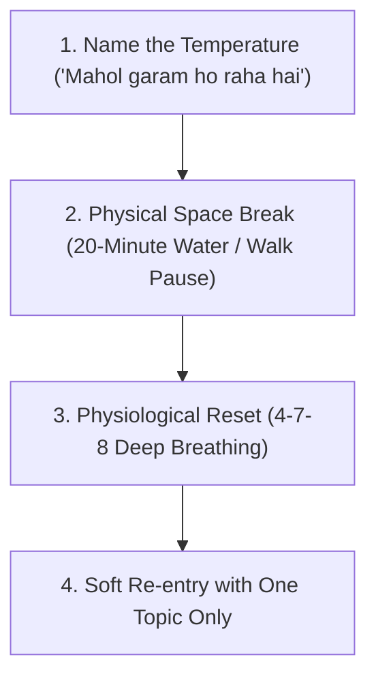

# PART 4: FUTURE-PROOF (AAGE KA SAFAR AUR MAZBOOT RISHTA)

---

## Chapter 13: The Sandwich Generation Dilemma
*(Maa-Baap Ki Dekhbhal, Bachhon Ki Parvarish, Aur Aapas Ka Pyaar)*

Agar aapki umar 35 se 52 saal ke beech hai, toh aap Bharat ki sabse zyada stressed generation ka hissa hain—jise hum kehte hain: **The Sandwich Generation.**

Aap ek aise sandwich ki tarah hain jo dono taraf se dab raha hai:
- Upar se buzurug maa-baap aur sasur-saas ki bimaariyan, doctor ke appointments, unka akelepan aur unki emotional demands.
- Neeche se bachhon ke board exams, competitive entrance test coaching, screen addiction aur teenage mood swings.
- Aur beech mein aapka apna corporate career, EMI, aur health.

Is sandwich mein jo cheez sabse pehle pichti hai aur gayab ho jaati hai, woh hai: **Aapka aur aapke partner ka aapas ka rishta.**

Aap subah uthte hain sasurji ki BP ki dawai check karne ke liye, phir bachhe ko coaching drop karte hain, phir 10 ghante office mein clients ki galiyan sunte hain, phir aakar maa ji ke ghutne ka dard sunte hain. Raat ko jab aap dono bed par aate hain, toh aap dono ke andar kisi insaan ko pyaar dene ki 1% bhi urja (energy) nahi bachi hoti.

### How to Protect Your Marriage in the Sandwich Phase:

1. **You Are a Team, Not Opponents:**  
   Jab ghar mein bimari ya stress aaye, toh aksar jode ek doosre par jhunjhlaane lagte hain: *"Tumhare papa ko maine bola tha thanda paani mat piyo, ab khansi ho gayi na!"* ya *"Tumhare bete ne marks dekhe hain? Tumhara dhyan hi nahi rehta!"*  
   Yaad rakhiye: Bimari aur stress dushman hain, aapka partner dushman nahi hai. Ek doosre ka haath pakadiye aur kahiye: *"Situation mushkil hai, par hum dono milkar isko paar karenge."*
2. **Scheduled Respite (Saans Lene Ka Waqt):**  
   Mahine mein ek baar, 4 ghante ke liye, sab kuch kisi trusted relative, professional caregiver ya daycare ko sonp kar sirf do ghante ke liye akele kisi coffee shop mein baithiye. Bina guilt ke.
3. **Praise Each Other’s Sacrifices:**  
   Jab aapka partner aapke maa-baap ke liye kuch karta hai, toh use silently assume mat kijiye. Akele mein unka shukriya adaa kijiye: *"Pata hai aaj papa ko hospital le jaana kitna mushkil tha, thank you so much tumne sambhal liya."* Yeh ek jumla saari thakan door kar deta hai.

---

## Chapter 14: The 10-Year Vision
*(Sath Budhe Hone Ka Roadmap: Logistics Se Dobara Saathi Banna)*

Ek din aayega jab bachhe bade hokar college nikal jayenge. Unka apna career hoga, unka apna parivar hoga.  
Ek din aayega jab mata-pita ki chhat bhi chhut jayegi.  
Ek din aayega jab office ki emails aur corporate designations bhi band ho jayengi.

Us din, jab ghar ka shor-sharaba shant ho jayega, toh us drawing room mein sirf do log bachenge: **Aap aur aapka partner.**

Agar aapne pichhle 20 saalon mein sirf "bachhe aur EMI" ke dhaage se khud ko baandh kar rakha tha, toh us din aap ek doosre ke samne bilkul anjaan ban kar khade honge. Hindustan mein 55 saal ke baad hone wale akelepan aur depression ki sabse badi wajah yahi hai.

Isliye aaj hi, isi waqt se, agle 10 saal ka ek joint vision banaiye.

### The 3 Anchor Questions for the Next Decade:

1. **Financial Freedom & Space:**  
   Hum kab tak rat-race mein daudenge? Kis umar ke baad hum aisi zindagi jeena chahte hain jahan roz ka bhag-daud na ho?
2. **Shared Passions (Sajha Shauk):**  
   Aap dono milkar aisi kaun si cheez enjoy karte hain jismein koi teesra involve na ho? Baghbani (gardening), purane gaane sunna, road trips, ya koi social work? Ek aisi cheez dhoondhiye jo sirf aap dono ki ho.
3. **The Final Pact:**  
   Yeh faisla kijiye ki chahe zindagi kitne bhi mod le, hum ek doosre ke dost ban kar rahenge. 

Jawani mein shaadi passion aur aakarshan se chalti hai; madhyam umar mein shaadi zimmedari aur partnership se chalti hai; aur budhape mein shaadi sirf aur sirf **Gehri Dosti aur Shanti** se chalti hai.

Us dosti ki buniyaad aaj se hi rakhni padegi.

---

# BONUS TOOLKITS & ACTION TEMPLATES

---

## Toolkit 1: The 30-Day Reconnection Daily Tracker

Apne fridge par ya bedroom ke side table par is tracker ko rakhiye. Har din sirf ek micro-action complete kijiye aur tick mark lagaiye:

| Din | Phase | Action / Exercise | Completed? |
| :--- | :--- | :--- | :---: |
| **Day 1** | Soft-Start | Subah aankh khulte hi 60 seconds eye contact + "Good morning, aaj kaisa din rahega?" | [ ] |
| **Day 2** | Curiosity | Dopahar mein bina kisi kaam ya list ke ek gentle check-in message bhejiye. | [ ] |
| **Day 3** | Shielding | Raat ko bed par aane se pehle phone ko 20 minute ke liye doosre kamre mein rakhiye. | [ ] |
| **Day 4** | Gratitude | Partner ki kisi ek aisi baat ki tareef kijiye jise aap aksar notice nahi karte the. | [ ] |
| **Day 5** | Unloading | Shaam ko ghar aane ke baad 15 minute partner ko suniye bina koi solution diye. | [ ] |
| **Day 6** | Touch | Rung 2: Casual non-demanding touch (kandhe par haath ya baal theek karna). | [ ] |
| **Day 7** | Chai Ritual | Raat ko bachhon ke sone ke baad terrace ya balcony par 20 minute chai peete hue purani yaadein taaza kijiye. | [ ] |
| **Day 8** | Micro-Kindness | Partner ke liye unki pasand ka ek chhota snack ya drink unko bina maange laakar dijiye. | [ ] |
| **Day 9** | The 30s Hug | Rung 3: Din mein bina kisi aage ki demand ke 30 seconds tak ek doosre ko gale lagaiye. | [ ] |
| **Day 10** | Mental Load | Ghar ke 3 aise tasks jinhe partner coordinate karta tha, unka poora ownership khud lijiye. | [ ] |
| **Day 11** | Clean Apology | Kisi purani chhoti baat par bina "Lekin" lagaye dil se ek saaf maafi mangiye. | [ ] |
| **Day 12** | Memory Lane | Apni shaadi ya shuruati dino ki 5 puraani photos saath baith kar dekhiye aur muskuraiye. | [ ] |
| **Day 13** | Laugh Together | Koi purana funny show, comedy clip ya comedy movie 30 minute saath baith kar dekhiye. | [ ] |
| **Day 14** | The Walk | 30 minute ki evening walk jismein koi earphones na hon aur hath pakad kar chaliye. | [ ] |
| **Day 15** | Mid-Point Check | "Pichhle do hafte mein hamare beech kya thoda sa better laga?" par 10 minute baat kijiye. | [ ] |
| **Day 16** | Food Memory | Woh dish order kijiye ya ghar par banaiye jo aap courtship ke dino mein khaya karte the. | [ ] |
| **Day 17** | Safe Space | Ek doosre se poochhiye: "Aisa kaun sa darr hai jo pichhle kuch dino se tumhe pareshan kar raha hai?" | [ ] |
| **Day 18** | WhatsApp Silence | Poore din parivar ke WhatsApp forwards ya rishtedaron ki gossip par discussion zero rakhiye. | [ ] |
| **Day 19** | Compliment in Public | Kisi family member ya bachhe ke samne partner ki sacchi tareef kijiye. | [ ] |
| **Day 20** | Quiet Presence | Ek hi kamre mein 30 minute bina screen ke baith kar book padhiye ya shanti mehsoos kijiye. | [ ] |
| **Day 21** | Date Night | 2 ghante ke liye akele bahar coffee ya dinner par jaiye (Rule: No kid logistics talk). | [ ] |
| **Day 22** | Surprise Coffee | Subah partner ke uthne se pehle unke liye bina maange unki manpasand chai ya coffee banaiye. | [ ] |
| **Day 23** | Future Dreaming | Agle saal ki kisi ek chhoti trip ke baare mein baat kijiye jo aap dono akele karna chahte hain. | [ ] |
| **Day 24** | Physical Reassurance | Haath pakad kar TV dekhiye ya sofa par aaram kijiye bina kisi awkwardness ke. | [ ] |
| **Day 25** | The Clean Reset | Agar koi chhoti si baat par jhagda ho, toh 20-minute pause rule apply karke mudde par baat kijiye. | [ ] |
| **Day 26** | Letter of Honor | Ek chhota sa handwritten note likhiye jismein 3 baatein likhi hon ki aap unki respect kyun karte hain. | [ ] |
| **Day 27** | Shared Silence | Raat ko terrace par taare dekhte hue 15 minute khamoshi mein ek doosre ka haath thamiye. | [ ] |
| **Day 28** | Gratitude Flood | Ek doosre ko 5 specific cheezein bataiye jinke liye aap unke aabhari (grateful) hain. | [ ] |
| **Day 29** | Intimate Reconnection | Bina kisi jaldbaazi ya pressure ke, dil se judte hue kareeb aaiye. | [ ] |
| **Day 30** | The New Covenant | Dono ek notebook mein likhiye: "Hum aage ke saal kaise bitana chahte hain?" aur ek doosre ko gale lagaiye. | [ ] |

---

## Toolkit 2: 50 Hinglish Conversation Starters
*(Baat Chhedne Ke 50 Aasaan Sawal — Logistics Aur Bill Se Hat Kar)*

Jab saalon se baat na hui ho, toh achanak baat shuru karna bada awkward lagta hai. In 50 sawalon mein se koi bhi ek sawal chai ke waqt ya car drive ke dauran aaram se poochhiye:

### Category A: Purani Yaadein & Nostalgia
1. "Humari pehli date par tumhare dimaag mein sabse pehla thought kya aaya tha mere baare mein?"
2. "Courtship ke dauran humara sabse funny ya embarrassed moment kaun sa tha?"
3. "Aapko bachpan ki aisi kaun si aadat yaad hai jo aaj bhi aapke andar thodi si zinda hai?"
4. "College ke dino ka kaun sa aisa gaana hai jise sunte hi aap purane dino mein chale jaate hain?"
5. "Humari shaadi ke function mein aisa kaun sa moment tha jo sirf hum dono ko pata tha par kisi rishtedaar ko nahi?"
6. "Agar humein humari pehli wali trip dobara recreate karni ho, toh kya badalna chahoge?"
7. "Bachpan mein aapko sabse zyada kis baat par daant padti thi?"
8. "Aapke school time ka sabse favourite teacher kaun tha aur kyun?"
9. "Aapko apni life ka pehla earned paisa yaad hai? Uska kya kiya tha?"
10. "Aisa kaun sa purana rishtedaar tha jo aapko bachpan mein sabse ajeeb lagta tha?"

### Category B: Dil Ki Baat & Unspoken Feelings
11. "Pichhle ek saal mein aisa kaun sa din tha jab aapne bohot akela mehsoos kiya par mujhe nahi bataya?"
12. "Aisa kaun sa kaam hai jo main karta/karti hoon aur aapko lagta hai ki main aapko appreciate nahi karta?"
13. "Jab aap bohot zyada stressed hote hain, toh mere kis reaction se aapko sabse zyada sukoon milta hai?"
14. "Aapko mujhse aakhiri baar sabse zyada pyaar kab mehsoos hua tha?"
15. "Aapko meri aisi kaun si baat lagti hai jo pichhle 5 saalon mein kaafi change ho gayi hai?"
16. "Agar aapko pata ho ki main gussa nahi hounga, toh aap mujhse kya kehna chahoge?"
17. "Aapke dimaag mein aisi kaun si baat hai jise aap share karna chahte the par socha 'rehnde do'?"
18. "Aapko sabse zyada kis cheez ka darr lagta hai jab aap future ke baare mein sochte hain?"
19. "Kya kabhi aisa hua hai jab aapko laga ho ki maine aapki baat ka mazaak uda diya?"
20. "Aapko kya lagta hai, humare rishte mein sabse pehle kis cheez par dhyan dene ki zaroorat hai?"

### Category C: Dimaag, Sapne & Aspirations
21. "Agar paison aur family ki koi tension na ho, toh aap agle 6 mahine kya karna pasand karenge?"
22. "Aisa kaun sa shauk ya passion tha jo shaadi ya career ke chakkar mein peeche chhoot gaya?"
23. "Agar aapko koi ek nayi language ya skill seekhni ho bina kisi pressure ke, toh kya hogi?"
24. "Aapko retirement ke baad kis shehar ya pahadi ilaqe mein rehne ka mann karta hai?"
25. "Aapko apni professional life mein aisi kaun si achievement lagti hai jispar aapko sabse zyada garv hai?"
26. "Aapke hisaab se humari sabse badi strength as a couple kya hai?"
27. "Agar hum dono milkar koi ek social work ya charity karna chahein, toh woh kya honi chahiye?"
28. "Aapko kaun si nayi habit shuru karne ka mann hai jo aap akele nahi kar paa rahe?"
29. "Aapko duniya mein sabse shaant aur sukoon bhari jagah kaun si lagti hai?"
30. "Aapko agle 5 saalon mein humare ghar mein kya badlaav dekhna hai?"

### Category D: Fun, Quirky & Playful
31. "Agar hum dono ko kisi reality TV show mein bhej diya jaaye, toh sabse pehle kaun haarega?"
32. "Aapko meri aisi kaun si weird aadat lagti hai jo sirf aapko pata hai?"
33. "Agar kal subah aapko ek din ke liye mera dimaag mil jaaye, toh aap sabse pehle kya check karenge?"
34. "Agar aapko humare pure ghar mein se koi ek aisi cheez phenkne ki permission mile jo meri hai, toh kya phenkoge?"
35. "Aapke hisaab se humare bachhe mein aapki kaun si quality aayi hai aur meri kaun si kamzori?"
36. "Agar humein ek din ke liye bilkul anjaan ban kar ek hotel bar mein milna ho, toh aapka pick-up line kya hoga?"
37. "Aapki sabse guilty pleasure wali movie ya web series kaun si hai jo aap akele mein dekhte hain?"
38. "Aisa kaun sa street food hai jise dekh kar aapki diet ki saari planning fail ho jaati hai?"
39. "Agar humari shaadi par koi Bollywood movie banti, toh uska title kya hota?"
40. "Aapko sabse zyada irritating WhatsApp forward kaun sa lagta hai?"

### Category E: Intimacy, Touch & Romance
41. "Aapko mera kaun sa touch sabse zyada safe aur soothing lagta hai?"
42. "Aapko mere kaun se kapde ya look mein sabse zyada attractiveness mehsoos hoti hai?"
43. "Aisa kaun sa romantic moment tha jo aap chahte the ki thoda lamba chale par khatam ho gaya?"
44. "Aapke hisaab se humari intimacy ko fresh rakhne ke liye humein kya experiment karna chahiye?"
45. "Kya aapko subah ka hug zyada pasand hai ya raat ko sone se pehle ka?"
46. "Aisi kaun si baat hai jo main romantically karoon aur aapko lage ki haan, main sirf aapka hoon?"
47. "Aapko haath pakad kar chalna public mein comfortable lagta hai ya akele mein?"
48. "Aapko kiss karne ka sabse favourite moment kaun sa yaad hai?"
49. "Agar humein 24 ghante ke liye bina kisi phone aur disturbance ke ek kamre mein rehna pade, toh hum kya karenge?"
50. "Aapko mere andar aisi kaun si cheez sabse khoobsurat lagti hai jo umar ke saath aur nikhri hai?"

---

## Toolkit 3: 10 Word-for-Word Scripts For Difficult Indian Situations
*(Mushkil Maukon Par Kya Bolein — Desi Living Room Survival Scripts)*

Aksar humein pata hota hai ki humein kya chahiye, lekin muh se aisi line nikal jaati hai jo mahol kharab kar deti hai. In 10 scripts ko yaad kar lijiye ya bookmark kar lijiye:

### Script 1: Jab Sasural Ya Mayke Ki Taraf Se Unfair Demand Aaye
- **Galat Tareeka:** *"Aapke gharwale hamesha humara mazaak banate hain! Main unke function mein nahi jaungi!"*
- **Sahi Word-for-Word Script:**  
  > *"Suniyega, main jaanta/jaanti hoon ki Mummy ji aur parivar ke log humare liye kitne zaroori hain aur main unki poori izzat karta/karti hoon. Lekin is weekend par mere andar itni capacity nahi hai ki main yeh additional responsibilty le sakoon. Chaliye dono milkar ek aisa rasta nikalte hain jisse unka aadar bhi bana rahe aur humare upar bhi bekaar ka stress na aaye. Aap bataiye hum ise politely kaise handle karein?"*

### Script 2: Jab Partner Office Ka Gussa Ghar Par Nikal Raha Ho
- **Galat Tareeka:** *"Apna office ka gussa mujh par mat nikalo! Main tumhari naukar nahi hoon!"*
- **Sahi Word-for-Word Script:**  
  > *"Main dekh raha/rahi hoon ki aaj aap bohot zyada frustrated aur thake hue hain aur din bohot tough raha hai. Lekin jis tone mein aap mujhse baat kar rahe hain, usse mujhe chot lag rahi hai. Aap 15 minute aaram kar lijiye, paani pijiye. Jab aapka gussa thoda shant ho jaaye, tab main aapki baat sunne ke liye bilkul tayyar hoon."*

### Script 3: Jab Physical Intimacy Ke Liye Mann Na Ho (Bina Hurt Kiye Reject Karna)
- **Galat Tareeka:** *"Mujhe chhoo mat, main bohot thaki hui hoon. Tumhe bas yahi soojhta hai."*
- **Sahi Word-for-Word Script:**  
  > *"Main aapke kareeb aana chahti/chahta hoon aur aapki closeness mere liye bohot matter karti hai. Lekin sach yeh hai ki aaj mera sharir aur dimag itna zyada thaka hua hai ki main present mehsoos nahi kar paa raha/rahi. Kya hum aaj sirf ek doosre ko pakad kar gale lagakar so sakte hain? Kal shaam ko hum bilkul fresh hokar time spend karenge."*

### Script 4: Jab Partner Ke Kharchon Ya Budget Par Baat Karni Ho
- **Galat Tareeka:** *"Tumhe paise udane ke alawa kuch aata hai? Saara mahine ka budget barbad kar diya!"*
- **Sahi Word-for-Word Script:**  
  > *"Maine is mahine ke accounts aur savings dekhi. Humare jo aane wale goals hain (jaise bachhe ki fees ya emergency fund), unko dekh kar mujhe thodi si anxiety ho rahi hai. Main aap par koi ungli nahi utha raha/rahi, par chaliye dono milkar 10 minute dekhte hain ki hum kahan thoda balance bana sakte hain taaki hum dono chain se so sakein."*

### Script 5: Jab Partner Phone Chhod Kar Baat Na Sun Raha Ho
- **Galat Tareeka:** *"Din bhar bas yeh manhoos phone chalate raho! Mujhse toh koi matlab hi nahi hai!"*
- **Sahi Word-for-Word Script:**  
  > *"Mujhe aapse ek bohot zaroori aur pyaari baat share karni hai, lekin jab aapki nazar screen par hoti hai toh mujhe lagta hai ki main akela bol raha/rahi hoon. Kya aap bas 5 minute ke liye phone face-down rakh sakte hain? Uske baad aap aaram se apna kaam complete kar lijiyega."*

### Script 6: Jab Bachhe Ke Samne Kisi Faisle Par Disagreement Ho
- **Galat Tareeka:** *"Dekho apne baap/maa ko, kaise bachhe ko bigaad rahe hain!"*
- **Sahi Word-for-Word Script:**  
  > *(Bachhe ke samne)*: *"Papa/Mummy ne jo bola hai, abhi hum uspar sochte hain."*  
  > *(Bedroom mein band hokar)*: *"Bachhe ke samne humein ek team dikhna zaroori hai. Mujhe aapka woh decision theek nahi laga kyunki isse uska routine kharab hoga. Aage se hum pehle aapas mein align karenge, phir bachhe ko batayenge."*

### Script 7: Jab Partner Purani Galatiyan Ginwana Shuru Kare
- **Galat Tareeka:** *"Tum toh ho hi purane murde ukhadne wale! Kabhi aage badh hi nahi sakte!"*
- **Sahi Word-for-Word Script:**  
  > *"Main samajh sakta/sakti hoon ki purani baaton ne aapko bohot dard diya hai aur shayad main us waqt aapko poori tarah sun nahi paya/payi. Lekin agar hum aaj saari purani baatein ek saath discuss karenge, toh hum dono mein se koi bhi shant nahi reh payega. Abhi hum aaj ke is specific mudde ko solve karte hain, aur kal fursat mein purani baaton ko shanti se sunenge."*

### Script 8: Jab Ghar Ke Kaamon Ka Division Unfair Lag Raha Ho
- **Galat Tareeka:** *"Saara kaam main hi karti/karta hoon, tum bas aaram se aadesh dete ho!"*
- **Sahi Word-for-Word Script:**  
  > *"Ghar aur office dono ka mental load sambhalte-sambhalte meri battery bilkul 5% par aa gayi hai. Mujhe aapke support ki sakht zaroorat hai. Agar aap yeh do specific cheezein (jaise grocery aur school follow-up) poori tarah se apne zimme le lein, toh main thoda saans le paungi/paunga. Kya hum yeh partnership kar sakte hain?"*

### Script 9: Jab Partner Ke Taane Ya Sarcasm Ko Rokna Ho
- **Galat Tareeka:** *"Aapka taana marna band nahi ho sakta na? Zeher ugalte rehte ho!"*
- **Sahi Word-for-Word Script:**  
  > *"Aapne jo abhi baat mazaak mein kahi, uske peeche ka taana mujhe seedha dil par laga. Agar aapko mujhse koi shikayat hai, toh please mujhse saaf-saaf gusse ke bina boliye, main sunne ko tayyar hoon. Lekin please aise taane mat mariye, isse meri izzat aur pyaar dono kam hote hain."*

### Script 10: The Reconnection Olive Branch (Jab Ghanton Ki Khamoshi Todni Ho)
- **Galat Tareeka:** Chupchap aakar muh phula kar baith jaana aur intezar karna ki pehle saamne wala bolega.
- **Sahi Word-for-Word Script:**  
  > *(Chai ka cup ya paani ka glass unke aage rakhte hue)*:  
  > *"Pichhle do ghante se humare beech ka yeh sannata mujhe bohot bhaari lag raha hai. Mujhe ladna nahi hai aur na hi jeetna hai. Hum dono is rishte mein zaroori hain. Chalo sab chhod kar ek baar shuru se baat karte hain."*

---

## Toolkit 4: The Emergency De-escalation Protocol
*(Jab Mahol Garam Ho Jaaye — The 5-Minute Circuit Breaker)*

Jab drawing room ya bedroom mein aawazein unchi hone lagein aur purani kadvahat bahaar aane lage, toh turant yeh 4-step protocol apply kijiye:

1. **Step 1: Signal the Red Flag:**  
   Koi ek partner haath uthakar kahega: *"Red Light. Hum track se bhatak rahe hain aur chot pahunchane wale hain."*
2. **Step 2: 20-Minute Separation:**  
   Dono bina kisi slamming door ya gusse ke alag-alag kamron mein chale jayenge. 20 minute tak kisi ko text ya phone call nahi karna.
3. **Step 3: Drink Cold Water & 4-7-8 Breathing:**  
   Ek bada glass thanda paani pijiye. 4 second naak se saans lijiye, 7 second rokiye, aur 8 second mein muh se chhodie. Isse heart rate 80 ke neeche aa jata hai.
4. **Step 4: Soft Re-Entry:**  
   20 minute baad doosre kamre mein aakar sirf itna boliye: *"Main shant hoon. Hum dono ek hi side par hain. Bataiye kya solution nikalein."*
